<table>
<colgroup>
<col style="width: 100%" />
</colgroup>
<thead>
<tr>
<th style="text-align: center;">DSD Best Practices</th>
</tr>
<tr>
<th style="text-align: center;"><strong>Good Practices Collection</strong></th>
</tr>
<tr>
<th style="text-align: center;">
edited by

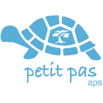
</th>
</tr>
</thead>
<tbody>
</tbody>
</table>

[**Introduction** 3](#introduction)

[**Section 1**: 6](#section-1)

[Good Practices in Education for Sustainable Development (ESD) 6](#good-practices-in-education-for-sustainable-development-esd)

> [EUROPEAN YOUTH PARLIAMENT FOR WATER 7](#_58azwqm0nhl6)
>
> [5P COMPETENCES — European partnership that develops a competence framework for sustainable development tailored to the needs of adult education 10](#_8bv8t21uzzr)
>
> [GREENING EVERY LEARNING ENVIRONMENT 12](#_9h0tew14msv6)
>
> [APPRENTICESHIPS FOR GREENER ECONOMIES AND SOCIETIES 15](#_an3te54vk6pl)
>
> [WARKA TOWER by architec Arturo Vittori 18](#_fgmhmlncf5no)
>
> [RIFÒ 20](#_yoodjpn2q0n4)
>
> [WELL-BEING IN A MORE SUSTAINABLE NEIGHBOURHOOD 23](#_y4b0dsarbc4k)
>
> [SCHOOLS TOWARDS SUSTAINABILITY IN NETWORK (ESENRED) 27](#_6bc8blb2ppi4)
>
> [GREENER AND SAFER SCHOOL STREETS 31](#_wde1b6vc4g8u)
>
> [InnoVET – INNOVATION AND PARTICIPATION IN THE DIGITAL AND GREEN TRANSITION OF VOCATIONAL EDUCATION AND TOURISM 33](#_j2o9lcqrzh7m)
>
> [Patrula de Reciclare (Recycling Patrol) – National Environmental Education Program 36](#_nz69b9w57adw)
>
> [Eco-Școala (Eco-Schools Program) – EDUCATION FOR SUSTAINABLE DEVELOPMENT IN SCHOOLS 39](#_up0yv0yn41jy)

[**Section 2**: 44](#section-2)

[Good Practices in TEAL Methodology 44](#good-practices-in-teal-methodology)

> [CircuTex – INNOVATIVE LEARNING SOLUTIONS FOR A GREENER FUTURE 45](#_wwhh9wae19k7)
>
> [ELEMENTS OF AI FREE ONLINE COURSES 47](#_7sz14uabav4)
>
> [THE SKILLS FOR THE GREEN TRANSFORMATION TOOLKIT 50](#_9wpnhtz1fjp7)
>
> [AUGMENTED REALITY IN ENVIRONMENTAL EDUCATION 53](#_thibv5be45pc)
>
> [FLIPPED LEARNING IN ADULT EDUCATION 55](#_yx6zeb51f5tm)
>
> [MATEMATICA LIVE 57](#_bcf9f6dfw8mk)
>
> [E-GROWTH ERASMUS PROJECT 60](#_d1wqgl1j4f27)
>
> [PADLET AS A COLLABORATIVE WORK INSTRUMENT TO IMPROVE EDUCATIONAL CARE THROUGH CYBERCOEXISTENCE IN PRIMARY EDUCATION 63](#_rc3brawv1wl1)
>
> [DIGITAL SKILLS DEVELOPMENT THROUGH APPLIED LEARNING – ALGEBRA VET PROGRAMS 68](#_jtm4ez9ovw55)
>
> [INTERACTIVE USE OF DIGITAL TOOLS IN ADULT EDUCATION – DANTE, RIJEKA 69](#_7e4sqdt2e2br)
>
> [Digitaliada – Digital Education for Active Learning in Rural Schools 72](#_egwdmw34dym2)
>
> [SmartLab Bucov – High-Tech Active Learning Laboratory in a Rural School 78](#_83uc7xl2kjgz)

[**Section 3**: 84](#section-3)

[General Notes 84](#general-notes)

> [ACTA Center - ROMANIA 85](#acta-center---romania)
>
> [CCIF Cyprus - CYPRUS 86](#ccif-cyprus---cyprus)
>
> [PETIT PAS - ITALY 87](#petit-pas---italy)
>
> [STP CONSULTING, SL - SPAIN 88](#stp-consulting-sl---spain)
>
> [UDRUGA - Association 4 ELEMENTS - CROATIA 89](#udruga---association-4-elements---croatia)
>
> [Asociația UZINADUZINA - ROMANIA 90](#asociația-uzinaduzina---romania)

[**Conclusion** 92](#conclusion)

<table>
<colgroup>
<col style="width: 100%" />
</colgroup>
<thead>
<tr>
<th><h1 id="section"></h1></th>
</tr>
<tr>
<th><h1 id="introduction">Introduction</h1></th>
</tr>
</thead>
<tbody>
</tbody>
</table>

This document, titled "**DSD_Best Practices**" presents one of the key outcomes of the Erasmus+ project “***Drops of Sustainable Development: Sustainable Development Competencies through Innovative Methodologies***”.

The project, led by Asociatia Uzinaduzina (RO) and carried out in collaboration with Petit Pas aps (IT), Asociatia Centrul European pentru Integrare Socioprofesionala (RO), Cross Culture International Foundation Cyprus (CY), SOLUCIONES TECNO-PROFESIONALES CONSULTING (ES), and Udruga 4 elementa (HR), aims to provide adult educators with innovative tools and strategies to integrate sustainable development competencies into their training programs.

To achieve this goal, the project explores the use of the TEAL (Technology Enhanced Active Learning) methodology, promoting active and collaborative learning through technology. The initiative stems from the need to support educators and trainers in overcoming the challenges of integrating sustainability into curricula by offering practical and engaging methods. Through the application of the TEAL method, the project not only provides innovative educational tools but also creates dynamic learning environments that facilitate active participation and the development of concrete solutions to sustainability-related issues.

Key Project Outcomes:

- **DSD_Best Practices**: A collection of best practices for sustainability education through TEAL.

- **DSD_Toolkit**: Educational modules for educators, featuring practical and participatory methods based on TEAL.

- **DSD_E-learning Platform**: A digital platform providing access to the developed resources.

- **DSD_Interactive Simulation Exercises**: Interactive exercises for adult learners aimed at developing skills for ecological transition.

The main project outcomes were achieved through the application of innovative and practical methods, as described in the educational modules and developed platforms. However, for these resources to have a concrete impact, it was essential to select best practices that were effective, replicable, and sustainable. The best practices collected and presented in this document were selected through a process that combined academic research with the analysis of educational and community projects focused on sustainable development education and the use of technological tools in education. This approach helped identify the most promising practices, ensuring that they met the needs of educators and communities while contributing to the successful integration of sustainability competencies into educational programs.

Selection Criteria:

- **Impact:** Significant contribution to increasing awareness and competencies in sustainability.

- **Innovation:** Original and creative approaches in the educational context.

- **Replicability:** Ease of adaptation to different educational settings.

- **Participation:** Active involvement of students, educators, and communities.

- **Sustainability:** Ability to maintain positive effects in the long term.

The application of these criteria allowed for the identification of practices that can be effectively adopted in different educational contexts, facilitating their dissemination and implementation.

In a global context that demands urgent action to address environmental and social challenges, adult education plays a crucial role in promoting sustainability. This document presents innovative methods and approaches aimed at fostering conscious and active citizens in sustainability promotion through the TEAL methodology.

To better understand these approaches and find inspiration for your own educational practice, we encourage you to continue reading.

<table>
<colgroup>
<col style="width: 100%" />
</colgroup>
<thead>
<tr>
<th><h1 id="section-1">Section 1:</h1></th>
</tr>
<tr>
<th><h1 id="good-practices-in-education-for-sustainable-development-esd">Good Practices in Education for Sustainable Development (ESD)</h1></th>
</tr>
</thead>
<tbody>
</tbody>
</table>

| Partner Organization Name | **ACTA Center**   |
|---------------------------|-------------------|
| Country:                  | **ROMANIA**       |
| Contact Person:           | **MARIANA RATIU** |
| Date:                     | **March 2025**    |

<table style="width:100%;">
<colgroup>
<col style="width: 16%" />
<col style="width: 83%" />
</colgroup>
<thead>
<tr>
<th colspan="2"><strong>1.1 Good Practice Title:</strong></th>
</tr>
<tr>
<th colspan="2" style="text-align: left;">EUROPEAN YOUTH PARLIAMENT FOR WATER</th>
</tr>
<tr>
<th colspan="2"><strong>1.1.1 Picture if available</strong></th>
</tr>
<tr>
<th colspan="2" style="text-align: center;">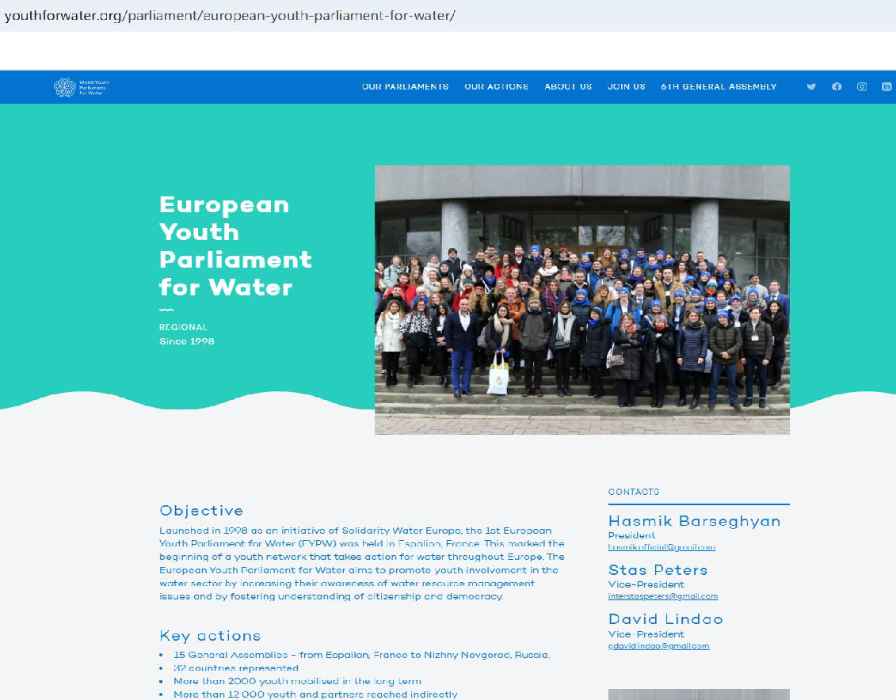</th>
</tr>
<tr>
<th colspan="2"><strong>1.2 Description:</strong></th>
</tr>
<tr>
<th colspan="2" style="text-align: left;">
The <strong>16th European Youth Parliament for Water</strong> (EYPW), October 20-26, 2024, in Szolnok and Budapest, Hungary, with the theme <strong>“Water and Biodiversity”</strong>. It aims to promote youth involvement in the water sector by increasing their awareness of water resource management issues and by fostering understanding of citizenship and democracy.

EYPW is part of the international network "World Youth Parliament for Water", a network of passionate young people from over 80 countries, under the motto "<em><strong>Water Leaders of Tomorrow Making Waves of Change Today</strong></em>". They are involved in action and measures on water issues at all levels, from concrete actions in local communities to advocacy for youth leadership in the water sector at the United Nations General Assembly.
</th>
</tr>
<tr>
<th colspan="2"><strong>1.3 Context:</strong></th>
</tr>
<tr>
<th colspan="2" style="text-align: left;">This international collaboration underscored the importance of collective action in addressing critical water challenges and fostering sustainable water management practices.</th>
</tr>
<tr>
<th colspan="2"><strong>1.4 Selection Criteria:</strong></th>
</tr>
<tr>
<th><strong>Impact:</strong></th>
<th style="text-align: left;">The youth shared innovative projects or actions from their countries related to water and biodiversity protection. They were equipped with the knowledge and skills necessary to advocate for water-related causes and implement tangible actions in their communities.</th>
</tr>
<tr>
<th><strong>Innovation:</strong></th>
<th style="text-align: left;">Under the motto „Water Leaders of Tomorrow Making Waves of Change Today“, the youth are involved in debates, networking, workshops, panel discussions, and field visits, exploring diverse perspectives on land use planning, environmental protection, public awareness, and sustainable management of water resources.</th>
</tr>
<tr>
<th><strong>Replicability:</strong></th>
<th style="text-align: left;">The EYPW is connected to a broader youth movement coordinated by the International Secretariat for Water and SWE, with strong synergies at the global level with the World Youth Parliament for Water.</th>
</tr>
<tr>
<th><strong>Participation:</strong></th>
<th style="text-align: left;">On the website there is an invitation to “Become a member or start your Parliament”. Motivated young people from all over the world are invited to become network members, young water heroes, or to create their own parliament at national, regional or local level and collaborate with leaders and partners around the world.</th>
</tr>
<tr>
<th colspan="2"><strong>1.5 Sources of Collection:</strong></th>
</tr>
<tr>
<th colspan="2"><ol type="1">
<li>
European Youth Parliament for Water. <a href="https://youthforwater.org/parliament/european-youth-parliament-for-water/"><u>https://youthforwater.org/parliament/european-youth-parliament-for-water/</u></a>
</li>
<li>
EU Strategy for the Danube Region (EUSDR) <a href="https://danube-region.eu/empowering-danube-youth-council-for-water-and-biodiversity-highlights-from-the-16th-european-youth-parliament-for-water/"><u>https://danube-region.eu/empowering-danube-youth-council-for-water-and-biodiversity-highlights-from-the-16th-european-youth-parliament-for-water/</u></a>
</li>
</ol></th>
</tr>
<tr>
<th colspan="2"><strong>1.6 Results:</strong></th>
</tr>
<tr>
<th colspan="2" style="text-align: left;">
Young participants from 32 European countries at this event (five from Romania, through ACTA Center Oradea), more than 2000 youth mobilised along the time and more than 12000 youth and partners reached indirectly. The World Youth Parliament for Water network comprises young people from over 80 countries.

Through their involvement, they:

<ul>
<li>
seek to respond to young people's interests by working together to prioritize water issues and create platforms for young people's expertise to be recognized on these issues.
</li>
<li>
support youth-led water projects
</li>
<li>
ensure young people have a valued and respected place in decision-making among senior officials responsible for water management
</li>
<li>
<em><strong>they are a team thirsty for change!</strong></em>
</li>
</ul>

The <em><strong>European Youth Parliament for Water</strong></em> and <em><strong>World Youth Parliament for Water</strong></em> are examples of good practices that are perfectly compatible with the objectives of project “<em><strong>Drops of Sustainability</strong></em>”, by:

<ul>
<li>
promoting a real culture among young people on the sustainable use of water resources, which is a global environmental challenge, and therefore contributes to the promotion of education for sustainable development of the whole society
</li>
<li>
the opportunity to become a member of this community and, moreover, to create a similar parliament at any level, thus giving a chance to all those who wish to improve their skills and level of expertise in the field of sustainability
</li>
<li>
direct promotion and broad, active participation of all those interested in responsible sustainable education for a more secure future for future generations.
</li>
</ul></th>
</tr>
</thead>
<tbody>
</tbody>
</table>

<table style="width:100%;">
<colgroup>
<col style="width: 16%" />
<col style="width: 83%" />
</colgroup>
<thead>
<tr>
<th colspan="2"><strong>1.1 Good Practice Title:</strong></th>
</tr>
<tr>
<th colspan="2" style="text-align: left;">5P COMPETENCES — European partnership that develops a competence framework for sustainable development tailored to the needs of adult education</th>
</tr>
<tr>
<th colspan="2"><strong>1.1.1 Picture if available</strong></th>
</tr>
<tr>
<th colspan="2" style="text-align: center;">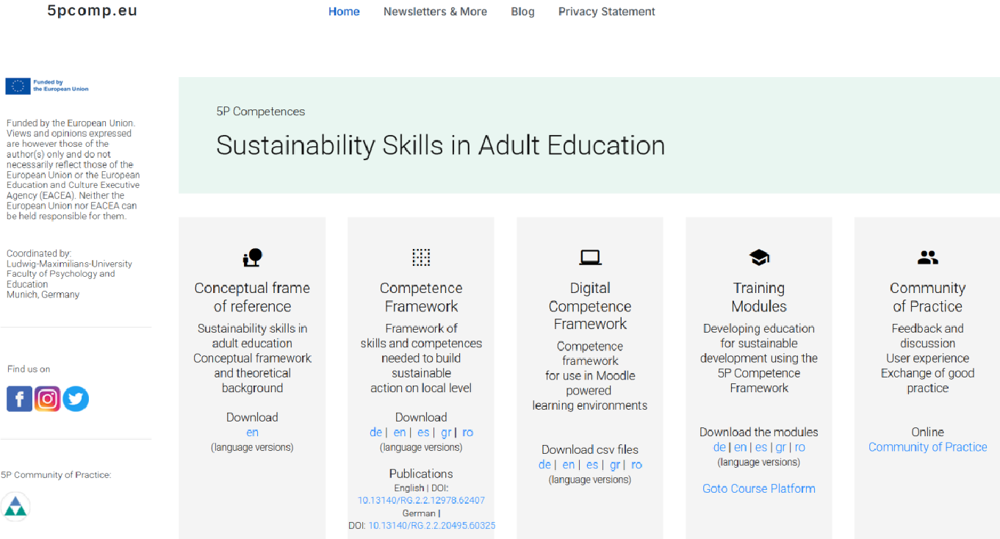</th>
</tr>
<tr>
<th colspan="2"><strong>1.2 Description:</strong></th>
</tr>
<tr>
<th colspan="2" style="text-align: left;">The 5P Competences Project is a European partnership dedicated to the development of a competence framework for sustainable development in Adult Education, special tailored to the needs of adult education. In the project are involved educators and trainers, non-governmental organisations and municipalities from 5 European countries. The project address to that persons who develop professional or civic activities concerning the development of learning for sustainable development. The project has established also an online community of practice for the exchange of ideas, experiences and good practices.</th>
</tr>
<tr>
<th colspan="2"><strong>1.3 Context:</strong></th>
</tr>
<tr>
<th colspan="2" style="text-align: left;">5P Competences — European partnership that develops a competence framework for sustainable development tailored to the needs of adult education, is an European project implemented by seven partners from 5 countries (DE, GR, BE, ES, RO), coordinated by LUDWIG-MAXIMILIANS-UNIVERSITAET MUENCHEN, DE.</th>
</tr>
<tr>
<th colspan="2"><strong>1.4 Selection Criteria:</strong></th>
</tr>
<tr>
<th><strong>Impact:</strong></th>
<th style="text-align: left;">The 5P Competences project recognizes the unique needs education for sustainable development in adult education. The competence framework provides not a one-size-fits-all solution but rather a flexible tool that educators can adapt to diverse learning environments. By bridging the gap between theory and practice, this project initiatives enriches adult education with a holistic approach that prepares learners for the challenges and opportunities of the real world. The project outputs focus on sustainability in everyday life and from a professional standpoint and ensures that adult learners acquire skills on education for sustainable development that today are not only highly relevant but also immediately applicable. Thereby, the 5P Competences Project stands as a testament to the power of adult education to shape a more sustainable and resilient future.</th>
</tr>
<tr>
<th><strong>Innovation:</strong></th>
<th style="text-align: left;">The Digital Competence Framework for ESD can be read in e-learning systems and used to develop online courses and programs. Use the network and community of practice for the exchange of good practice.</th>
</tr>
<tr>
<th><strong>Replicability:</strong></th>
<th style="text-align: left;">The Competence Framework supports teaching staff working in adult education in developing ESD-relevant events and courses that are geared to the actual developmental tasks of learners.</th>
</tr>
<tr>
<th><strong>Participation:</strong></th>
<th style="text-align: left;">Through the discussion on 5P Community of Practice or attending the materials available on the Couse Platform.</th>
</tr>
<tr>
<th colspan="2"><strong>1.5 Sources of Collection:</strong></th>
</tr>
<tr>
<th colspan="2"><ol start="3" type="1">
<li>
<a href="https://www.5pcomp.eu/"><u>https://www.5pcomp.eu/</u></a>
</li>
<li>
<a href="https://epale.ec.europa.eu/en/blog/5p-competences-project-education-sustainable-development-adult-education"><u>https://epale.ec.europa.eu/en/blog/5p-competences-project-education-sustainable-development-adult-education</u></a>
</li>
</ol></th>
</tr>
<tr>
<th colspan="2"><strong>1.6 Results:</strong></th>
</tr>
<tr>
<th colspan="2" style="text-align: left;">
5P Community of Practice: <a href="http://www.discuss-community.eu"><u>www.discuss-community.eu</u></a>

Competence Framework: <a href="http://www.5pcomp.eu"><u>www.5pcomp.eu</u></a>

Course Platform: <a href="http://www.moodle.5pcomp.eu"><u>www.moodle.5pcomp.eu</u></a>

The European project <em><strong>5P Competences — European partnership that develops a competence framework for sustainable development tailored to the needs of adult education</strong></em> is, by its own name, as well as by the competence framework developed, perfectly compatible with the objectives of project “<em><strong>Drops of Sustainability</strong></em>”, aiming to increase the level of competence of educators, facilitators and experts working primarily with adults in formal, informal and non-formal learning contexts, with a focus on education for sustainable development.

Complementary to the framework, the partners developed an <em><strong>online learning programme</strong></em>, which consists of seven general modules, which can be used as a basis and example for the online platform that will be developed within our project.
</th>
</tr>
</thead>
<tbody>
</tbody>
</table>

| Partner Organization Name | **CCIF Cyprus**        |
|---------------------------|------------------------|
| Country:                  | **CYPRUS**             |
| Contact Person:           | **MARINA ARISTODIMOU** |
| Date:                     | **March 2025**         |

<table style="width:100%;">
<colgroup>
<col style="width: 19%" />
<col style="width: 80%" />
</colgroup>
<thead>
<tr>
<th colspan="2"><strong>1.1 Good Practice Title:</strong></th>
</tr>
<tr>
<th colspan="2" style="text-align: left;">GREENING EVERY LEARNING ENVIRONMENT</th>
</tr>
<tr>
<th colspan="2"><strong>1.1.1 Picture if available</strong></th>
</tr>
<tr>
<th colspan="2" style="text-align: center;">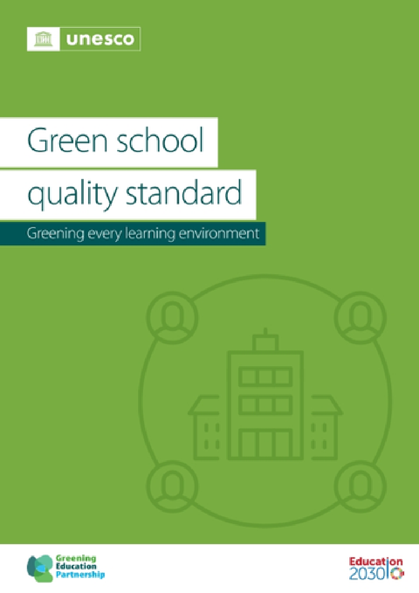 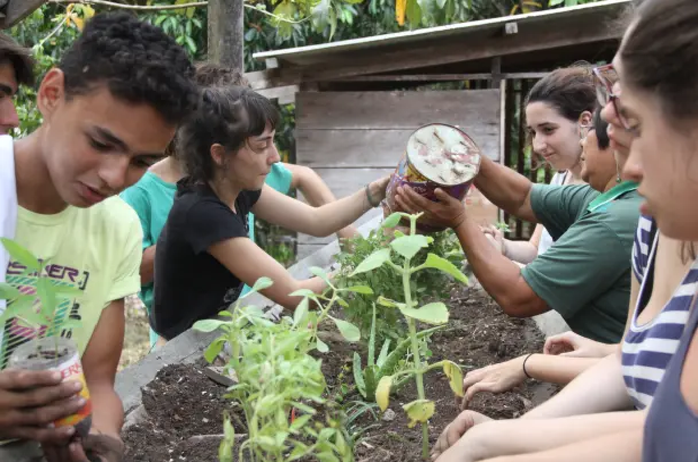</th>
</tr>
<tr>
<th colspan="2"><strong>1.2 Description:</strong></th>
</tr>
<tr>
<th colspan="2" style="text-align: left;">In 2022, UNESCO conducted a global survey revealing that 70% of young people couldn't explain climate change, prompting the launch of the Greening Education Partnership at the UN Transforming Education Summit. The Green School Quality Standard (UNESCO, 2024) provides a unified framework to help schools become sustainable and climate resilient by defining what it means to be “climate ready.” It promotes a whole institution approach structured around four key dimensions: school governance, facilities and operations, teaching and learning, and community engagement to integrate sustainability into all aspects of education. The standard’s objectives include promoting sustainability and climate readiness, offering a common framework for accreditation, encouraging continuous improvement, and aligning educational efforts with the Sustainable Development Goals (SDGs). Its target audience includes accreditation bodies, governments, schools, and broader educational stakeholders such as teachers, students, and communities, all working together to green at least 50% of schools worldwide by 2030.</th>
</tr>
<tr>
<th colspan="2"><strong>1.3 Context:</strong></th>
</tr>
<tr>
<th colspan="2" style="text-align: left;">The practice was implemented in response to global climate challenges and educational gaps in climate change awareness. It includes formal settings (e.g., primary, secondary, higher education) to informal settings(e.g., technical and vocational education and training TVET and community learning centers) Designed for a wide range of institutions from early childhood to higher education, including TVET and community learning centers, it ensures sustainability education spans the full learning journey. The standard has a global scope, with pilot implementation in diverse countries across Africa, Asia, Latin America, and the MENA region, reflecting varied cultural, socio-economic and environmental contexts. Rooted in youth demand, it promotes inclusive, climate resilient education for learners of all backgrounds.</th>
</tr>
<tr>
<th colspan="2"><strong>1.4 Selection Criteria:</strong></th>
</tr>
<tr>
<th><strong>Impact:</strong></th>
<th style="text-align: left;">Improvements in awareness and skills related to sustainability included greater understanding among educators and students about environmental issues, the integration of sustainability into curricula, enhanced capacity to address local environmental challenges, and the development of practical green skills, all of which contributed to building climate-resilient schools and communities.</th>
</tr>
<tr>
<th><strong>Innovation:</strong></th>
<th style="text-align: left;">The <em>Green School Quality Standard</em> introduces several innovative approaches to make schools climate ready and sustainable. It adopts a <strong>Whole-Institution Approach</strong> (WIA), engaging all aspects of school life governance, operations, curriculum, and community. Its <strong>flexible, resource-based action planning</strong> let's schools adapt activities to their capacities. <strong>Student empowerment</strong> is central, with learners involved in Green Committees, campaigns, and decision-making. It values <strong>indigenous and local knowledge</strong>, promotes <strong>hands-on learning</strong> through green infrastructure and environmental monitoring, and aligns with global frameworks like the Sustainable Development Goals (SDGs) and the Comprehensive School Safety Framework (CSSF), bridging safety, resilience, and sustainability in education. Importantly, it embraces a <strong>practice-informed, non-prescriptive model</strong>, making it adaptable and inclusive across contexts.</th>
</tr>
<tr>
<th><strong>Replicability:</strong></th>
<th style="text-align: left;">This practice offers a flexible, inclusive approach to integrating sustainability into adult education by promoting whole institution practices in governance, operations, teaching, and community engagement. Adaptable to vocational training, community centers, and continuing education, the framework equips adult learners with practical green skills such as climate-smart agriculture, renewable energy, and sustainable entrepreneurship through experiential, culturally relevant learning. It encourages active learner participation in decision-making and community sustainability projects, while allowing institutions to start with low-cost initiatives and grow capacity over time. By prioritizing inclusivity and lifelong learning, the standard empowers adult learners as agents of green transitions and sustainable development.</th>
</tr>
<tr>
<th><strong>Participation:</strong></th>
<th style="text-align: left;">
UNESCO’s <em>Green School Quality Standard</em> actively engages students, teachers, and community members across governance, operations, teaching, and outreach to build <strong>green skills for sustainable work</strong>. By forming inclusive committees, involving <strong>students</strong> in eco-audits and green entrepreneurship, and embedding sustainability in hands-on curricula from composting to climate-smart projects learners develop practical competencies like problem-solving, collaboration, and environmental stewardship.

<strong>Teachers</strong> serve as facilitators, guiding experiential learning and aligning sustainability with academic goals, while <strong>community members</strong> contribute to local knowledge and real-world relevance. Through joint service learning projects, capacity building workshops, and partnerships with businesses or civic groups, schools become hubs of climate action and workforce readiness. This collaborative model cultivates leadership, technical know-how, and a strong sustainability ethic equipping all stakeholders, especially adult and youth learners, with the skills and mindset needed for a green, resilient future.
</th>
</tr>
<tr>
<th colspan="2"><strong>1.5 Sources of Collection:</strong></th>
</tr>
<tr>
<th colspan="2">
Education for Sustainable Development

<ul>
<li>
<a href="https://www.unesco.org/en/sustainable-development/education"><u>https://www.unesco.org/en/sustainable-development/education</u></a>
</li>
<li>
<a href="https://www.unesco.org/en/articles/education-sustainable-development-how-unesco-improves-community-climate-resilience-through-literacy#:~:text=copies%20of%20Information%2C%20Educational%2C%20and,in%20UNESCO%E2%80%99s%20literacy%20classes"><u>https://www.unesco.org/en/articles/education-sustainable-development-how-unesco-improves-community-climate-resilience-through-literacy#:~:text=copies%20of%20Information%2C%20Educational%2C%20and,in%20UNESCO%E2%80%99s%20literacy%20classes</u></a>
</li>
</ul></th>
</tr>
<tr>
<th colspan="2"><strong>1.6 Results:</strong></th>
</tr>
<tr>
<th colspan="2" style="text-align: left;">This practice equips adult learners and educators globally with green skills essential for sustainable work, such as climate smart agriculture, resource conservation, and disaster preparedness. By integrating environmental education into adult learning programs, participants gain practical knowledge that supports low carbon lifestyles and employability in green sectors. Initiatives have led to measurable outcomes such as cost savings through energy efficiency and increased community resilience while also building leadership among adult learners and educators. In Afghanistan, for instance, the program trained over 100 community leaders and reached 6,500 adult learners, empowering them to take on sustainability challenges at work and in their communities. This growing global movement, adopted by over 80 countries and 1,300+ organizations, reflects a trend toward lifelong, work ready climate education that positions adult learners as active agents in the green transition.</th>
</tr>
</thead>
<tbody>
</tbody>
</table>

<table>
<colgroup>
<col style="width: 17%" />
<col style="width: 82%" />
</colgroup>
<thead>
<tr>
<th colspan="2"><strong>1.1 Good Practice Title:</strong></th>
</tr>
<tr>
<th colspan="2" style="text-align: left;">APPRENTICESHIPS FOR GREENER ECONOMIES AND SOCIETIES</th>
</tr>
<tr>
<th colspan="2"><strong>1.1.1 Picture if available</strong></th>
</tr>
<tr>
<th colspan="2" style="text-align: center;">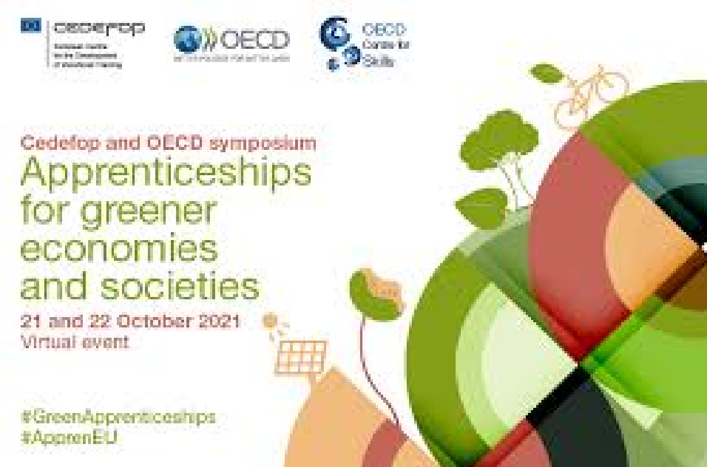</th>
</tr>
<tr>
<th colspan="2"><strong>1.2 Description:</strong></th>
</tr>
<tr>
<th colspan="2" style="text-align: left;">
The greening of apprenticeships through modular and systemic adaptation aims to embed sustainability and green skills across European vocational training programs, making apprenticeships a key enabler of sustainable work. This approach includes updating training modules with green content, involving apprentices in sustainability projects, integrating green strategies within companies, and building the capacity of educators and trainers. Targeting apprentices, educators, policy-makers, and industry leaders, particularly in sectors like construction and energy the initiative fosters partnerships to align education with real-world sustainability needs.

For example, Siemens incorporates circular economy principles into its training, empowering apprentices to innovate for environmental impact. Ultimately, apprenticeships serve as catalysts for green innovation and long-term workforce resilience.
</th>
</tr>
<tr>
<th colspan="2"><strong>1.3 Context:</strong></th>
</tr>
<tr>
<th colspan="2" style="text-align: left;">
This practice has been implemented across vocational education and training (VET) systems in European countries with strong dual apprenticeship models, notably Germany, Austria, and Switzerland. These systems combine work-based learning in companies with theoretical instruction in vocational schools, making them ideal for integrating sustainability.

The initiative spans vocational schools, training centers, and companies especially in construction, energy, and manufacturing and involves public-private partnerships. It targets young apprentices (15–25), VET instructors, policy-makers, and stakeholders. Projects like Germany’s NAZUBI program exemplify its inclusive and cross-sectoral approach, supported by coordinated market economies that enable effective curriculum reform and alignment with green job market needs.
</th>
</tr>
<tr>
<th colspan="2"><strong>1.4 Selection Criteria:</strong></th>
</tr>
<tr>
<th><strong>Impact:</strong></th>
<th style="text-align: left;">
The document highlights significant improvements in apprentices’ sustainability awareness and skills, including a stronger understanding of climate change, energy efficiency, and the SDGs, which they learned to apply in both personal and professional contexts. Apprentices demonstrated greater engagement, self-reflection, and motivation to take ownership of environmental issues, supported by collaborative learning that connected theory to practical solutions. Hands-on initiatives, such as gamified training and virtual simulations, enhanced their job-specific green competencies.

Additionally, trainers themselves became more aware and engaged, reinforcing a cultural shift toward sustainability within vocational education and training environments.
</th>
</tr>
<tr>
<th><strong>Innovation:</strong></th>
<th style="text-align: left;">The initiative employs several original and creative approaches to embed sustainability into vocational education and training (VET). These include participatory curriculum co-design, where apprentices, educators, and industry partners collaboratively shape green learning content, and specialized sustainability training for teachers and trainers to act as ambassadors of green thinking. The program fosters strong collaboration between schools and companies, enabling knowledge spillovers, feedback loops, and shared sustainability efforts. It also uses dialogical curriculum development rooted in local needs, role exchanges where apprentices take on teaching roles, and tech-driven methods like gamification and virtual reality to teach green skills in engaging, hands-on ways. Together, these approaches promote systemic change, learner empowerment, and a deeply embedded culture of sustainability in VET.</th>
</tr>
<tr>
<th><strong>Replicability:</strong></th>
<th style="text-align: left;">The practice can be adapted to diverse educational settings by applying its core principles of collaboration, and experiential learning. Key strategies include integrating sustainability into existing curricula, fostering partnerships with industry and community stakeholders, and training educators to promote green values. Engaging students through project-based learning, using technology like VR and gamification, and tailoring programs to local needs ensures relevance and impact. Additionally, promoting a whole-institution approach where schools model sustainable practices helps embed environmental responsibility throughout the learning environment, making this model adaptable across formal and informal education systems.</th>
</tr>
<tr>
<th><strong>Participation:</strong></th>
<th style="text-align: left;">It can engage students, teachers, and the community through a collaborative, hands-on approach. Students actively co-create learning experiences, participate in sustainability audits, and lead projects. Teachers and trainers receive sustainability focused training to champion green practices, while industry and community partners help shape programs through public private collaboration. This integrated model fosters shared responsibility for sustainability and embeds green learning within both education and the broader community.</th>
</tr>
<tr>
<th colspan="2"><strong>1.5 Sources of Collection:</strong></th>
</tr>
<tr>
<th colspan="2"><ul>
<li>
<a href="https://westminsterresearch.westminster.ac.uk/download/4aa8055e372377e5d9277d9bcef25d0f934695d807e611791f440472cc921a26/2783073/3091_en_0.pdf"><u>https://westminsterresearch.westminster.ac.uk/download/4aa8055e372377e5d9277d9bcef25d0f934695d807e611791f440472cc921a26/2783073/3091_en_0.pdf</u></a>
</li>
<li>
<a href="https://www.cedefop.europa.eu/en/publications/3091"><u>https://www.cedefop.europa.eu/en/publications/3091</u></a>
</li>
</ul></th>
</tr>
<tr>
<th colspan="2"><strong>1.6 Results:</strong></th>
</tr>
<tr>
<th colspan="2" style="text-align: left;">The Apprenticeships for Greener Economies and Societies has yielded strong qualitative outcomes, with apprentices gaining environmental awareness, green skills, and applying sustainable practices in real-world settings. It fostered collaboration between schools and companies, improved curricula, and promoted green technologies. Educators became key agents of change, embedding sustainability into institutional culture. The GRÆDUCATION project is a partnership between Greek and German TVET stakeholders who further demonstrated how green apprenticeships can drive innovation, entrepreneurship, and local job creation. The initiative shows clear impact in transforming attitudes, business practices, and education systems toward long-term sustainability.</th>
</tr>
</thead>
<tbody>
</tbody>
</table>

| Partner Organization Name | **PETIT PAS**        |
|---------------------------|----------------------|
| Country:                  | **ITALY**            |
| Contact Person:           | **ANGELO RICCHIUTO** |
| Date:                     | **21/03/2025**       |

<table style="width:100%;">
<colgroup>
<col style="width: 16%" />
<col style="width: 83%" />
</colgroup>
<thead>
<tr>
<th colspan="2"><strong>1.1 Good Practice Title:</strong></th>
</tr>
<tr>
<th colspan="2" style="text-align: left;">WARKA TOWER by architec Arturo Vittori</th>
</tr>
<tr>
<th colspan="2"><strong>1.1.1 Picture if available</strong></th>
</tr>
<tr>
<th colspan="2" style="text-align: center;">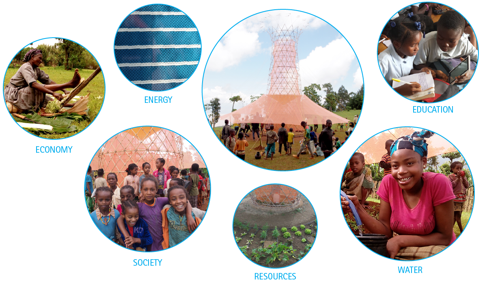</th>
</tr>
<tr>
<th colspan="2"><strong>1.2 Description:</strong></th>
</tr>
<tr>
<th colspan="2" style="text-align: center;">
<em>„Warka Tower is designed to harvest water from the atmosphere (rain, fog, dew) providing an alternative water source for rural populations that face challenges accessing drinkable water.“</em>

Designed by Italian architect Arturo Vittori, the Warka Tower represents an innovative solution for collecting potable water in rural areas with scarce water resources. Inspired by traditional water harvesting techniques and the principles of biomimicry (the imitation of natural processes), the tower harnesses the properties of natural and local materials, such as bamboo and plant fibers, to extract water from the atmosphere.

In summary, the tower's lattice-like structure, made of bamboo, supports an internal mesh of natural fibers. This mesh captures moisture present in the air in the form of fog, dew, and water vapor, and the water droplets that form on the mesh through condensation slide downwards, where they are collected in a tank at the base of the tower. The use of natural and local materials makes the Warka Tower environmentally friendly and low-impact. Furthermore, its modular structure facilitates assembly, maintenance, and adaptation to various environmental conditions.

The Warka Tower simultaneously provides an alternative and sustainable water source, reducing dependence on traditional water sources that are often scarce or contaminated, a meeting point for local communities, promoting knowledge sharing and raising awareness about the importance of sustainable water resource management, and the ease of construction and maintenance of the tower allows communities to autonomously manage their water resource, fostering local development and resilience.

In conclusion, the Warka Tower is an example of how innovation and sustainability can combine to address global challenges related to water scarcity, offering concrete and low-impact solutions for the most vulnerable communities.
</th>
</tr>
<tr>
<th colspan="2"><strong>1.3 Context:</strong></th>
</tr>
<tr>
<th colspan="2" style="text-align: left;">Warka Tower has been built in several rural communities in countries such as Ethiopia, Togo, and Haiti, characterized by arid climatic conditions, inadequate water infrastructure, and socio-economic difficulties. These communities, often lacking access to clean water, benefit from the Warka Tower as a sustainable and participatory solution to address the water challenge.</th>
</tr>
<tr>
<th colspan="2"><strong>1.4 Selection Criteria:</strong></th>
</tr>
<tr>
<th><strong>Impact:</strong></th>
<th style="text-align: left;">Warka Tower has a positive impact on the health and well-being of communities by providing clean water, reducing the time spent collecting water, and improving hygiene. It promotes awareness about the importance of sustainable water resource management and encourages community participation.</th>
</tr>
<tr>
<th><strong>Innovation:</strong></th>
<th style="text-align: left;">Warka Tower represents an innovative approach to water harvesting, combining modern design and biomimicry with traditional techniques. Its modular structure and the use of local materials make it adaptable to diverse contexts and easily replicable.</th>
</tr>
<tr>
<th><strong>Replicability:</strong></th>
<th style="text-align: left;">Warka Tower is designed to be easily replicated in various locations, thanks to its simple structure and the use of local materials. The Warka Water project includes workshops and training for local communities on the construction and maintenance of the towers.</th>
</tr>
<tr>
<th><strong>Participation:</strong></th>
<th style="text-align: left;">The construction and management of the Warka Tower actively involves the local community, promoting collaboration and a sense of ownership. Women, in particular, play a key role in the project and in the management of the tower and water collection.</th>
</tr>
<tr>
<th colspan="2"><strong>1.5 Sources of Collection:</strong></th>
</tr>
<tr>
<th colspan="2"><ul>
<li>
<a href="https://warkawater.org/warkatower/">https://warkawater.org/warkatower/</a>
</li>
</ul></th>
</tr>
<tr>
<th colspan="2"><strong>1.6 Results:</strong></th>
</tr>
<tr>
<th colspan="2" style="text-align: left;">Warka Tower has proven to be an effective and sustainable solution for water harvesting in rural communities with water scarcity. The project has led to improvements in the health, hygiene, and living conditions of the communities involved, promoted community participation, female empowerment, and awareness of the importance of sustainable water resource management.</th>
</tr>
</thead>
<tbody>
</tbody>
</table>

<table style="width:100%;">
<colgroup>
<col style="width: 16%" />
<col style="width: 83%" />
</colgroup>
<thead>
<tr>
<th colspan="2"><strong>1.1 Good Practice Title:</strong></th>
</tr>
<tr>
<th colspan="2" style="text-align: left;">RIFÒ</th>
</tr>
<tr>
<th colspan="2"><strong>1.1.1 Picture if available</strong></th>
</tr>
<tr>
<th colspan="2" style="text-align: center;">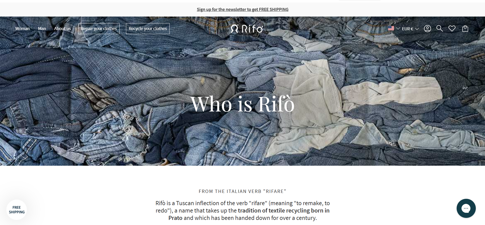</th>
</tr>
<tr>
<th colspan="2"><strong>1.2 Description:</strong></th>
</tr>
<tr>
<th colspan="2" style="text-align: center;">
<em>From the Italian verb "rifare"</em>

<em>Rifò is a Tuscan inflection of the verb "rifare" (meaning "to remake, to redo"), a name that takes up the <strong>tradition of textile recycling born in Prato</strong> and which has been handed down for over a century. It is precisely in this textile district, an excellence of Italian craftsmanship, that we have chosen to carefully produce our garments, limiting our environmental impact.</em>

Rifò is an Italian company with a clear mission: to revolutionize the fashion industry through the production of sustainable clothing and accessories. Founded on the philosophy of the circular economy, Rifò is committed to reducing the environmental impact of the textile sector by transforming waste and used garments into new, high-quality products. Rifò's Core Principles are:

<ul>
<li>
<u>Recycled and Regenerated Materials</u>: Rifò primarily uses recycled materials, both pre-consumer (production waste) and post-consumer (used garments). This approach reduces the need for new raw materials and limits waste. The company focuses on regenerating fibers such as cashmere, wool, and cotton, giving new life to materials otherwise destined for landfills.
</li>
<li>
<u>Circular Economy</u>: Rifò main goal is to create a circular fashion system, where products are designed to be reused and recycled at the end of their life cycle. This approach reduces the environmental impact of the textile industry, promoting more responsible and conscious consumption.
</li>
<li>
<u>Local and Artisan Production</u>: Rifò produces its garments in the Prato textile district, an Italian district renowned for its artisan excellence. Local production supports the local economy and reduces the carbon footprint associated with transportation.
</li>
<li>
<u>Transparency and Responsibility</u>: Rifò is committed to maintaining high standards of transparency throughout the production chain. The company promotes social and environmental responsibility, ensuring fair and respectful working conditions.
</li>
<li>
<u>Social Projects</u>: Rifò also pays attention to social impact, with projects such as "Nei Nostri Panni" (In Our Clothes) that focuses on promoting the integration of migrants and generational change in the textile sector.
</li>
</ul>

Rifò demonstrates that it is possible to create high-quality, beautiful, and durable fashion garments without compromising the environment, ultimately a sustainable and responsible business model that aims to drive positive change in the fashion industry.
</th>
</tr>
<tr>
<th colspan="2"><strong>1.3 Context:</strong></th>
</tr>
<tr>
<th colspan="2" style="text-align: left;">Rifò primarily operates in Italy, within the Prato textile district, where it collaborates with various local entities for the collection and recycling of textiles. The company targets a broad and diverse audience, comprising consumers who are attentive to sustainability and ethical production without neglecting aesthetics. Through its products and awareness initiatives, Rifò promotes a cultural shift in the fashion sector, encouraging a more circular and environmentally respectful approach.</th>
</tr>
<tr>
<th colspan="2"><strong>1.4 Selection Criteria:</strong></th>
</tr>
<tr>
<th><strong>Impact:</strong></th>
<th style="text-align: left;">Rifò contributes to the reduction of textile waste and pollution related to clothing production, promotes awareness of the importance of recycling and the circular economy in the fashion sector, and encourages more responsible consumption.</th>
</tr>
<tr>
<th><strong>Innovation:</strong></th>
<th style="text-align: left;">Rifò distinguishes itself through the use of innovative technologies for textile recycling and the production of regenerated fibers, constantly experimenting with new materials and production processes to reduce the environmental impact of its products.</th>
</tr>
<tr>
<th><strong>Replicability:</strong></th>
<th style="text-align: left;">Rifò business model, based on circular fashion and the use of recycled materials, can be replicated and adapted to other contexts and production sectors. The company also offers consulting and support to other entities that wish to adopt a more sustainable approach.</th>
</tr>
<tr>
<th><strong>Participation:</strong></th>
<th style="text-align: left;">Rifò actively involves consumers in the recycling process by incentivizing the collection of used garments through dedicated collection points and awareness campaigns, and actively collaborates with schools and universities to promote education on sustainability and circular fashion.</th>
</tr>
<tr>
<th colspan="2"><strong>1.5 Sources of Collection:</strong></th>
</tr>
<tr>
<th colspan="2"><ul>
<li>
<a href="https://rifo-lab.com/en/pages/who-is-rifo">https://rifo-lab.com/en/pages/who-is-rifo</a>
</li>
<li>
<a href="https://rifo-lab.com/en/blogs/rifo-stories">https://rifo-lab.com/en/blogs/rifo-stories</a>
</li>
<li>
https://rifo-lab.com/en/pages/free-repair-service
</li>
</ul></th>
</tr>
<tr>
<th colspan="2"><strong>1.6 Results:</strong></th>
</tr>
<tr>
<th colspan="2" style="text-align: left;">Rifò has achieved significant results in reducing textile waste and promoting circular fashion. The company has collected and recycled tons of textiles, creating new high-quality products and raising awareness among a growing number of consumers about the importance of sustainability in the fashion sector.</th>
</tr>
</thead>
<tbody>
</tbody>
</table>

| Partner Organization Name | **STP CONSULTING, SL** |
|---------------------------|------------------------|
| Country:                  | **SPAIN**              |
| Contact Person:           | **RAÚL GONZALO**       |
| Date:                     | **17/02/2025**         |

<table style="width:100%;">
<colgroup>
<col style="width: 16%" />
<col style="width: 83%" />
</colgroup>
<thead>
<tr>
<th colspan="2"><strong>1.1 Good Practice Title:</strong></th>
</tr>
<tr>
<th colspan="2" style="text-align: left;">WELL-BEING IN A MORE SUSTAINABLE NEIGHBOURHOOD</th>
</tr>
<tr>
<th colspan="2"><strong>1.1.1 Picture if available</strong></th>
</tr>
<tr>
<th colspan="2" style="text-align: center;">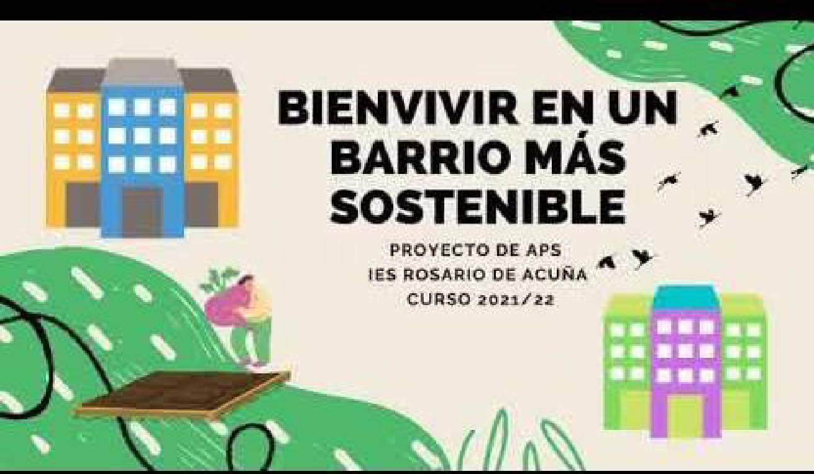</th>
</tr>
<tr>
<th colspan="2"><strong>1.2 Description:</strong></th>
</tr>
<tr>
<th colspan="2" style="text-align: left;">
Reflection is given in the classrooms on what needs are perceived in our immediate environment and surveys are prepared and carried out on families by the students. The Needs: scarcity of sustainable uses in green spaces; Lack of involvement of the community in the management and care of green and public spaces, and lack of recreational activities that encourage contact with nature. Different groups of students of different levels and subjects propose and carry out different activities A group of people who respond to each of these needs and who are shared by a Wide diversity of our adolescent student body.

The project has the following objectives:

<ul>
<li>
To improve group cohesion and the sense of belonging to the school and the neighbourhood;
</li>
<li>
Improve oral and written expression skills, and promote contact with nature;
</li>
<li>
Participate in the improvement of the emotional state of the community;
</li>
<li>
Bring green spaces closer to people's daily lives and promote scientific culture.
</li>
</ul></th>
</tr>
<tr>
<th colspan="2"><strong>1.3 Context:</strong></th>
</tr>
<tr>
<th colspan="2" style="text-align: left;">
After the lockdown and the pandemic, it was detected that our educational community started to value more the little things, the environment and its resources.

IES Rosario de Acuña is a secondary school Compulsory located in the southern area of the city of Gijón which offer Compulsory Secondary Education and Baccalaureate.

It had location problems in its beginnings because it did not have a pre-established headquarters.Since its transfer in the 1997-1998 academic year to one of the buildings, the center has carried out a considerable and meritorious effort to adapt to its new headquarters and environment.

The school stands out for its Attention to Diversity, for its involvement with the most important students. vulnerable, because of the good coexistence between the staff who work in it and because of its in application in projects.

The center is line four in ESO and line three in Baccalaureate.There are 70 teachers, 560 students, and nine people as non-teaching staff. The building has three floors and is surrounded by slopes for the sports and green areas

Finalists in the Sustainability category of the National Awards of Service Learning, which has been a source of pride for all the participants.
</th>
</tr>
<tr>
<th colspan="2"><strong>1.4 Selection Criteria:</strong></th>
</tr>
<tr>
<th><strong>Impact:</strong></th>
<th style="text-align: left;">
Our school has developed, on an annual basis since 2014, a learning and service, adapting to the needs of the moment. Thus, it has developed, among other initiatives, cultural and cognitive stimulation programmes in collaboration with a centre for people Greater; reflections on the barriers imposed by social distancing caused by the pandemic and its consequences on multiple environmental realities, and research on school radio as a resource that allows us to overcome these barriers and alleviate their effects on different areas.

Classrooms reflect on what needs are perceived in our immediate environment. and surveys are prepared and carried out on families by the students. The following are extracted. Needs: scarcity of sustainable uses in green spaces; Lack of involvement of the community in the management and care of green and public spaces, and lack of recreational activities that encourage contact with nature.

<ul>
<li>
Learning related to know-how has been developed, such as communicating in different contexts, participating in community activities... Similarly, learning related to knowing how to be as they are, to have initiative and interest, to participate in a creative way. A new version of the Constitution They have been perfectly achieved by all the students who have participated in the project;
</li>
<li>
This project is a first step towards establishing a resource that will continue at the centre as a didactic tool and openness to the community;
</li>
<li>
Very relevantly, it is worth highlighting an important impact on the inclusion of students with Special Educational Needs.
</li>
</ul></th>
</tr>
<tr>
<th><strong>Innovation:</strong></th>
<th style="text-align: left;">
The collaboration of the neighborhood association in the development and maintenance of the actions, and the support of the City Council by providing technical material for the Community garden allows the permanence of the project in future school years. In the end-of-year report, the incorporation of this project into the individualized work plans of students with Specific Educational Support Needs is established as a proposal for improvement. Likewise, other participating departments confirm the relevance of this resource to deepen learning and key competences.

Activities related to the main contents they are the start-up and maintenance of urban gardens and vertical gardens; the creation of healthy spaces such as reading points, bird and plant observation; the preparation of dissemination materials and advertising campaigns, and the analysis of the properties that nature offers us.

The entire project has as a transversal line the interest to promote the health and well-being of the population, with the purpose of improving the socio-emotional state of the people and contributing to the construction of a friendlier, more inclusive and welcoming environment for all.

For instance; activities such as:

a. <strong>The feeling of the neighborhood community</strong>.Design, elaboration and analysis of surveys to know the uses of green spaces and the detection of demands by the inhabitants of the neighbourhood. It is achieved to involve and involve the whole community in improving our neighborhood. Task in groups to find the actions in green areas that need and/or can be beneficial for the neighbourhood;

b. <strong>Space of the senses</strong>. Creation of a place in one of the neighborhood parks for the experiencing sensations related to nature and the senses: smelling, hearing, seeing, touching, and tasting;

c. <strong>The bell</strong>: Selection of music for class changes that contributes to the emotional well-being of the educational community and the neighborhood around the institute.
</th>
</tr>
<tr>
<th><strong>Replicability:</strong></th>
<th style="text-align: left;">
On the other hand, this project was the beginning of a collaboration with other nearby educational centers which will enable new joint activities. In addition other schools in the Asturias Region, seeing the impact of our project, have asked us for support and collaboration.

In the final report of the course,it is established as a proposal for improvement the incorporation of the of this project in the individual work plans of students with Specific Support Needs Educational. Other participating departments will also confirm the relevance of this resource to deepen in learning and key competences.
</th>
</tr>
<tr>
<th><strong>Participation:</strong></th>
<th style="text-align: left;">
The project is carried out collaboratively between several departments, involving students of the school in the different levels of ESO and Baccalaureate, along with the Primary and Infant students of the schools adyacentes. In the proposal and preparation of activities have both members of the educational community participated and non-educational.

It is worth highlighting in this project the networking between the different departments of the IES, collaborating and sharing the same signs of identity and a coherence internal. However, the work of each of the departments with students in the elaboration of different structures and products required the following external collaborations, as for example:

<ul>
<li>
Gijón City Council. Through different areas, especially the area of Parks and Gardens collaborating directly into the provisioning of structures and materials for the installation of urban gardens in the park and in the intercenter area;
</li>
<li>
Association of Residents of the Polygon "Evaristo San Miguel", with a fundamental dynamic function and with the community of the neighborhood, which always showed a welcoming gives very positive to the project and participated widely in its dissemination.
</li>
</ul></th>
</tr>
<tr>
<th colspan="2"><strong>1.5 Sources of Collection:</strong></th>
</tr>
<tr>
<th colspan="2"><ul>
<li>
Catalogue of publications of Education Ministery: sede.educacion.gob.es/publiventa
</li>
<li>
General Catalogue of official publications: cpage.mpr.gob.es
</li>
</ul></th>
</tr>
<tr>
<th colspan="2"><strong>1.6 Results:</strong></th>
</tr>
<tr>
<th colspan="2" style="text-align: left;">
This project has been developed in the 2021-2022 school year, but it is still in force with different actions in the 2022-2023 academic year. It began as a small school project linked to the School garden to grow and become a benchmark in the neighbourhood and in the city.

The project meant a greater motivation in the learning of the students, a competency-based learning in different skills and a significant learning when seeing the purpose of the work carried out. It is important to document the entire process to organize a day of celebration that shows the work done throughout the course. Dissemination is essential. It makes the entire educational community feel proud of the work done and perceive their project as something of their own that makes them feel proud to belong to the center.

The assessment by all our collaborators has been very satisfactory and has helped. To move forward with more actions. Almost a year has already passed, and all the performances are still respected and used by the entire community. Our students have collaboration with other centers and institutions has been established and the project continues to grow.
</th>
</tr>
</thead>
<tbody>
</tbody>
</table>

<table style="width:100%;">
<colgroup>
<col style="width: 16%" />
<col style="width: 83%" />
</colgroup>
<thead>
<tr>
<th colspan="2"><strong>1.1 Good Practice Title:</strong></th>
</tr>
<tr>
<th colspan="2" style="text-align: left;">SCHOOLS TOWARDS SUSTAINABILITY IN NETWORK (ESENRED)</th>
</tr>
<tr>
<th colspan="2"><strong>1.1.1 Picture if available</strong></th>
</tr>
<tr>
<th colspan="2" style="text-align: center;">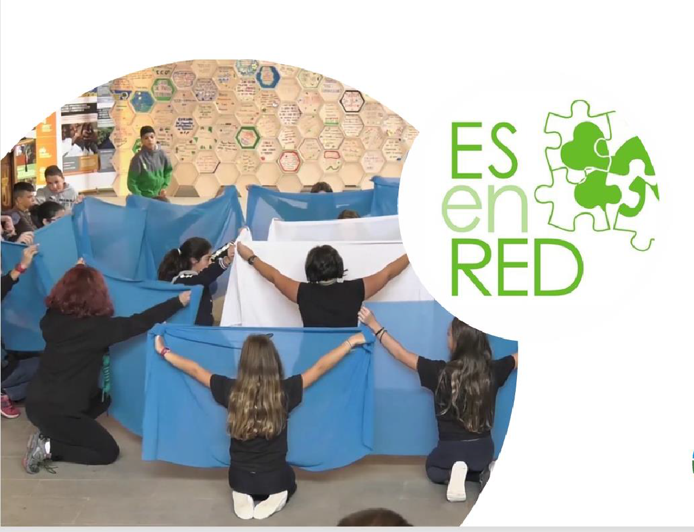</th>
</tr>
<tr>
<th colspan="2"><strong>1.2 Description:</strong></th>
</tr>
<tr>
<th colspan="2" style="text-align: left;">
ESenRED is a network of public initiative networks of educational centres that work for the development of students' competences in sustainability.

Network of networks of non-university educational centres working for sustainability promoted at the initiative of public administrations.

Our goal is to develop environmental education for sustainability and global citizenship to empower students in the face of the ecosocial crisis.

Objectives ESenRED emerged with the following objectives:

<ol type="1">
<li>
To facilitate the meeting, exchange, collaboration and dissemination between the different networks of actions, resources, materials and ideas.
</li>
<li>
To promote reflection, evaluation and innovation on one's own practice in order to collectively construct knowledge in reference models.
</li>
<li>
To develop common projects or shared by the networks that seek the permanent improvement of students' learning skills, through their participatory protagonism, as well as the permanent improvement of the professional competence of teachers.
</li>
<li>
Establish contacts, relationships and common projects with other international networks of schools towards sustainability
</li>
</ol></th>
</tr>
<tr>
<th colspan="2"><strong>1.3 Context:</strong></th>
</tr>
<tr>
<th colspan="2" style="text-align: left;">
ESenRED is a network structure of networks with common interests and objectives, which is configured as a community of practices in which all its members have the possibility of acting and taking responsibility for themselves in terms of equality, generating cooperative networking.

ESenRED favors the change and advancement of networks, offering a way to practice shared responsibility, in which the representatives of each network contribute with different functions, giving rise to distributed and shared leadership.

In the seminars of the technical staff of the different networks that make up ESenRED, different experiences and perspectives are exchanged, information and debate are given, difficulties, challenges and objectives are raised with the aim of learning and growing collectively to improve the projects of each network and, therefore, the daily dynamics of the educational centers in terms of environmental education.

From 13 to 15 October 2010, representatives of different environmental education networks and programmes promoted by autonomous communities, provincial councils and town councils met for the first time in Valsaín, the headquarters of CENEAM. There, experiences of each network are presented, problems are identified and shared in order to propose possible solutions and different instruments are considered to move towards a network of networks.

The fruitful story of ESenRED begins.
</th>
</tr>
<tr>
<th colspan="2"><strong>1.4 Selection Criteria:</strong></th>
</tr>
<tr>
<th><strong>Impact:</strong></th>
<th style="text-align: left;">
The environmental education projects of the ESenRED networks, as they deal with the eco-social problems that affect the planet, are intimately linked to the SDGs. The SDGs offer projects the possibility of participating in a global commitment. It is an opportunity for schools and their educational communities to start a new way of acting to improve the lives of all, leaving no one behind.

The projects offer the SDGs a real and concrete scenario, contextualized at the local level. A space where it can gain visibility and multiply its echo in favour of a more ecologically sustainable and socially fair world.
</th>
</tr>
<tr>
<th><strong>Innovation:</strong></th>
<th style="text-align: left;">
Innovative aspects

<ul>
<li>
Networking, in a horizontal network with sharing of responsibilities;
</li>
<li>
Leadership is shared;
</li>
<li>
Common projects;
</li>
<li>
Improvements in the projects of each network;
</li>
<li>
Inclusiveness, the new networks welcomed begin their journey from the principle of equality in contributions and responsibilities with the others;
</li>
<li>
These projects propose to break the obsolete organization of educational centers by promoting work and reflections among equals and between unequals, interlevels and intergenerational rationals;
</li>
<li>
Creation of a state structure to support schools to develop work in education towards sustainability;
</li>
<li>
Diversity of approaches under the common approach to SDG work.
</li>
</ul></th>
</tr>
<tr>
<th><strong>Replicability:</strong></th>
<th style="text-align: left;">
Those networks, over the years, acted as nodes to which new ones were joined, although there were also some along the way.

This shared effort has managed to develop twelve seminars for technical staff at CENEAM, including the 2020 seminar that was held online due to the health crisis. Hundreds of School CONFINTs have been developed throughout the geography, dozens of Regional CONFINTs and 5 State CONFINTs have been carried out.

It has also collaborated in the organization and participated in 4 European CONFINTs, together with a dozen countries. It should also be noted that 6 symposia of ESen RED teachers have been organized and developed, with notable references in environmental education, exchanging experiences, learning among peers in an excellent environment, at CENEAM.
</th>
</tr>
<tr>
<th><strong>Participation:</strong></th>
<th style="text-align: left;">
Participants / Collaborators:

ESenRED, in 2021, is made up of: • 16 networks from 15 Autonomous Communities: Provincial Council of Albacete, Provincial Council of Andalusia, Autonomous Community of the Principality of Asturias, Autonomous Community of Andalusia, Autonomous Community of Catalonia, Autonomous Community of the Balearic Islands, Autonomous Community of La Rioja, Madrid (municipality), Autonomous Community of Madrid, Provincial Council of Murcia, Provincial Council of Navarra, Provincial Council of Palencia, Provincial Council of Valladolid, Valencian and Ceuta A.C. were present.

<ul>
<li>
4,225 non-university education centres.
</li>
<li>
More than 1,500,000 students.
</li>
<li>
More than 100,000 teachers.
</li>
</ul>

ESenRED has collaboration agreements with CENEAM (National Center for Environmental Education).
</th>
</tr>
<tr>
<th colspan="2"><strong>1.5 Sources of Collection:</strong></th>
</tr>
<tr>
<th colspan="2"><ul>
<li>
<a href="https://esenred.blogspot.com/"><u>https://esenred.blogspot.com/</u></a>
</li>
<li>
Rodrigo-Cano, D., Picó, M. J., &amp; Dimuro, G. (2019). Los Objetivos de Desarrollo Sostenible como marco para la acción y la intervención social y ambiental. RETOS. Revista de Ciencias de la Admi nistración y Economía, 9(17), 25-36.
</li>
<li>
Stornaiuolo, A., Dizio, J., &amp; Hellmich, E. A. (2012). Desarrollando la comunidad: jóvenes, redes sociales y escuelas. Comunicar: Revista científica iberoamericana de comunicación y educación.
</li>
</ul></th>
</tr>
<tr>
<th colspan="2"><strong>1.6 Results:</strong></th>
</tr>
<tr>
<th colspan="2" style="text-align: left;">
ESenRED are several strong ideas on which new processes and learning have been based and an important environmental educational recognition. The ideas do not vary much from what it is to generate an educational center committed to the culture of ecological sustainability and social justice; and networking.

Some ideas;

<ol type="a">
<li>
People outraged and responsible in the face of the global eco-social crisis. People who are competent to work in a network, capable of translating this responsibility into a desire to meet, to meet, to organise small structures, to want to learn and share experiences, to want to carry out common projects, to generate a good atmosphere, etc.
</li>
<li>
A horizontal organisation that favours a culture of active participation, that allows leadership and responsibilities to be shared, that responds to the needs of the group, that is flexible and not an obstacle, that is agile when making decisions, that constantly evaluates its processes and agreements.
</li>
<li>
Common projects. It is important that, in addition to the processes of training and sharing experiences and programmes, common projects are carried out that mobilise as many networks and people as possible in a collective aim.
</li>
<li>
Educommunication. It is essential to communicate the phases of the processes, to make visible what has been done, both to ensure one's own knowledge and to communicate outside the networks what is being carried out.
</li>
</ol>

<em><strong>A lot of little people in small places, doing small things, can change The world</strong></em>
</th>
</tr>
</thead>
<tbody>
</tbody>
</table>

| Partner Organization Name | **UDRUGA - Association 4 ELEMENTS** |
|---------------------------|-------------------------------------|
| Country:                  | **CROATIA**                         |
| Contact Person:           | **MAJA SRHOJ-MAROHNIC**             |
| Date:                     | **March 2025**                      |

<table style="width:100%;">
<colgroup>
<col style="width: 20%" />
<col style="width: 79%" />
</colgroup>
<thead>
<tr>
<th colspan="2"><strong>1.1 Good Practice Title:</strong></th>
</tr>
<tr>
<th colspan="2" style="text-align: left;">GREENER AND SAFER SCHOOL STREETS</th>
</tr>
<tr>
<th colspan="2"><strong>1.1.1 Picture if available</strong></th>
</tr>
<tr>
<th colspan="2" style="text-align: center;">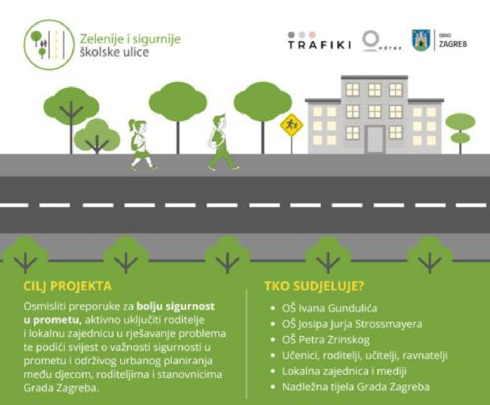 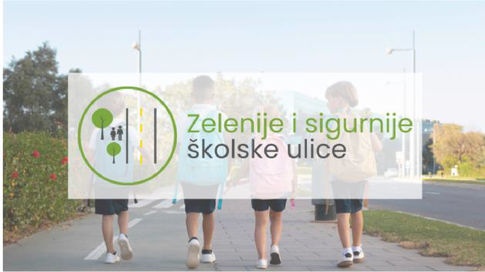</th>
</tr>
<tr>
<th colspan="2"><strong>1.2 Description:</strong></th>
</tr>
<tr>
<th colspan="2" style="text-align: left;">
“Greener and Safer School Streets” is a local participatory project aimed at improving the safety and environmental quality of areas around schools. The project brings together pupils, teachers, parents, local residents, and city representatives to jointly identify traffic and environmental challenges and co-create solutions for safer, greener, and healthier school surroundings. The objectives include raising awareness, building practical problem-solving skills, and strengthening collaboration between schools and their local communities. The main target groups are primary school pupils, teachers, parents, and local authorities.

The project is designed and implemented by NGOs TRAFIKA and ODRAZ-Sustainable community development, and funded by Donji Grad City District Council and the Councils of the local committees “Cvjetni trg” and “Petar Zrinski”.
</th>
</tr>
<tr>
<th colspan="2"><strong>1.3 Context:</strong></th>
</tr>
<tr>
<th colspan="2" style="text-align: left;">
The "Greener and Safer School Streets" project was implemented in the Donji Grad district of Zagreb, Croatia, focusing on urban primary schools within this central city area. The participating institutions are situated in densely populated neighborhoods characterized by mixed residential and commercial zones, where heavy traffic and limited green spaces present daily challenges. The student population is diverse, reflecting a range of socio-economic backgrounds. The educational context involves collaboration between school administrations, teachers, students, parents, local community members, and city

officials, aiming to enhance the safety and environmental quality of the streets surrounding the schools. This initiative encourages active participation from all stakeholders to identify issues and develop sustainable solutions tailored to the specific needs of their urban school environments.
</th>
</tr>
<tr>
<th colspan="2"><strong>1.4 Selection Criteria:</strong></th>
</tr>
<tr>
<th><strong>Impact:</strong></th>
<th style="text-align: left;">
The project significantly improved participants’ understanding of sustainability in the context of everyday urban life. Pupils became more aware of how traffic, air quality, noise, and green spaces affect their health and well-being. They learned to observe, document, and critically assess their surroundings, gaining skills in environmental mapping, teamwork, and civic engagement.

Teachers noted increased student motivation when learning was connected to real-life issues in their own neighborhood. The project fostered a sense of responsibility and agency among children, encouraging them to see themselves as contributors to positive community change.
</th>
</tr>
<tr>
<th><strong>Innovation:</strong></th>
<th style="text-align: left;">The project uses a child-led, place-based approach where students act as “local experts” who map problems, propose solutions, and co-create safer, greener school zones-blending civic education with environmental action.</th>
</tr>
<tr>
<th><strong>Replicability:</strong></th>
<th style="text-align: left;">The practice is highly replicable as it requires minimal resources and relies on local knowledge, community participation, and simple tools like maps and observation sheets. It can be adapted to any school setting-urban or rural-by engaging students in assessing and improving their immediate environment.</th>
</tr>
<tr>
<th><strong>Participation:</strong></th>
<th style="text-align: left;">Students lead field observations and propose improvements; teachers integrate the activities into classroom learning; parents and local residents share insights and support actions; and local councils collaborate in planning and implementing changes-creating a fully participatory, community-driven process.</th>
</tr>
<tr>
<th colspan="2"><ol start="5" type="1">
<li>
<strong>Sources of Collection:</strong>
</li>
</ol></th>
</tr>
<tr>
<th colspan="2"><ul>
<li>
<a href="https://www.odraz.hr/projekti/svi-projekti/zelenije-i-sigurnije-skolske-ulice/?fbclid=IwZXh0bgNhZW0CMTAAAR0c6bs1HL5t8odXFqI3Jao7_vBrfq2PxoTOGim2UoN6zxTkg1ZCafEod78_aem_yM028XqeqKEtRBvqwzjimw"><u>https://www.odraz.hr/projekti/svi-projekti/zelenije-i-sigurnije-skolske-ulice/?fbclid=IwZXh0bgNhZW0CMTAAAR0c6bs1HL5t8odXFqI3Jao7_vBrfq2PxoTOGim2UoN6zxTkg1ZCafEod78_aem_yM028XqeqKEtRBvqwzjimw</u></a>
</li>
<li>
<a href="https://www.facebook.com/odraz.odrzivi.razvoj.zajednice/photos/novi-projekt-zelenije-i-sigurnije-%C5%A1kolske-ulice-u%C4%8Denici-roditelji-u%C4%8Ditelji-i-lok/1069352341900570/"><u>https://www.facebook.com/odraz.odrzivi.razvoj.zajednice/photos/novi-projekt-zelenije-i-sigurnije-%C5%A1kolske-ulice-u%C4%8Denici-roditelji-u%C4%8Ditelji-i-lok/1069352341900570/</u></a>
</li>
</ul></th>
</tr>
<tr>
<th colspan="2"><strong>1.6 Results:</strong></th>
</tr>
<tr>
<th colspan="2" style="text-align: left;">
<strong>Increased awareness and knowledge about sustainable development:</strong> Pupils are expected to gain a deeper understanding of environmental challenges and sustainable practices in their urban surroundings.

<strong>Improved critical thinking and problem-solving skills:</strong> Through active involvement in identifying and addressing real-life issues, students will develop practical skills related to observation, analysis, and civic engagement.

<strong>Active community involvement:</strong> The project aims to strengthen cooperation between schools, parents, local authorities, and other community stakeholders, fostering a shared sense of responsibility.

<strong>Tangible improvements in school environments:</strong> It is anticipated that student-led proposals will result in safety and sustainability enhancements such as improved pedestrian crossings, traffic reduction near schools, and increased green space.

<strong>A model for future initiatives:</strong> If successful, this approach could serve as an inspiring and adaptable model for other schools and neighborhoods facing similar challenges.
</th>
</tr>
</thead>
<tbody>
</tbody>
</table>

<table style="width:100%;">
<colgroup>
<col style="width: 16%" />
<col style="width: 83%" />
</colgroup>
<thead>
<tr>
<th colspan="2"><strong>1.1 Good Practice Title:</strong></th>
</tr>
<tr>
<th colspan="2" style="text-align: left;">InnoVET – INNOVATION AND PARTICIPATION IN THE DIGITAL AND GREEN TRANSITION OF VOCATIONAL EDUCATION AND TOURISM</th>
</tr>
<tr>
<th colspan="2"><strong>1.1.1 Picture if available</strong></th>
</tr>
<tr>
<th colspan="2" style="text-align: center;">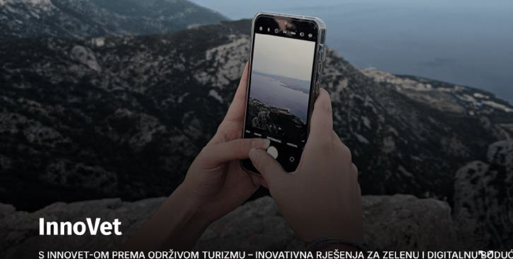</th>
</tr>
<tr>
<th colspan="2"><strong>1.2 Description:</strong></th>
</tr>
<tr>
<th colspan="2" style="text-align: left;">
InnoVET is an Erasmus+ project (2022–2024) focused on empowering vocational education students to take an active role in the digital and green transformation of the tourism sector. The project brought together VET schools, tourism boards, and IT experts to develop concrete tools for identifying environmental challenges and promoting sustainable tourism. Its key innovation is a mobile application that helps users discover local tourist attractions while also enabling them to report environmental incidents such as illegal dumping or water pollution.

The project targeted VET students, teachers, and professionals in the tourism and IT sectors, aiming to equip them with relevant 21st-century skills for sustainability and digital innovation.
</th>
</tr>
<tr>
<th colspan="2"><strong>1.3 Context:</strong></th>
</tr>
<tr>
<th colspan="2" style="text-align: left;">
The project was implemented in Croatia, Slovenia, and Serbia, with participating VET schools from Karlovac, Maribor, and Belgrade. The educational setting included upper secondary vocational schools with a focus on tourism, ICT, and environmental education. The initiative connected students and teachers with real-world actors, including the

Karlovac County Tourist Board and Ericsson Nikola Tesla. The cross-border collaboration emphasized applied learning, interdisciplinary cooperation, and student agency in addressing local sustainability challenges.
</th>
</tr>
<tr>
<th colspan="2"><strong>1.4 Selection Criteria:</strong></th>
</tr>
<tr>
<th><strong>Impact:</strong></th>
<th style="text-align: left;">Students gained practical skills in identifying and addressing environmental issues through the lens of sustainable tourism. They improved digital literacy, environmental awareness, and critical thinking while developing solutions with real-world value.</th>
</tr>
<tr>
<th><strong>Innovation:</strong></th>
<th style="text-align: left;">The creation of a mobile app combining eco-reporting and tourist information is a novel approach to teaching sustainability. The app functions as both an educational tool and a mechanism for citizen engagement.</th>
</tr>
<tr>
<th><strong>Replicability:</strong></th>
<th style="text-align: left;">The project model can easily be adapted to other VET contexts or tourism-focused regions. The app and training materials are publicly available and designed to be transferable across different communities and countries.</th>
</tr>
<tr>
<th><strong>Participation:</strong></th>
<th style="text-align: left;">Students co-created content and participated in app testing. Teachers integrated the project into lessons. Local businesses, municipal offices, and tourism boards contributed expertise and supported the project’s dissemination.</th>
</tr>
<tr>
<th colspan="2"><strong>1.5 Sources of Collection:</strong></th>
</tr>
<tr>
<th colspan="2"><ul>
<li>
<a href="https://visitkarlovaccounty.hr/hr/erasmus-innovet/"><u>https://visitkarlovaccounty.hr/hr/erasmus-innovet/</u></a>
</li>
</ul></th>
</tr>
<tr>
<th colspan="2"><strong>1.6 Results:</strong></th>
</tr>
<tr>
<th colspan="2" style="text-align: left;">As the project concluded in September 2024, initial results indicate increased student engagement with sustainability topics and strengthened digital competencies. The mobile app developed through the project is already in use and contributes to raising public awareness about local environmental issues. The project has laid the groundwork for ongoing collaboration between schools, tourism organizations, and municipalities, with potential for expansion and long-term impact on sustainable tourism education.</th>
</tr>
</thead>
<tbody>
</tbody>
</table>

| Partner Organization Name | **Asociația UZINADUZINA** |
|---------------------------|---------------------------|
| Country:                  | **ROMANIA**               |
| Contact Person:           | **LIVIU POP**             |
| Date:                     | **30/03/2025**            |

<table style="width:100%;">
<colgroup>
<col style="width: 16%" />
<col style="width: 83%" />
</colgroup>
<thead>
<tr>
<th colspan="2"><strong>1.1 Good Practice Title:</strong></th>
</tr>
<tr>
<th colspan="2" style="text-align: left;">Patrula de Reciclare (Recycling Patrol) – National Environmental Education Program</th>
</tr>
<tr>
<th colspan="2"><strong>1.1.1 Picture if available</strong></th>
</tr>
<tr>
<th colspan="2" style="text-align: center;">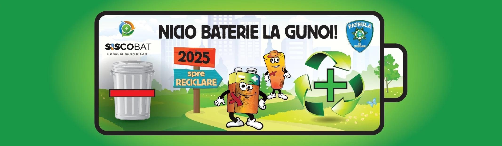</th>
</tr>
<tr>
<th colspan="2"><strong>1.2 Description:</strong></th>
</tr>
<tr>
<th colspan="2" style="text-align: left;">Patrula de Reciclare (Recycling Patrol) is a nationwide environmental education program launched in 2011 to engage students and teachers in responsible e-waste recycling. Its objectives are to raise awareness of sustainable waste management and to actively involve youth in collecting and recycling electronic waste. School-based teams (“patrols”) of students, guided by coordinating teachers, organize e-waste collection campaigns, educational workshops, and community outreach. The target audience is primarily K-12 students and educators across Romania, with broader impact on local communities through awareness campaigns. Over the years, the program has grown into a vibrant network of schools and volunteers, fostering environmental responsibility and hands-on learning for sustainability.</th>
</tr>
<tr>
<th colspan="2"><strong>1.3 Context:</strong></th>
</tr>
<tr>
<th colspan="2" style="text-align: left;">This good practice is implemented in the formal education context as an extracurricular nationwide initiative. Schools from all types (primary, secondary, urban, rural, including special education institutions) voluntarily join the program each year. Romania’s need for improved electronic waste recycling (being decades behind EU standards in 2011) provided the backdrop. The program is coordinated by environmental NGOs (initially Asociația RoRec, now Asociația Volens) in partnership with national authorities. By 2021, Patrula de Reciclare had active participation in hundreds of schools across all counties, including small rural schools and large urban schools, making sustainable development education accessible in diverse geographical and demographic settings. The initiative often runs in parallel with the school year, with dedicated campaigns (e.g., Earth Hour, EU Green Week) that integrate into the school’s activities.</th>
</tr>
<tr>
<th colspan="2"><strong>1.4 Selection Criteria:</strong></th>
</tr>
<tr>
<th><strong>Impact:</strong></th>
<th style="text-align: left;">The program has demonstrated significant improvements in sustainability awareness and action among participants. Patrula de Reciclare has involved over 4,300 teachers and 118,000 children and youths nationwide, who together collected more than 8 million kilograms of waste electrical and electronic equipment for recycling. This collective effort not only diverted substantial e-waste from landfills, but also cultivated eco-conscious habits in hundreds of local communities. Participants report greater knowledge of recycling and a sense of empowerment in contributing to environmental protection. Notably, the initiative provided a successful inclusion experience for students with disabilities or those at risk of school abandonment, by engaging them in collaborative environmental actions. Such outcomes indicate a broad improvement in sustainability-related skills (project management, teamwork, environmental stewardship) and awareness across diverse student groups.</th>
</tr>
<tr>
<th><strong>Innovation:</strong></th>
<th style="text-align: left;">Patrula de Reciclare introduced a creative, hands-on approach to ESD in Romania at a time when waste education was minimal. It employs an original model of “patrol” teams that turn recycling into an interactive, goal-oriented challenge for schools. This approach was novel in leveraging student enthusiasm and friendly competition to drive community recycling efforts. The program regularly integrates creative activities – from art made of recycled materials to digital storytelling about the environment – and has expanded to cover contemporary themes like climate change and circular economy. Its innovative public outreach (such as national contests and eco-pledge campaigns) and the High Patronage it received in 2015 underscored its unique role in Romania’s educational landscape. Patrula’s success and originality have been recognized internationally: it was invited by the European Commission as a benchmark project in the launch of the European Education for Environment Coalition, highlighting its pioneering status in climate education programs.</th>
</tr>
<tr>
<th><strong>Replicability:</strong></th>
<th style="text-align: left;">This practice is highly adaptable to other educational contexts. The “Recycling Patrol” model can be easily replicated by any school or community group with basic guidance on organizing collection campaigns and partnerships with recycling authorities. In fact, the program was scaled up from an initial pilot to a platform of excellence for environmental education, with the intention that its methods be adopted broadly. The structure – forming student eco-teams, setting local recycling targets, and celebrating achievements – is simple and flexible enough to apply in different regions or countries. Many schools sustain the practice year after year, and new schools join annually, evidencing its adaptability. The concept has inspired similar youth-led environmental initiatives beyond e-waste (e.g., battery recycling drives, tree planting patrols), showing that the core approach can be transferred to various sustainability topics.</th>
</tr>
<tr>
<th><strong>Participation:</strong></th>
<th style="text-align: left;">Active involvement of students, teachers, and the community is at the heart of Patrula de Reciclare. Students take on key roles as “eco-ambassadors,” designing posters, giving presentations, and leading collection events in their neighborhoods. Teachers mentor the students and often integrate the project with classroom lessons (science, civic education, etc.), reinforcing learning through practice. Parents and local community members are engaged by contributing their used electronics to the school’s recycling drives. To date, tens of thousands of citizens have been indirectly reached and mobilized by these student-led actions. The program’s collaborative nature also extends to partnerships: schools work with local recycling companies and authorities who help remove the collected e-waste. This multi-level participation – from individual students to national agencies – not only enriches the learning experience but also builds a community ethos around sustainable practices. Moreover, the inclusivity of the program (involving students of different ages, abilities, and backgrounds) has strengthened social cohesion; participants learn from each other and feel collectively responsible for the environmental outcome.</th>
</tr>
<tr>
<th colspan="2"><strong>1.5 Sources of Collection:</strong></th>
</tr>
<tr>
<th colspan="2"><ul>
<li>
<a href="https://www.patruladereciclare.ro/">Official program website and materials (Asociația Volens – Patrula de Reciclare) – including program reports and guides.</a>
</li>
<li>
<a href="https://adevarul.ro/stiri-interne/educatie/zeci-de-mii-de-profesori-si-elevi-intr-un-program-2126319.html#:~:text=Derulat%20din%202011,%20programul%20de,mii%20de%20elevi%20%C5%9Fi%20profesori">National media interviews and articles featuring the program’s coordinators and results (e.g., Adevărul newspaper).</a>
</li>
<li>
<a href="https://www.cnr-unesco.ro/admin/uploads/884_prezentare%20patrula%20de%20reciclare%20unesco.docx#:~:text=%5BDOC%5D%20Patrula%20de%20reciclare%20,excelen%C8%9B%C4%83%20pentru%20educa%C8%9Bia%20de">Press releases and impact reports by the organizing NGOs (RoRec Association, Volens Association), and UNESCO Romania communications endorsing the project as a best practice.</a>
</li>
</ul></th>
</tr>
<tr>
<th colspan="2"><strong>1.6 Results:</strong></th>
</tr>
<tr>
<th colspan="2" style="text-align: left;">Over more than a decade, Patrula de Reciclare has achieved notable qualitative and quantitative results. Quantitatively, as noted, it removed over 8 million kiolograms of e-waste from the environment, contributing directly to Romania’s recycling targets. It built a nationwide network of environmentally conscious educators and students; by its 10th year, 4,300 teachers and 118,000 students had participated, many schools establishing permanent recycling points as a result of the project. Qualitatively, participating schools report heightened environmental awareness and activism among their students. Teachers observed improvements in students’ teamwork, leadership, and problem-solving skills through their patrol activities. The program’s inclusive approach yielded social benefits, integrating students with special needs into team activities and improving their confidence and social skills. Patrula de Reciclare has received several accolades, and its members have been celebrated as “eco-champions” nationally. The continuity of the program (reaching Edition X in 2021 ) indicates sustained effectiveness. Many alumni of the program carry forward the values of sustainability – some have initiated recycling actions in their high schools or communities after moving on. In sum, the Recycling Patrol has proven to be an effective ESD practice that produces measurable environmental impact and instills long-term sustainability mindsets in the younger generation.</th>
</tr>
</thead>
<tbody>
</tbody>
</table>

<table style="width:100%;">
<colgroup>
<col style="width: 16%" />
<col style="width: 83%" />
</colgroup>
<thead>
<tr>
<th colspan="2"><strong>1.1 Good Practice Title:</strong></th>
</tr>
<tr>
<th colspan="2" style="text-align: left;">Eco-Școala (Eco-Schools Program) – EDUCATION FOR SUSTAINABLE DEVELOPMENT IN SCHOOLS</th>
</tr>
<tr>
<th colspan="2"><strong>1.1.1 Picture if available</strong></th>
</tr>
<tr>
<th colspan="2" style="text-align: center;">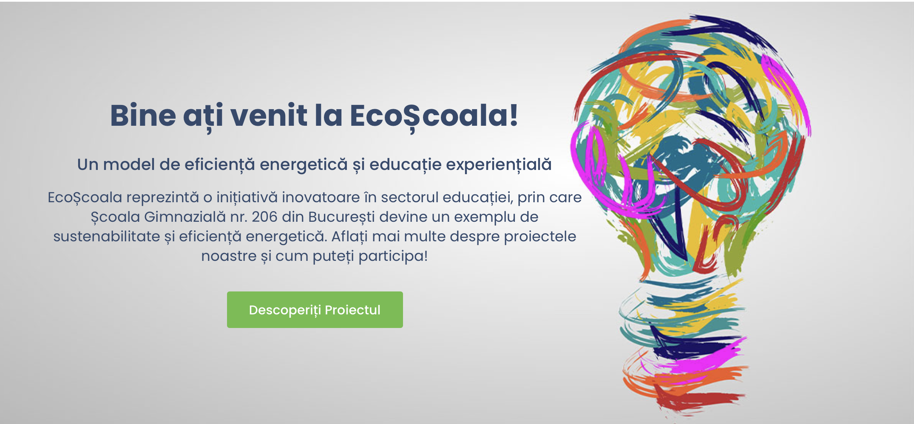</th>
</tr>
<tr>
<th colspan="2"><strong>1.2 Description:</strong></th>
</tr>
<tr>
<th colspan="2" style="text-align: left;">The Eco-Școala program is the Romanian implementation of the international Eco-Schools initiative, which integrates Education for Sustainable Development into the daily life of schools. Coordinated nationally by the Carpatho-Danubian Center for Geoecology (CCDG) since 1999, this program guides schools through a structured framework to improve their environmental performance and sustainability education. Its objectives include incorporating environmental topics (such as waste, water, energy, biodiversity, etc.) into the curriculum and school culture, reducing the school’s ecological footprint, and empowering students to take leadership in “greening” their school. The target audience spans all pre-university education levels – from kindergartens to high schools – that voluntarily enroll in the program. Schools that successfully implement the required steps (forming an Eco-Committee, auditing their environmental impact, creating an action plan, and monitoring progress) over a two-year cycle are awarded the Green Flag certification, an internationally recognized symbol of excellence in ESD. Through Eco-Școala, students engage in projects like school gardens, recycling drives, energy saving campaigns, and community clean-ups, making sustainability a tangible and continuous learning experience.</th>
</tr>
<tr>
<th colspan="2"><strong>1.3 Context:</strong></th>
</tr>
<tr>
<th colspan="2" style="text-align: left;">Eco-Școala was introduced in Romania at a time when environmental education was largely extracurricular. Since its debut with 5 pilot schools in 1999, it has expanded dramatically within the Romanian education system. The program operates in public and private schools across all regions of Romania, under various socio-economic conditions. By the end of the 2023/2024 school year, approximately 850 school units nationwide (including primary schools, secondary schools, high schools, vocational schools, special education institutions, and even children’s clubs) have participated in Eco-Școala at some point, with 265 schools currently active in the program. This widespread adoption illustrates the program’s adaptability to local contexts – from rural village schools to large urban colleges. The national coordination by CCDG provides training sessions, educational resources, and an annual seminar to share best practices. Local authorities often support schools in their sustainability projects (for example, city halls may help with tree-planting events or waste management facilities). Given Romania’s commitment to the UN Sustainable Development Goals and the Ministry of Education’s encouragement of environmental initiatives, Eco-Școala has become a cornerstone of ESD in the country, fostering a culture of sustainability in formal education.</th>
</tr>
<tr>
<th colspan="2"><strong>1.4 Selection Criteria:</strong></th>
</tr>
<tr>
<th><strong>Impact:</strong></th>
<th style="text-align: left;">The Eco-Școala program has a broad and sustained impact on raising sustainability awareness and skills among students and educators. Thousands of Romanian students each year learn to assess and improve their immediate environment through this program. Since its inception, around 850 educational institutions in Romania have implemented Eco-Școala’s 7-step methodology, and as of 2024, 265 schools actively hold the Green Flag status, reflecting ongoing commitment. The impact is evident in tangible improvements: participating schools report reduced waste and energy use on campus, creation of green spaces (like small gardens or eco-corners in classrooms), and improved recycling habits in the school community. Moreover, students involved in Eco-Școala demonstrate greater knowledge of environmental issues and more responsible attitudes. They learn to link local environmental problems to global sustainability challenges, and they gain practical skills in project management and eco-innovation. Teachers also benefit by deepening their understanding of sustainable development and learning new pedagogical approaches for ESD. The program’s influence often extends beyond the school walls – many Eco-Școala institutions become local hubs for environmental action, organizing community events such as Earth Day fairs, environmental contests, or neighborhood clean-ups. Through qualitative outcomes like increased student leadership and quantitative outcomes like waste reductions, Eco-Școala significantly advances ESD goals in Romanian education.</th>
</tr>
<tr>
<th><strong>Innovation:</strong></th>
<th style="text-align: left;">Eco-Școala introduced a pioneering, student-centered approach to environmental education in Romania. Its innovation lies in making students key actors in driving change: each school forms an Eco Committee that typically includes students, teachers, parents, and local stakeholders, giving students a voice in decision-making about the school’s sustainability practices. This was a novel concept for Romanian schools, creating a participatory governance model at the school level. The program is holistic, covering up to 12 thematic areas of sustainability (from climate change and biodiversity to waste and healthy living) , and encourages creative, project-based learning in each area. Students might conduct experiments on water quality, develop awareness campaigns, or design innovative solutions like solar chargers or rainwater harvesting systems, depending on the themes chosen. The continuous improvement cycle (plan-do-check-act) built into Eco-Școala ensures that innovation is ongoing; schools often set new targets every year, fostering a culture of continuous creative problem-solving. At an international level, Eco-Schools is supported by the EU, UNESCO, and UNEP and is implemented in 68 countries worldwide. Romanian schools, by participating, join this international network – an innovative aspect that enables cross-cultural exchange of ideas (some Romanian Eco-Schools have twinned with schools abroad to share project innovations). Thus, Eco-Școala’s framework itself is an innovative educational model, and it continually spurs schools to devise original, student-led sustainability initiatives.</th>
</tr>
<tr>
<th><strong>Replicability:</strong></th>
<th style="text-align: left;">Replicability is a core strength of Eco-Școala – the program is explicitly designed to be replicated across different contexts and has been scaled globally. In Romania, it has been successfully adapted to all types of schools (small rural schools, large urban schools, kindergartens, technical colleges, etc.), demonstrating flexibility. The requirements for participation (such as forming a committee, doing an environmental review, and implementing at least two sustainability themes) are clear and attainable, yet allow each school to tailor activities to its reality. For instance, one school might focus on waste and water conservation, while another emphasizes biodiversity and energy, based on local needs. The availability of a detailed guide and support from CCDG makes it easy for new schools to adopt the program’s methodology. Many elements of Eco-Școala can also be replicated informally: even schools that are not officially in the program have used the 7-step framework as a model to start their own green initiatives. The fact that 265+ Romanian schools remain active indicates that the practice is sustainable and can be re-run annually with new student cohorts. Additionally, the Eco-Școala concept has been replicated through national campaigns like “Școala Verde” (Green School) and “Săptămâna Verde” (Green Week) introduced by the Ministry of Education, which borrow from the Eco-Schools philosophy to spread ESD practices nationwide. Overall, the program’s structure and success stories provide a replicable blueprint for any educational institution aiming to integrate sustainable development into its teaching and operations.</th>
</tr>
<tr>
<th><strong>Participation:</strong></th>
<th style="text-align: left;">Active participation is fundamentally built into Eco-Școala’s design. The program requires whole-school involvement: active support from the school leadership and local authorities, genuine decision-making roles for students, and engagement of the entire teaching staff. Students participate through the Eco Committee and various working teams; they investigate issues (like auditing how much energy the school uses), propose solutions, and implement action plans (such as starting a recycling program or creating a butterfly garden). This gives students a sense of ownership and responsibility for their school environment – they become “protagonists of their own education,” developing leadership and collaboration skills in the process. Teachers participate by embedding ESD topics into lessons and by mentoring student projects, often working across disciplines (e.g. a biology and art teacher might co-lead a project on creating recycled art to depict ecosystems). School principals and administrators are involved by aligning school policies (like procurement or maintenance) with the green action plans students create, demonstrating institutional participation. Parents and community members are also drawn in – many Eco-Schools host community events (tree plantings, eco-fairs) and collaborate with local businesses or NGOs for resources and expertise. This broad participation ensures that the program is not an isolated effort but a communal one, reinforcing the values of sustainability at multiple levels. The participatory approach has proven effective in changing mindsets: students influence their families’ habits (such as energy saving at home), and teachers often become sustainability champions in their broader community. In summary, Eco-Școala actively involves all stakeholders in the education process, creating a participatory culture that extends from the classroom to the community.</th>
</tr>
<tr>
<th colspan="2"><ol start="5" type="1">
<li>
<strong>Sources of Collection:</strong>
</li>
</ol></th>
</tr>
<tr>
<th colspan="2"><ul>
<li>
<a href="https://www.ccdg.ro/programe/eco-scoala#:~:text=%C3%8En%20Romania,%20Programul%20Eco,fiind%C2%A0active%20un%20num%C4%83r%20de%20265">Centrul Carpato-Danubian de Geoecologie (CCDG) – official Eco-Școala program guidelines, statistics, and annual reports (e.g., data on number of schools and thematic areas)</a>;
</li>
<li>
<a href="https://scoalacuzabacau.ro/eco-schools-eco-scoala/#:~:text=Eco,Programul%20Na%C5%A3iunilor%20Unite%20pentru%20Mediu">Eco-Schools International – background on the global program and its recognition by bodies like UNESCO and UNEP</a>;
</li>
<li>
<a href="https://www.ccdg.ro/programe/eco-scoala/beneficiile-programului#:~:text=Elevii:">Educational portals and articles – documentation of Eco-Școala benefits and steps (e.g., didactic resources on the 7 steps and lists of outcomes for students and teachers)</a>.
</li>
</ul></th>
</tr>
<tr>
<th colspan="2"><strong>1.6 Results:</strong></th>
</tr>
<tr>
<th colspan="2" style="text-align: left;">In over two decades of implementation in Romania, the Eco-Școala program has yielded substantial results in cultivating sustainable schools. Quantitative results include the large number of schools engaged (265 currently active, cumulatively 850+ involved) and the repeated renewal of Green Flags – many schools have maintained their Eco-Școala status for multiple cycles, with some proudly renewing the Green Flag 5 or more times, indicating long-term commitment . Schools have implemented countless practical improvements: for example, schools have reported cutting down their waste by significant percentages after starting recycling and composting, or reducing electricity consumption by switching to energy-efficient lighting as part of student-driven action plans. Some schools have secured small grants or community funding to install solar panels, rainwater harvesting systems, or to plant trees, directly improving local environmental quality. Qualitative results are evident in the transformative educational experiences seen at Eco-Schools. Students involved often show increased environmental literacy and civic engagement; they are more likely to volunteer and initiate sustainability projects outside school. Teachers note that project-based involvement in Eco-Școala boosts student motivation and teamwork skills. The ethos of “learning by doing” has led to innovative student projects—ranging from designing eco-fashion shows with reused materials to conducting awareness campaigns on biodiversity in their towns—that have garnered local and even national recognition. The program’s community impact is also significant: many Eco-Școala activities involve local residents (e.g., neighborhood cleanup events), thereby raising environmental awareness beyond the school. Importantly, Eco-Școala has institutionalized ESD in many participating schools; environmental topics have been integrated into school curricula and annual plans as a direct result of the program. Schools often share their successes at the annual national Eco-Școala symposium, creating a ripple effect of inspiration. In summary, the Eco-Școala good practice has led to greener school operations, empowered students as change agents, and forged stronger school-community partnerships for sustainable development . Its longevity and continual growth in Romania attest to its effectiveness in nurturing a generation of environmentally conscious citizens.</th>
</tr>
</thead>
<tbody>
</tbody>
</table>

<table>
<colgroup>
<col style="width: 100%" />
</colgroup>
<thead>
<tr>
<th><h1 id="section-2">Section 2:</h1></th>
</tr>
<tr>
<th><h1 id="good-practices-in-teal-methodology">Good Practices in TEAL Methodology</h1></th>
</tr>
</thead>
<tbody>
</tbody>
</table>

| Partner Organization Name | **ACTA Center**   |
|---------------------------|-------------------|
| Country:                  | **ROMANIA**       |
| Contact Person:           | **MARIANA RATIU** |
| Date:                     | **March 2025**    |

<table style="width:100%;">
<colgroup>
<col style="width: 16%" />
<col style="width: 83%" />
</colgroup>
<thead>
<tr>
<th colspan="2"><strong>2.1 Good Practice Title:</strong></th>
</tr>
<tr>
<th colspan="2" style="text-align: left;">CircuTex – INNOVATIVE LEARNING SOLUTIONS FOR A GREENER FUTURE</th>
</tr>
<tr>
<th colspan="2"><strong>2.1.1 Picture if available</strong></th>
</tr>
<tr>
<th colspan="2" style="text-align: center;">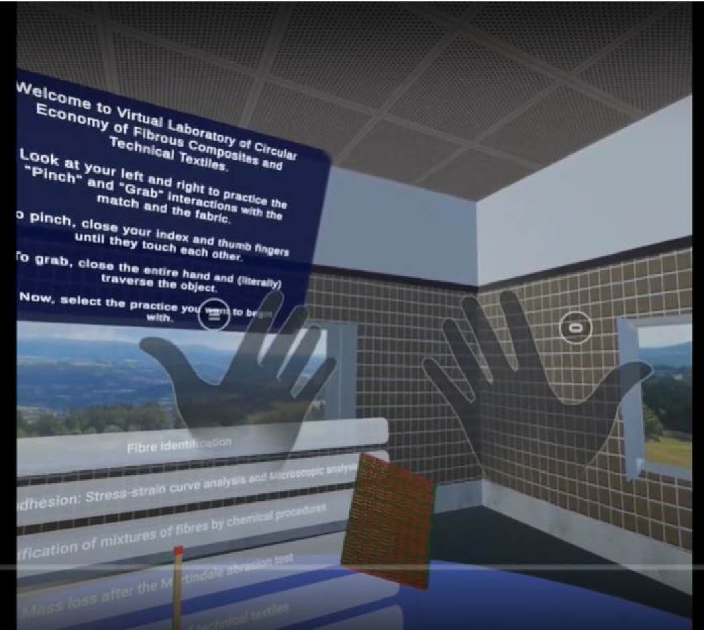</th>
</tr>
<tr>
<th colspan="2"><strong>2.2 Description:</strong></th>
</tr>
<tr>
<th colspan="2" style="text-align: left;">
CircuTex is an Erasmus+ project which aims to enhance the sustainability competences of HEI students and educators in the sector of fibrous composites and technical textiles, by using an eLearning platform and Virtual Reality Laboratory.

CircuTex aims at offering an online course on circular economy for fibrous composites and technical textiles, which will help students, who are enrolled in relevant fields in their Universities to upskill their sustainability competences and raise their awareness on how to reduce the effect that fibrous composites and technical textiles have on the climate change.
</th>
</tr>
<tr>
<th colspan="2"><strong>2.3 Context:</strong></th>
</tr>
<tr>
<th colspan="2" style="text-align: left;">CircuTex is a partnership project between four European universities in Spain, Romania, Lithuania and Greece and a company specializing in business consulting, training services and high-tech applications from Greece.</th>
</tr>
<tr>
<th colspan="2"><strong>2.4 Selection Criteria:</strong></th>
</tr>
<tr>
<th style="text-align: left;"><strong>Effectiveness:</strong></th>
<th style="text-align: left;">The students can access the virtual laboratory, by using virtual reality equipment. The laboratory includes virtual “digital twins” of actual laboratory equipment, enhanced with 3D representations and virtual movement. Through this tool, they are able to test and apply experiments related to the circular economy of fibrous composites and technical textiles. Thus, CircuTex aims to motivate and responsible the students, in order to increase their engagement, content comprehension, and learning outcomes.</th>
</tr>
<tr>
<th style="text-align: left;"><strong>Technology:</strong></th>
<th><ol type="a">
<li>
ELearning course on circular economy of fibrous composites and technical textiles.
</li>
<li>
Virtual laboratory for the implementation of virtual experiments.
</li>
</ol></th>
</tr>
<tr>
<th style="text-align: left;"><strong>Collaboration:</strong></th>
<th style="text-align: left;">To carry out experiments in the virtual lab, students are divided into groups and participate in discussions in which they share their own experience, each of them being excited by the new working tools and discoveries they have access to through virtual reality.</th>
</tr>
<tr>
<th style="text-align: left;"><strong>Feedback:</strong></th>
<th style="text-align: left;">The eLearning course is modular and self-passed, and based on learning outcomes and competences. It includes assessment of knowledge gained and offers certification.</th>
</tr>
<tr>
<th colspan="2"><strong>2.5 Sources of Collection</strong>:</th>
</tr>
<tr>
<th colspan="2"><ul>
<li>
<a href="https://circutex.eu/"><u>https://circutex.eu/</u></a>
</li>
</ul></th>
</tr>
<tr>
<th colspan="2"><strong>2.6 Results</strong>:</th>
</tr>
<tr>
<th colspan="2" style="text-align: left;">
The outcomes of the project are:

<ol type="1">
<li>
Capacity building:

<ol type="a">
<li>
of Higher Education educators and students in applying sustainability processes in the design, production, use, and recycling of fibrous composites and technical textiles.
</li>
<li>
of Higher Education educators in applying virtual reality.
</li>
</ol></li>
<li>
Awareness-raising:

<ol type="a">
<li>
about the environmental impact of fibrous composites and technical textiles.
</li>
<li>
about the need to apply circular economy in the life cycle of fibrous composites and technical textiles.
</li>
</ol></li>
</ol>

<em><strong>CircuTex – Innovative learning solutions for a greener future</strong></em>, by its own name, as well as by the materials developed and equipment used, is perfectly compatible with the objectives and the results of the project “<em><strong>Drops of Sustainability</strong></em>”:

<ul>
<li>
It is specially designed for adults to cultivate the skills and competences needed for a greener future.
</li>
<li>
It offers a more active, effective, engaging, and innovative learning in line with TEAL methodology and that promotes responsibility for a sustainable future.
</li>
<li>
It promotes collaboration and participation among the participants.
</li>
</ul></th>
</tr>
</thead>
<tbody>
</tbody>
</table>

<table style="width:100%;">
<colgroup>
<col style="width: 16%" />
<col style="width: 83%" />
</colgroup>
<thead>
<tr>
<th colspan="2"><strong>2.1 Good Practice Title:</strong></th>
</tr>
<tr>
<th colspan="2" style="text-align: left;">ELEMENTS OF AI FREE ONLINE COURSES</th>
</tr>
<tr>
<th colspan="2"><strong>2.1.1 Picture if available</strong></th>
</tr>
<tr>
<th colspan="2" style="text-align: center;">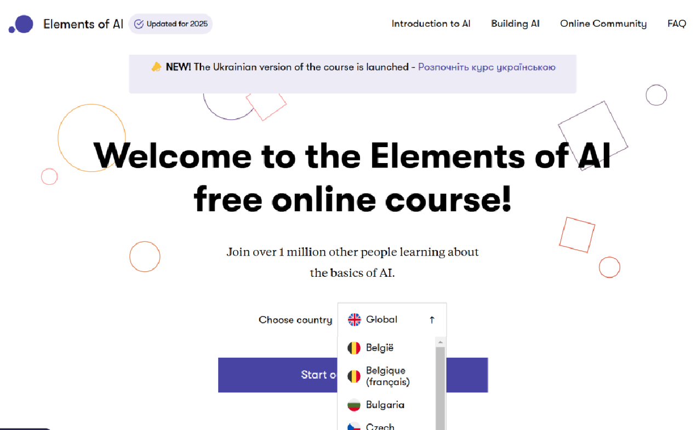</th>
</tr>
<tr>
<th colspan="2"><strong>2.2 Description:</strong></th>
</tr>
<tr>
<th colspan="2" style="text-align: left;">The Elements of AI is a series of free online courses created in order to encourage as broad a group of people as possible to learn what AI is, what can (and can’t) be done with AI, and how to start creating AI methods. The courses combine theory with practical exercises and can be completed at own pace of each learner.</th>
</tr>
<tr>
<th colspan="2"><strong>2.3 Context:</strong></th>
</tr>
<tr>
<th colspan="2" style="text-align: left;">The courses are created by MinnaLearn and the University of Helsinki and they are available in 30 countries, including Romania, through the partners Romanian American University and Bucharest AI. Over 1 million people have already learned about the basics of AI in these courses.</th>
</tr>
<tr>
<th colspan="2"><strong>2.4 Selection Criteria:</strong></th>
</tr>
<tr>
<th style="text-align: left;"><strong>Effectiveness:</strong></th>
<th style="text-align: left;">Even if the learners do not interact directly during the course, the improvement of their level of knowledge in this field will be an effective one, which can be shared with other people. Over 1 million other people learning about the basics of AI.</th>
</tr>
<tr>
<th style="text-align: left;"><strong>Technology:</strong></th>
<th style="text-align: left;">The courses are about AI, that is going to have as big an impact on our society as electricity, according to Risto Siilasmaa, Chairman of board, Nokia.</th>
</tr>
<tr>
<th style="text-align: left;"><strong>Collaboration:</strong></th>
<th style="text-align: left;">The courses available for companies are for groups of 6-10 people. Even if it is a question of going through the courses individually, the learning results can be shared and discussed in teams, thus contributing to a better understanding of the concepts and methods learned.</th>
</tr>
<tr>
<th style="text-align: left;"><strong>Feedback:</strong></th>
<th style="text-align: left;">Each module includes practical exercises and a test at the end, the Turing test, an imitation game, in which a human interrogator interacts with two players, A and B, by exchanging written messages (in a chat).</th>
</tr>
<tr>
<th colspan="2"><strong>2.5 Sources of Collection</strong>:</th>
</tr>
<tr>
<th colspan="2"><ul>
<li>
<a href="https://www.elementsofai.com/"><u>https://www.elementsofai.com/</u></a>
</li>
<li>
<a href="https://courses.minnalearn.com/"><u>https://courses.minnalearn.com/</u></a>
</li>
<li>
<a href="https://www.elementsofai.ro/"><u>https://www.elementsofai.ro/</u></a>
</li>
</ul></th>
</tr>
<tr>
<th colspan="2"><strong>2.6 Results</strong>:</th>
</tr>
<tr>
<th colspan="2" style="text-align: left;">
The main goal of the course is to demystify AI and it comprises two parts for individuals and one part for companies:

<ol type="1">
<li>
Part 1. Introduction to AI, an online course for everyone interested in learning what AI is, what is possible (and not possible) with AI, and how it affects our lives – with no complicated math or programming required.
</li>
<li>
Part 2. Building AI, an online course where participants learn about the actual algorithms that make creating AI methods possible. Some basic Python programming skills are recommended to get the most out of the course.
</li>
</ol>

For Companies. Bring AI Learning to Your Organization, supporting the needs of the organisations to develop new AI training content for LMS platforms, with high-quality materials to make AI approachable and practical for all knowledge workers.

In essence, the connection between "<em><strong>Elements of AI</strong></em>" and "<em><strong>Drops of Sustainability</strong></em>" lies in how AI can empower individuals, organizations, and industries to make smarter, more sustainable decisions, leveraging data and technology to ensure a greener future.

<ul>
<li>
AI technologies covered in the "Elements of AI" course can be used to address sustainability challenges. For instance, AI can help optimize energy use, reduce waste, and predict environmental patterns. The course could teach how machine learning algorithms can analyse large datasets related to climate change, resource management, and ecological sustainability.
</li>
<li>
The course could explore how AI tools can enable smarter decision-making for sustainable practices, or contribute to larger environmental or societal impacts, such as reducing carbon emissions or improving water management systems.
</li>
<li>
The "Elements of AI" course can teach students how AI algorithms can be applied in sectors like agriculture, water management, and waste recycling, thus promoting a more sustainable future. For example, AI could optimize farming techniques, improve water conservation strategies, or streamline waste management.
</li>
<li>
AI can play a role in monitoring environmental changes or tracking sustainability progress. In the context of "Drops of Sustainability," AI models could be used to assess how individual or collective actions impact sustainability goals, helping to quantify and visualize the progress made.
</li>
</ul></th>
</tr>
</thead>
<tbody>
</tbody>
</table>

| Partner Organization Name | **CCIF Cyprus**        |
|---------------------------|------------------------|
| Country:                  | **CYPRUS**             |
| Contact Person:           | **MARINA ARISTODIMOU** |
| Date:                     | **March 2025**         |

<table style="width:100%;">
<colgroup>
<col style="width: 20%" />
<col style="width: 79%" />
</colgroup>
<thead>
<tr>
<th colspan="2"><strong>2.1 Good Practice Title:</strong></th>
</tr>
<tr>
<th colspan="2" style="text-align: left;">THE SKILLS FOR THE GREEN TRANSFORMATION TOOLKIT</th>
</tr>
<tr>
<th colspan="2"><strong>2.1.1 Picture if available</strong></th>
</tr>
<tr>
<th colspan="2" style="text-align: center;">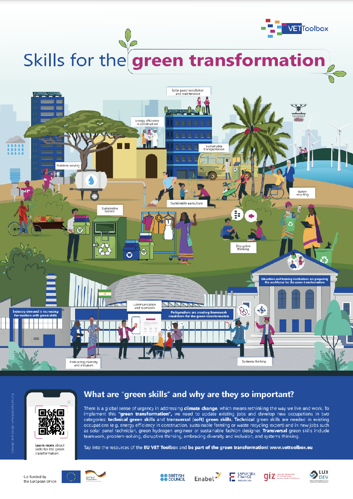</th>
</tr>
<tr>
<th colspan="2"><strong>2.2 Description:</strong></th>
</tr>
<tr>
<th colspan="2" style="text-align: left;">It is an interactive resource from the EU-funded VET Toolbox that highlights global good practices for developing green skills and supporting a just, sustainable transition. It offers practical tools and approaches across eight thematic areas, including curriculum reform and circular economy. Its objectives are to guide policy and institutional change, promote green education strategies, and foster cross-sector collaboration. The toolkit targets stakeholders at all levels: policy-makers, educational institutions, and individual educators and trainers involved in vocational and higher education.</th>
</tr>
<tr>
<th colspan="2"><strong>2.3 Context:</strong></th>
</tr>
<tr>
<th colspan="2" style="text-align: left;">The S4GT Toolkit was implemented across diverse educational settings in Sub-Saharan Africa, Asia, Latin America, and Europe through the EU’s VET Toolbox initiative. It supports the integration of green skills into vocational education, higher education, adult learning, and teacher training. Applied in institutions ranging from rural vocational schools to national reform programs, the toolkit addresses key sectors like energy, agriculture, and green entrepreneurship. Its target groups include young learners, women, educators, and policymakers, enabling a broad, inclusive approach that builds green capacity at policy, institutional, and individual levels.</th>
</tr>
<tr>
<th colspan="2"><strong>2.4 Selection Criteria:</strong></th>
</tr>
<tr>
<th style="text-align: left;"><strong>Effectiveness:</strong></th>
<th style="text-align: left;">The practice demonstrates increased student interaction and understanding through active, practice-based learning approaches. Key evidence includes the use of Living Labs and green campuses, where students engage in hands-on sustainability projects; practice-focused programs like PESEREE II Senegal that emphasize teamwork and applied research; and youth empowerment initiatives that build ownership and advocacy skills. Additionally, involving students in curriculum co-design enhances critical thinking and engagement. These strategies collectively foster deeper comprehension and collaboration, highlighting the toolkit’s effectiveness in promoting education for sustainable development.</th>
</tr>
<tr>
<th style="text-align: left;"><strong>Technology:</strong></th>
<th style="text-align: left;">
The <em>Skills for the Green Transformation Toolkit</em> employs several technological tools:

<ul>
<li>
Interactive PDF Toolkit: A clickable, multi-layered guide with embedded links to strategies and case studies.
</li>
<li>
Digital Dashboard: A searchable platform showcasing global green skills projects, filterable by country, SDG, and sector.
</li>
<li>
Animated Explainer Videos: Simplify complex concepts and guide users through the toolkit and dashboard.
</li>
<li>
Green Campuses &amp; Living Labs: Educational spaces using real-world sustainable technologies for hands-on learning and research.
</li>
<li>
Posters &amp; Visual Aids: Infographics that help visualize key concepts like skill types and transformation pathways.
</li>
</ul>

These tools are applied innovatively to:

<ul>
<li>
Integrate green technology into education.
</li>
<li>
Connect learning with real-world applications.
</li>
<li>
Offer modular, stakeholder-specific access.
</li>
<li>
Strengthen local capacities through digital replication of best practices.
</li>
</ul></th>
</tr>
<tr>
<th style="text-align: left;"><strong>Collaboration:</strong></th>
<th style="text-align: left;">The S4GT Toolkit fosters teamwork and cooperation by integrating collaborative learning and green transversal skills like communication, leadership, and problem-solving into education. It encourages students to work together on sustainability projects, engage in shared learning environments like green campuses and living labs, and participate in international, cross-institutional collaborations. These approaches help students co-create solutions, build intercultural competencies, and develop a collective sense of responsibility for driving the green transition.</th>
</tr>
<tr>
<th style="text-align: left;"><strong>Feedback:</strong></th>
<th style="text-align: left;">Supports continuous improvement in green skills education through a range of immediate and constructive feedback mechanisms. These include quality certification and on-site validation, which provide real-time feedback on technical performance; Living Labs, where learners and stakeholders collaboratively test and refine solutions; and continuous curriculum review, guided by input from educators and industry. Additionally, monitoring and evaluation (M&amp;E) frameworks track outcomes like employability, while external expert reviews ensure objective assessments. Together, these tools help maintain high training standards and align learning with evolving sustainability needs.</th>
</tr>
<tr>
<th colspan="2"><strong>2.5 Sources of Collection</strong>:</th>
</tr>
<tr>
<th colspan="2"><ul>
<li>
<a href="https://vettoolbox.eu/publications/skills-for-green-transformation/#:~:text=The%20Skills%20for%20the%20Green%20Transformation%20Toolkit%20is%20an%20interactive,examples%20of%20projects%20in%20each"><u>https://vettoolbox.eu/publications/skills-for-green-transformation/#:~:text=The%20Skills%20for%20the%20Green%20Transformation%20Toolkit%20is%20an%20interactive,examples%20of%20projects%20in%20each</u></a>
</li>
</ul></th>
</tr>
<tr>
<th colspan="2"><strong>2.6 Results</strong>:</th>
</tr>
<tr>
<th colspan="2" style="text-align: left;">The S4GT Toolkit has effectively supported green skills development globally by showcasing scalable, real-world projects that inform vocational training and curriculum reform. Key outcomes include improved employability through hands-on learning, institutional integration of sustainability practices, and the empowerment of youth and women via inclusive programs. The toolkit has also driven curriculum updates aligned with labor market needs and proven adaptable across diverse regions. With over 80 innovative and impactful projects analyzed, it serves as a valuable resource for promoting a just and sustainable global transition.</th>
</tr>
</thead>
<tbody>
</tbody>
</table>

<table style="width:100%;">
<colgroup>
<col style="width: 16%" />
<col style="width: 83%" />
</colgroup>
<thead>
<tr>
<th colspan="2"><strong>2.1 Good Practice Title:</strong></th>
</tr>
<tr>
<th colspan="2" style="text-align: left;">AUGMENTED REALITY IN ENVIRONMENTAL EDUCATION</th>
</tr>
<tr>
<th colspan="2"><strong>2.1.1 Picture if available</strong></th>
</tr>
<tr>
<th colspan="2" style="text-align: center;"></th>
</tr>
<tr>
<th colspan="2"><strong>2.2 Description:</strong></th>
</tr>
<tr>
<th colspan="2" style="text-align: left;">AR is an effective tool for enhancing ecological literacy and engagement. Its objectives include promoting active, immersive learning, developing green skills like problem-solving and sustainability thinking, and supporting educators in delivering complex content using TEAL aligned methods. The target audience spans students from primary to tertiary levels, educators, curriculum developers, and even parents, emphasizing AR’s broad educational impact and potential for fostering collaborative, experiential learning in environmental and eco-design education.</th>
</tr>
<tr>
<th colspan="2"><strong>2.3 Context:</strong></th>
</tr>
<tr>
<th colspan="2" style="text-align: left;">The systematic review shows that Augmented Reality (AR) in environmental education has been applied across diverse formal and informal educational settings ranging from primary schools to universities around the world, including Europe, Asia, and North America. These practices target learners aged 10 to 25, particularly in STEM and eco-design fields, while also engaging educators, parents, and communities. AR has proven adaptable across cultural and economic contexts, supporting immersive, inclusive, and collaborative learning experiences aligned with TEAL principles and aiming to bridge digital gaps in underserved regions.</th>
</tr>
<tr>
<th colspan="2"><strong>2.4 Selection Criteria:</strong></th>
</tr>
<tr>
<th style="text-align: left;"><strong>Effectiveness:</strong></th>
<th style="text-align: left;">This significantly improves student interaction and understanding in environmental education. AR increases engagement and motivation, helps visualize complex environmental concepts, and enhances spatial reasoning. It promotes collaboration through peer and community interaction and supports the development of critical thinking, communication, and self-regulation skills. Additionally, AR use has led to positive behavioral changes, with students showing greater initiative in sustainability practices. Overall, AR fosters active, immersive learning aligned with TEAL principles, leading to deeper comprehension and lasting educational impact.</th>
</tr>
<tr>
<th style="text-align: left;"><strong>Technology:</strong></th>
<th style="text-align: left;">
The systematic review highlights a range of innovative AR tools used in environmental education to enhance student engagement and understanding.

Mobile apps, marker-based platforms like Unity and CoSpaces Edu, and AR objects such as MERGE Cube bring environmental concepts to life through interactive 3D models and simulations.

Location-based AR connects learning to real-world environments, while teacher-designed AR experiences allow curriculum customization.

These tools promote immersive, experiential learning, turning students into content creators and bridging formal education with real-world sustainability challenges closely aligning with TEAL methodology.
</th>
</tr>
<tr>
<th style="text-align: left;"><strong>Collaboration:</strong></th>
<th style="text-align: left;">The use of Augmented Reality (AR) in environmental education fosters teamwork by creating collaborative, interactive learning experiences. Students engage in group-based AR activities, problem-solving projects, and peer learning, often adopting different roles to explore environmental challenges. AR also extends collaboration beyond the classroom, involving parents and communities. These practices help students develop key transversal skills such as communication, leadership, and civic responsibility aligning well with both green education goals and the TEAL methodology.</th>
</tr>
<tr>
<th style="text-align: left;"><strong>Feedback:</strong></th>
<th style="text-align: left;">AR in environmental education supports immediate and constructive feedback through interactive features and guided learning tools. Real-time visual cues help students see the outcomes of their actions instantly, while built-in prompts promote self correction. Teacher led debriefings and peer discussions provide additional reflection and feedback. Some AR platforms also include quizzes and checkpoints for instant assessment. These mechanisms encourage active learning, deeper understanding, and align closely with TEAL methodology.</th>
</tr>
<tr>
<th colspan="2"><strong>2.5 Sources of Collection</strong>:</th>
</tr>
<tr>
<th colspan="2"><ul>
<li>
Ladykova, T. I., Sokolova, E. I., Grebenshchikova, L. Y., Sakhieva, R. G., Lapidus, N. I., &amp; Chereshneva, Y. V. (2024). Augmented reality in environmental education: A systematic review. EURASIA Journal of Mathematics, Science and Technology Education, 20(8), em2488. <a href="https://doi.org/10.29333/ejmste/14914"><u>https://doi.org/10.29333/ejmste/14914</u></a>
</li>
</ul></th>
</tr>
<tr>
<th colspan="2"><strong>2.6 Results</strong>:</th>
</tr>
<tr>
<th colspan="2" style="text-align: left;">The review confirms that AR enhances environmental education by improving student engagement, motivation, and understanding of complex ecological concepts. AR supports the development of green and transversal skills like critical thinking and collaboration, while also encouraging environmentally responsible behavior. Teachers and students reported positive experiences with the immersive, hands-on approach. Although primarily qualitative, the evidence shows that AR promotes meaningful, long-term learning and aligns well with TEAL principles, making it an effective tool for sustainability education.</th>
</tr>
</thead>
<tbody>
</tbody>
</table>

| Partner Organization Name | **PETIT PAS**        |
|---------------------------|----------------------|
| Country:                  | **ITALY**            |
| Contact Person:           | **ANGELO RICCHIUTO** |
| Date:                     | **21/03/2025**       |

<table style="width:100%;">
<colgroup>
<col style="width: 16%" />
<col style="width: 83%" />
</colgroup>
<thead>
<tr>
<th colspan="2"><strong>2.1 Good Practice Title:</strong></th>
</tr>
<tr>
<th colspan="2" style="text-align: left;">FLIPPED LEARNING IN ADULT EDUCATION</th>
</tr>
<tr>
<th colspan="2"><ol type="1">
<li>
<strong>Picture if available</strong>
</li>
</ol></th>
</tr>
<tr>
<th colspan="2" style="text-align: center;">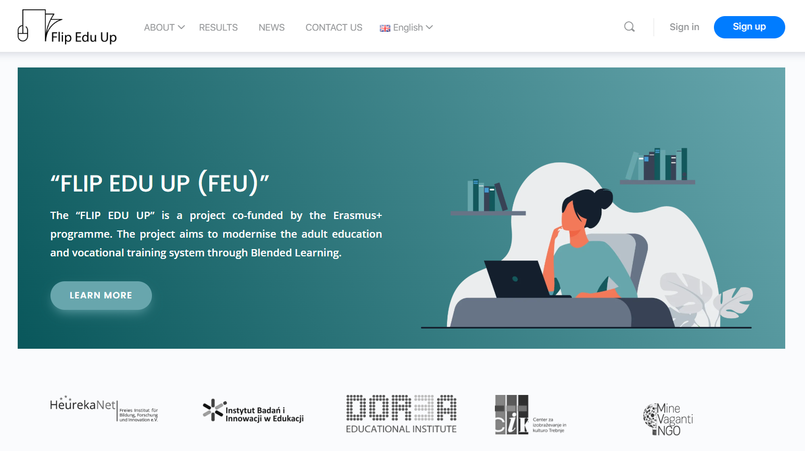</th>
</tr>
<tr>
<th colspan="2"><strong>2.2 Description:</strong></th>
</tr>
<tr>
<th colspan="2" style="text-align: left;">
Flipped Learning is a pedagogical approach that reverses the traditional learning model. Students access educational content, such as video lessons or readings, at home before the classroom lesson. This allows classroom time to be dedicated to interactive activities, such as discussions, problem-solving, and group work, with the support of the teacher, fostering greater interaction between students and the teacher. Flipped Learning is predominantly used in adult education and focuses on active learning, student autonomy, and the personalization of the learning experience. Here are the main characteristics:

<ul>
<li>
<u>Reversal of the traditional model</u>: Flipped Learning (or "flipped classroom") reverses the traditional teaching model. Instead of receiving lessons in the classroom and doing homework at home, students study theoretical content at home, through videos, readings, or other resources, and use classroom time for practical and interactive activities.
</li>
<li>
<u>Active learning</u>: The main goal is to transform the classroom into an active learning environment, where students can apply acquired knowledge, solve problems, discuss, and collaborate with their peers and the teacher.
</li>
<li>
<u>Autonomy and personalization</u>: This approach is particularly well-suited to adult education, as it promotes student autonomy and allows for the personalization of the learning experience. Adults can study theoretical materials at their own pace and according to their needs.
</li>
<li>
<u>Student-centered learning</u>: Flipped Learning places the student at the center, making them the protagonist of their own learning journey. The teacher assumes the role of facilitator, guiding students and supporting them in practical activities.
</li>
<li>
<u>Flexibility</u>: Adult education often has to deal with limited schedules and availability. Flipped learning, due to its nature, offers greater flexibility.
</li>
<li>
<u>Digital skills</u>: The use of video lessons and online materials implies an improvement in digital skills, a quality increasingly required in the world of work.
</li>
</ul></th>
</tr>
<tr>
<th colspan="2"><strong>2.3 Context:</strong></th>
</tr>
<tr>
<th colspan="2" style="text-align: left;">Flipped Learning can be applied in various adult education contexts, such as vocational training courses, universities of the third age, and continuing education programs. It is particularly suitable for adult learners who have diverse learning needs and require flexibility and autonomy.</th>
</tr>
<tr>
<th colspan="2"><strong>2.4 Selection Criteria:</strong></th>
</tr>
<tr>
<th style="text-align: left;"><strong>Effectiveness:</strong></th>
<th style="text-align: left;">Flipped Learning has been shown to increase student engagement, content comprehension, and learning outcomes. Students feel more motivated and responsible for their own learning, thanks to the ability to manage their time and actively interact in the classroom.</th>
</tr>
<tr>
<th style="text-align: left;"><strong>Technology:</strong></th>
<th style="text-align: left;">Flipped Learning relies on the use of various technologies, such as e-learning platforms, video lessons, podcasts, and online collaboration tools. These technologies allow students to access content flexibly and interact with each other and with the teacher even outside the classroom.</th>
</tr>
<tr>
<th style="text-align: left;"><strong>Collaboration:</strong></th>
<th style="text-align: left;">Flipped Learning fosters collaboration among students, who work together in class on activities and projects. The teacher assumes a role as facilitator, guiding and supporting students in their learning journey.</th>
</tr>
<tr>
<th style="text-align: left;"><strong>Feedback:</strong></th>
<th style="text-align: left;">Flipped Learning offers various opportunities for feedback, both peer-to-peer and from the teacher. Students can receive immediate feedback on their in-class activities and can interact with the teacher to clarify doubts and delve deeper into topics.</th>
</tr>
<tr>
<th colspan="2"><strong>2.5 Sources of Collection</strong>:</th>
</tr>
<tr>
<th colspan="2"><ul>
<li>
<a href="https://flipeduup.eu/">https://flipeduup.eu/</a>
</li>
<li>
https://www.heurekanet.de/fileadmin/user_upload/Dateien/FlipEduUp_Guidelines_EN.pdf
</li>
</ul></th>
</tr>
<tr>
<th colspan="2"><strong>2.6 Results</strong>:</th>
</tr>
<tr>
<th colspan="2" style="text-align: left;">Studies and research have shown that Flipped Learning can lead to improved learning outcomes, increased student engagement, and greater satisfaction with the educational experience.</th>
</tr>
</thead>
<tbody>
</tbody>
</table>

<table style="width:100%;">
<colgroup>
<col style="width: 16%" />
<col style="width: 83%" />
</colgroup>
<thead>
<tr>
<th colspan="2"><strong>2.1 Good Practice Title:</strong></th>
</tr>
<tr>
<th colspan="2" style="text-align: left;">MATEMATICA LIVE</th>
</tr>
<tr>
<th colspan="2"><strong>2.1.1 Picture if available</strong></th>
</tr>
<tr>
<th colspan="2" style="text-align: center;">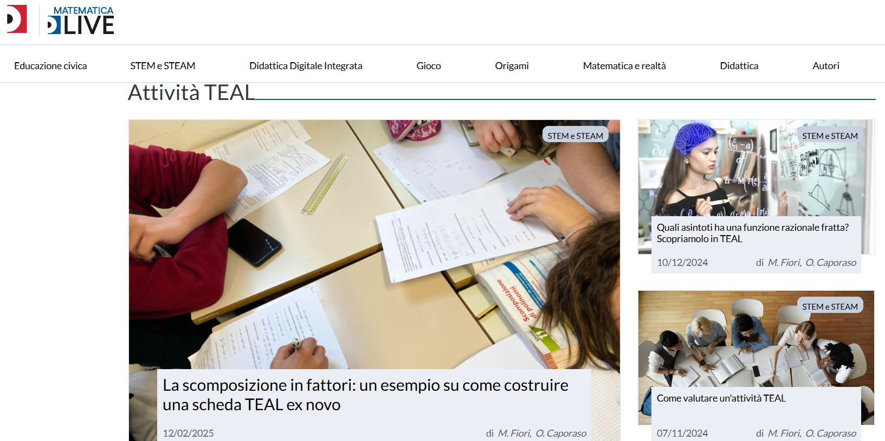</th>
</tr>
<tr>
<th colspan="2"><strong>2.2 Description:</strong></th>
</tr>
<tr>
<th colspan="2" style="text-align: left;">
MATEMATICA LIVE is an online platform that offers interactive resources and tools for teaching and learning mathematics. The website provides a wide range of content, including video lessons, interactive exercises, simulations, and games, covering various mathematical topics from primary school to university. Matematica Live is based on the TEAL (Technology Enhanced Active Learning) methodology, using technology to make math learning more engaging, stimulating, and accessible.

Here's an overview of MATEMATICA LIVE main features:

<ul>
<li>
Wide range of content:
</li>
</ul>

<u>Video lessons</u>: Clear and concise explanations of mathematical concepts; <u>Interactive exercises</u>: Practical activities to test your knowledge; <u>Simulations</u>: Virtual tools to visualize and experiment with mathematical concepts; <u>Games</u>: Playful activities to make learning fun and stimulating.

<ul>
<li>
Multi-level teaching:
</li>
</ul>

It represents an effective educational model from primary school to university, with materials suitable for students of all ages and levels of preparation.

<ul>
<li>
TEAL (Technology Enhanced Active Learning) methodology:
</li>
</ul>

<u>Technology</u>: Use of technology to promote active and participatory learning; <u>Engagement and stimulation</u>: Creation of an interactive and motivating learning environment; <u>Accessibility</u>: Making mathematics more accessible to all students.

MATEMATICA LIVE main objectives:

<ul>
<li>
Improve understanding of mathematics.
</li>
<li>
Increase interest and motivation towards this subject.
</li>
<li>
Provide effective tools for learning and teaching.
</li>
<li>
Make math learning more engaging, stimulating, and accessible.
</li>
</ul>

In summary, MATEMATICA LIVE aims to be a comprehensive and innovative resource for anyone who wants to learn or deepen their knowledge of mathematics in an interactive and fun way.
</th>
</tr>
<tr>
<th colspan="2"><strong>2.3 Context:</strong></th>
</tr>
<tr>
<th colspan="2" style="text-align: left;">
MATEMATICA LIVE was created by a group of Italian teachers and researchers with the aim of providing innovative support for mathematics education, a team of mathematics and technology enthusiasts with the desire to overcome traditional teaching methods, often perceived as boring and distant from the needs of modern students. An educational project that exploits the potential of digital technologies to create an interactive and engaging learning environment. The platform is constantly updated, with the addition of new content and features to meet user needs. The platform is aimed at students of all ages, teachers and parents, offering resources and tools for learning and teaching mathematics in a more effective and fun way. Students can strengthen their mathematical skills and overcome difficulties, teachers can enrich their lessons with innovative and engaging teaching tools, and parents can support their children in learning and monitor their progress.

In summary, MATEMATICA LIVE aims to <u>Democratize mathematics learning</u>, making mathematics accessible to everyone, regardless of their starting level or difficulties encountered; <u>Personalize learning</u> by offering educational paths adaptable to individual needs, allowing everyone to progress at their own pace; <u>Stimulate critical thinking</u> by encouraging students not to limit themselves to memorizing formulas, but to develop reasoning and problem-solving skills; <u>Create a learning community</u> by fostering, in addition to personal study, collaboration and the exchange of ideas between students and teachers.
</th>
</tr>
<tr>
<th colspan="2"><strong>2.4 Selection Criteria:</strong></th>
</tr>
<tr>
<th><strong>Effectiveness:</strong></th>
<th style="text-align: left;">Matematica Live has proven to increase students' interest and motivation towards mathematics, thanks to the use of interactive and engaging tools. The platform offers the possibility to personalize learning, adapting activities to the level and needs of each student.</th>
</tr>
<tr>
<th><strong>Technology:</strong></th>
<th style="text-align: left;">Matematica Live uses various digital technologies, such as videos, animations, simulations, and games, to make math learning more interactive and stimulating. The platform is accessible from various devices, such as computers, tablets, and smartphones, offering flexibility and accessibility to students.</th>
</tr>
<tr>
<th><strong>Collaboration:</strong></th>
<th style="text-align: left;">Matematica Live offers the possibility to collaborate with other students and teachers through forums, chats, and sharing tools. This promotes collaborative learning and the exchange of knowledge.</th>
</tr>
<tr>
<th><strong>Feedback:</strong></th>
<th style="text-align: left;">Matematica Live provides students with immediate feedback on their activities, allowing them to monitor their progress and correct any errors. The platform also offers the possibility to receive personalized feedback from teachers.</th>
</tr>
<tr>
<th colspan="2"><strong>2.5 Sources of Collection</strong>:</th>
</tr>
<tr>
<th colspan="2"><ul>
<li>
<a href="https://blog.matematica.deascuola.it/">https://blog.matematica.deascuola.it/</a>
</li>
<li>
<a href="https://blog.matematica.deascuola.it/tags/attivita-teal/">https://blog.matematica.deascuola.it/tags/attivita-teal/</a>
</li>
</ul></th>
</tr>
<tr>
<th colspan="2"><strong>2.6 Results</strong>:</th>
</tr>
<tr>
<th colspan="2" style="text-align: left;">
MATEMATICA LIVE has contributed to improving mathematics learning in various educational contexts through an interactive and playful approach that has made math learning more engaging and fun, stimulating students' curiosity and motivation. An inclusive approach that makes mathematics accessible to all students, regardless of their starting level or difficulties, including students with special educational needs.

The platform has proven to increase students' interest, motivation, and results, offering a stimulating and interactive learning environment. In particular, thanks to the interactive exercises and video lessons that allow students to strengthen their skills and fill gaps, and the personalized learning paths, adaptable to individual needs, allowing everyone to progress at their own pace
</th>
</tr>
</thead>
<tbody>
</tbody>
</table>

| Partner Organization Name | **STP CONSULTING, SL** |
|---------------------------|------------------------|
| Country:                  | **SPAIN**              |
| Contact Person:           | **RAÚL GONZALO**       |
| Date:                     | **17/02/2025**         |

<table style="width:100%;">
<colgroup>
<col style="width: 16%" />
<col style="width: 83%" />
</colgroup>
<thead>
<tr>
<th colspan="2"><strong>2.1 Good Practice Title:</strong></th>
</tr>
<tr>
<th colspan="2" style="text-align: left;">E-GROWTH ERASMUS PROJECT</th>
</tr>
<tr>
<th colspan="2"><strong>2.1.1 Picture if available</strong></th>
</tr>
<tr>
<th colspan="2" style="text-align: center;">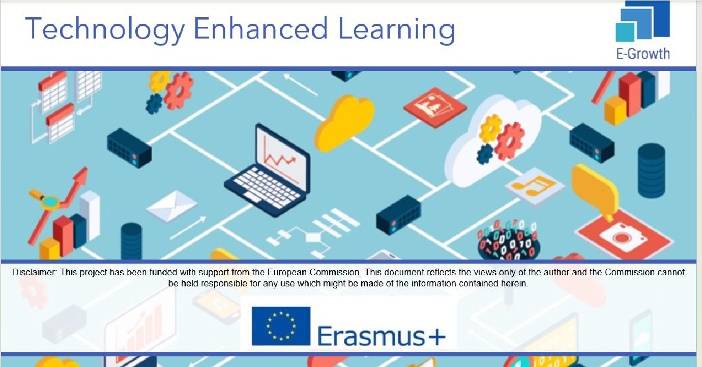</th>
</tr>
<tr>
<th colspan="2"><strong>2.2 Description:</strong></th>
</tr>
<tr>
<th colspan="2" style="text-align: left;">the Erasmus+ project called <strong>Enterprises Growing Through Business Simulations (E-Growth).</strong> This is about VET teacher/trainers in the use of <strong>Technology Enhanced Learning</strong> (TEL) within in VET courses. In addition, the project has also developed a business simulation called, <strong>PROSPER</strong>, as an example of the use of TEL – the simulation supports the development of the knowledge and skills associated with running and growing an enterprise.</th>
</tr>
<tr>
<th colspan="2"><strong>2.3 Context:</strong></th>
</tr>
<tr>
<th colspan="2" style="text-align: left;">E-Growth was executed by a partnership of six organisation from five different EU countries: CZ, UK, ES, HU and EL. The partnership comprised an NGO, a university a VET centre and SMEs. Partners demonstrated how VET teacher/trainers and VET institutes can develop and deliver TEL training. This have been achieved by creating a set of VET tools and resources which can be used in the delivery of entrepreneurship training.</th>
</tr>
<tr>
<th colspan="2"><strong>2.4 Selection Criteria:</strong></th>
</tr>
<tr>
<th style="text-align: left;"><strong>Effectiveness:</strong></th>
<th style="text-align: left;">
The E-Growth project impacted on the professional development and skills of VET teacher/trainers in the six partnership countries. It had also impact on institutes and stakeholder that were involveded in the project through their VET education centers by demonstrating how digital technology could support the development of new training and teaching methods and improve the effectiveness and impact of courses.

Finally, E-Growth contributed to the development of a modern and digital VET sector that is better equipped to meet the needs of the 21st students leading to a more digitally competent and productive European workforce in the participating countries.
</th>
</tr>
<tr>
<th style="text-align: left;"><strong>Technology:</strong></th>
<th style="text-align: left;">
This project innovative was that the E-Growth project provided a complete package of materials and tools enabling VET teacher/trainers, VET institutes and other stakeholders to develop and implement their own TEL training courses. It will showcase the latest digital technologies and how they are being use within VET.

For instance PROSPER tool; an innovative computer-based simulation called PROSPER as part of a learning portal for use by VET teacher/trainers engaged in entrepreneurship.
</th>
</tr>
<tr>
<th style="text-align: left;"><strong>Collaboration:</strong></th>
<th style="text-align: left;">
The project developed a computer-based simulation about growing an enterprise, a series of digital Learning Journeys about TEL, and an e-book, ‘A Guide to Using TEL in VET’. The simulation called, Entrepreneurs - Going for Growth and has been used to showcase how the effective use of TEL can enrich VET training.

During the project, a supportive learning environment event was conducted and in this way develop the skills and confidence of VET teacher/trainers in using TEL.
</th>
</tr>
<tr>
<th style="text-align: left;"><strong>Feedback:</strong></th>
<th style="text-align: left;">This project explored the skills required by enterprises for the effective management of teams using a new digital 360-degree assessment tool. The aggregate analysis based on 300+ completed assessments undertaken by managers in UK, BG, IT, RO, EL, ES, EI highlighted the need for more development in the Specific Skill: ‘Exploiting Technology’.</th>
</tr>
<tr>
<th colspan="2"><strong>2.5 Sources of Collection</strong>:</th>
</tr>
<tr>
<th colspan="2"><ul>
<li>
<a href="https://www.facebook.com/egrowthproject/"><u>https://www.facebook.com/egrowthproject/</u></a>
</li>
<li>
<a href="https://app.e-growth-project.eu"><u>https://app.e-growth-project.eu</u></a>
</li>
</ul>

In addition to the Erasmus+ Results Platform, Partners will aim to make use of the following on-line platforms:

<ul>
<li>
Other platforms will be used to promote and disseminate the project such as the European Business &amp; Innovation Centre Network (EBN - <a href="http://www.ebn.eu"><u>www.ebn.eu</u></a>) and the Enterprise European
</li>
<li>
Network (EEN - <a href="http://www.eenec.europa.eu"><u>www.eenec.europa.eu</u></a>)
</li>
</ul></th>
</tr>
<tr>
<th colspan="2"><strong>2.6 Results</strong>:</th>
</tr>
<tr>
<th colspan="2" style="text-align: left;">
E-Growth Simulation and Toolkit) with partners taking the lead on specific tasks associated with Output 1 as follows:

<ul>
<li>
Task 1: Problem definition, portal and business simulation specification (LEAD: BEST)
</li>
<li>
Task 2: Portal build/development of E-Growth simulation (Lead: BEST)
</li>
<li>
Task 3: The Business Growth Toolkit (Lead: STP)
</li>
<li>
Task 4: Facilitator Handbook (Lead: Trebag)
</li>
<li>
Task 5 : Pilot Test (Lead: Trebag)
</li>
</ul>

Technology Enhanced Learning VET Course with partners taking the lead on specific tasks associated with Output 2 as follows:

<ul>
<li>
Task 1: Learning Journeys (Trebag)
</li>
<li>
Task 2: TEL Case studies (Lead: STP)
</li>
<li>
Task 3: VET Training the Trainer course (Lead: ETA)
</li>
<li>
Task 4: E-book – A Guide to Technology Enhanced Learning in VET (Lead: CZU)
</li>
</ul>

The training event to train VET educators was conducted as following;

the aim of the Event was equiped more than 180 VET teacher/trainers with the skills and understanding of how to plan and integrate TEL into their training.

Participants was exposed to a range of TEL methodologies and will experience what it is like to to take part in a TEL.

The three-day event comprised the following sessions:

Day 1: Understanding TEL

- Introduction to TEL

- Advantages and disadvantages of TEL – why use TEL?

- TEL teacher/trainer competences and TEL methodologies

- Using simulations in VET courses

- Hands-on with E-Growth simulation: ‘Entrepreneurs - Going for Growth’

Day 2: Live Learning Lab – Using TEL tools

- Simulations and Serious games with COOP-IN

- E-assessment with TeamMate

- E-assessment with the LEAP e-portfolio

- E-learning and Learning Journeys

- The E-Growth Portal

Day 3: Implementing TEL Methodologies

- Planning VET courses using TEL

- Integrating TEL into a VET training programme

- VET course ideas for implementing TEL - action plans

- Partner ideas for implementing TEL - action plans

- Partner ideas for training other teacher/trainers – action plans

- Evaluation and course review
</th>
</tr>
</thead>
<tbody>
</tbody>
</table>

<table style="width:100%;">
<colgroup>
<col style="width: 16%" />
<col style="width: 83%" />
</colgroup>
<thead>
<tr>
<th colspan="2"><strong>2.1 Good Practice Title:</strong></th>
</tr>
<tr>
<th colspan="2" style="text-align: left;">PADLET AS A COLLABORATIVE WORK INSTRUMENT TO IMPROVE EDUCATIONAL CARE THROUGH CYBERCOEXISTENCE IN PRIMARY EDUCATION</th>
</tr>
<tr>
<th colspan="2"><strong>2.1.1 Picture if available</strong></th>
</tr>
<tr>
<th colspan="2" style="text-align: center;">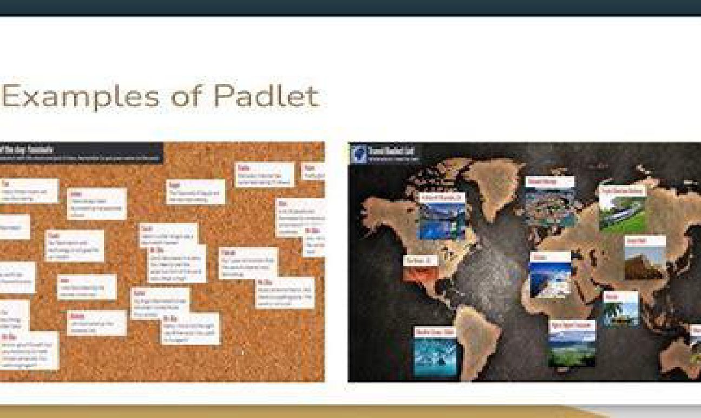</th>
</tr>
<tr>
<th colspan="2"><strong>2.2 Description:</strong></th>
</tr>
<tr>
<th colspan="2" style="text-align: left;">
In this way, future teachers learn to work with autonomy and personal responsibility, but also with positive interdependence, communicating effectively with their classmates. The fact that it is through technological means promotes greater interaction by optimizing learning outcomes.

Among the main objectives we highlight:

<ol type="1">
<li>
Collaborative learning through Padlet
</li>
<li>
To enhance digital competences through critical reflection of students
</li>
<li>
Involve students in the approach to responsible use of social networks from a preventive perspective and improve emotional management, addressing the challenges posed by research on these topics (Olweus &amp; Limber, 2018)
</li>
<li>
Encourage the creation of digital materials
</li>
</ol></th>
</tr>
<tr>
<th colspan="2"><strong>2.3 Context:</strong></th>
</tr>
<tr>
<th colspan="2" style="text-align: left;">
From the approach of the Edelvives Foundation Chair of Comprehensive Educational Care of the University of Zaragoza, one of the aspects of this care encompasses the improvement of interpersonal relationships at a virtual level, facing this challenge through cybercoexistence and the promotion of collaborative online learning.

We would like to point out that it has been implemented in subjects of the Degree in Teaching in Primary Education of the Faculty of Education of the University of Zaragoza during the 2019-2020 academic year and has positive implications that can be transferred to others.
</th>
</tr>
<tr>
<th colspan="2"><strong>2.4 Selection Criteria:</strong></th>
</tr>
<tr>
<th style="text-align: left;"><strong>Effectiveness:</strong></th>
<th style="text-align: left;">
The students who received the experience were made up of 153 students.

Both collaborative work, the implementation of information and communication technologies, at the service of improving teacher training to address cybercoexistence, are fundamental.

Each group of 3-5 students defined a topic to develop around cybercoexistence: netiquette, cyberbullying, digital identity, digital footprint, fake news, privacy, etc. Both the process and the final product of the work (an educational video) were asked to work through their own Padlet wall. Throughout the semester, each group designed and shared through this online tool different documents that marked the process of making the final video, such as, for example, the rundown of the video they were designing or the symbaloo generated with materials sought by the members of the group on the same topic as a repository of inspiration for their own design. Each group shared the wall with the teachers.

We have been able to verify that the perception of the students is that motivation for the subject, responsibility and that they have learned to collaborate through a digital application. In this sense, we also note their satisfaction with the use of the Padlet tool. These results are in line with previous work that includes other educational experiences at the university

The assessment of the success of the online tools used has been obtained through the weekly evaluation with the students on them, so that we included the necessary improvements constantly throughout the process.
</th>
</tr>
<tr>
<th style="text-align: left;"><strong>Technology:</strong></th>
<th style="text-align: left;">
This didactic experience has had the Padlet tool as its backbone. This online platform aims to provide an interactive mural. In addition, the platform allows the user to share multimedia resources from different sources (websites, videos, images, etc.). Some of its advantages are that it is very intuitive, can be used with any device and allows simultaneous collaboration once the user has registered in the application. In addition, it is possible to download the files that are shared on the wall. Padlet applications for the academic environment can be very diverse. For example, it can be used to collect ideas on a topic, evaluate and co-evaluate a piece of work, as well as run a project collaboratively as is the case. It is a tool that has a free version and a paid version with a greater possibility of functions and number of walls to use.

It encompasses a collaborative online and interdisciplinary perspective of the subject, with a relationship of several topics within the program and with a Service Learning approach so that it is useful to different groups of teachers and students in educational centers.

The aim is to promote innovation and the initiation of research, promoting the transfer, from a feedback of the collaborative work of teachers of the CEIP Ramiro Solans, students, management team with the students of the Degree in Primary Education of the Faculty of Education.
</th>
</tr>
<tr>
<th style="text-align: left;"><strong>Collaboration:</strong></th>
<th style="text-align: left;">
The proposed teaching methodology has been collaborative learning. First, the university professors proposed the project to the students. The project consists of creating educational material in video format for 5th and 6th year of Primary Education on the responsible use of the Internet and cybercoexistence. The guidelines for carrying out the project are presented to them through a wall of the Padlet application, which served to explain the online collaborative tool.

The comprehensive training of future teachers is improved, which provides the design of materials for their subsequent use from a Service Learning approach. They are able to exhibit in public, in front of a classroom in an educational center, part of the work they have done. A high degree of motivation is evident, since they give greater meaning and usefulness to this type of work carried out in the Faculty. They approach a real environment and lay the foundations, at the level of concerns, doubts and challenges, for future subjects that are in line with deepening digital skills.
</th>
</tr>
<tr>
<th style="text-align: left;"><strong>Feedback:</strong></th>
<th style="text-align: left;">
It has a high potential to the extent that the collaborative and service-learning approach is enhanced, in this case, with close collaboration with educational centers, with a greater or lesser digital divide between their students and with the need to improve cybercoexistence and the responsible use of social networks.

The work is linked to the Innovation Project of the University of Zaragoza, in its implementation. This Project has been developed, with different changes over the years and the participants find it relevant to highlight that to the extent that students are involved in different actions with educational centers, to this extent we consider that it has the possibility of being maintained and consolidated over time.
</th>
</tr>
<tr>
<th colspan="2"><strong>2.5 Sources of Collection</strong>:</th>
</tr>
<tr>
<th colspan="2"><ul>
<li>
Beltrán-Martín, I. (2022). Una propuesta de aprendizaje cooperativo basada en el uso de Pad let. Tecnología, Ciencia y Educación, 22, 7-38. <a href="https://doi.org/10.51302/tce.2022.654"><u>https://doi.org/10.51302/tce.2022.654</u></a> Cebollero-Salinas, A., Cano-Escoriaza, J. y Orejudo, S. (2022a)
</li>
</ul>

Impact of online emotions and netiquette on phubbing from a gender perspective:

<ul>
<li>
Educational challenges. Journal of New Approaches in Educational Research, 11(1), 64-78. <a href="https://doi.org/10.7821/naer.2022.1.848"><u>https://doi.org/10.7821/naer.2022.1.848</u></a> Cebollero-Salinas, A., Cano-Escoriaza, J. y Orejudo, S. (2022b).
</li>
<li>
Social networks, emotions, and education: design and validation of eCOM, a scale of socio-emotional interaction competencies among adolescents. Sustainability, 5(14), 2566. Cebollero-Salinas, A., Cano-Escoriaza, J. y Orejudo, S. (2022c).
</li>
<li>
Are emotional e-competencies a protective factor against habitual digital behaviors (media multitasking, cybergossip, phubbing) in Spanish students of secondary education? Computers &amp; Education, 181, 104464-104477. <a href="https://doi.org/10.1016/j.compedu.2022.104464"><u>https://doi.org/10.1016/j.compedu.2022.104464</u></a> Cebollero-Salinas, A., Orejudo, S., Cano-Escoriaza, J. e Íñiguez-Berrozpe, T. (2022d).
</li>
<li>
Cyber gossip and Problematic Internet Use in cyberaggression and cybervictimisation among adolescents. Computers in Human Behavior, 131, 107230-107241. Garaigordobil, M. (2017). Psychometric Properties of the Cyberbullying Test, a Screening Instrument to Measure Cybervictimization, Cyberaggression, and Cyberobservation. Jour nal of Interpersonal Violence, 32(23), 3556-3576. <a href="https://doi.org/10.1177/0886260"><u>https://doi.org/10.1177/0886260</u></a> 515600165 Olweus, D., y Limber, S. P. (2018).
</li>
<li>
Some problems with cyberbullying research. Current Opi nion in Psychology, 19, 139-143. <a href="https://doi.org/10.1016/j.copsyc.2017.04.012"><u>https://doi.org/10.1016/j.copsyc.2017.04.012</u></a> Ortega-Ruiz, R., Del Rey, R. y Casas, J. A. (2016).
</li>
<li>
Evaluar el bullying y el cyberbullying vali dación española del EBIP-Q y del ECIP-Q. Psicologia Educativa, 22(1), 71-79. <a href="https://doi.org/10.1016/j.pse.2016.01.004"><u>https://doi.org/10.1016/j.pse.2016.01.004</u></a> Serrano, R., y Casanova, O. (2020).
</li>
<li>
Social Learning. Posibilidades didácticas de Flipgrid. In J.L. Alejandre (Eds).
</li>
<li>
En Buenas Prácticas en la docencia universitaria con apoyo de TIC. Experiencias en 2019 (147-154). Prensas de la Universidad de Zaragoza
</li>
</ul></th>
</tr>
<tr>
<th colspan="2"><strong>2.6 Results</strong>:</th>
</tr>
<tr>
<th colspan="2" style="text-align: left;">
This experience can be carried out in different courses and years, as well as degrees related especially to the field of social sciences and those that are linked to computer science and technology in general. Finally, we point out some interesting conclusions related to the field of technologies applied for the prevention of cyberbullying, the development of transversal competencies, etc.

The results and discussion of this work allow us to conclude that a collaborative project using online applications seems to be a good methodology for future teachers to learn digital skills at the same time as social skills in the virtual environment.

In the same way, the teaching task is favored from the design of materials through technologies to prevent different difficulties and educate in the responsible use of social networks, a challenge that they will have to face in their future classrooms.
</th>
</tr>
</thead>
<tbody>
</tbody>
</table>

| Partner Organization Name | **UDRUGA - Association 4 ELEMENTS** |
|---------------------------|-------------------------------------|
| Country:                  | **CROATIA**                         |
| Contact Person:           | **MAJA SRHOJ-MAROHNIC**             |
| Date:                     | **March 2025**                      |

<table style="width:100%;">
<colgroup>
<col style="width: 16%" />
<col style="width: 83%" />
</colgroup>
<thead>
<tr>
<th colspan="2"><strong>2.1 Good Practice Title:</strong></th>
</tr>
<tr>
<th colspan="2" style="text-align: left;">DIGITAL SKILLS DEVELOPMENT THROUGH APPLIED LEARNING – ALGEBRA VET PROGRAMS</th>
</tr>
<tr>
<th colspan="2"><strong>2.1.1 Picture if available</strong></th>
</tr>
<tr>
<th colspan="2" style="text-align: center;">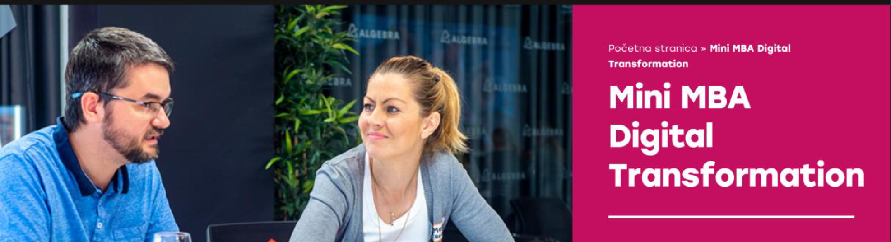</th>
</tr>
<tr>
<th colspan="2"><strong>2.2 Description:</strong></th>
</tr>
<tr>
<th colspan="2" style="text-align: left;">Algebra, a higher education and lifelong learning institution in Croatia, offers innovative adult education programs focused on digital skills — such as video game development, BIM (Building Information Modeling), digital marketing, and data analytics. These programs combine digital platforms, real-world projects, and interactive content to promote active and applied learning. The primary target group includes adult learners seeking upskilling or reskilling in technology-driven industries.</th>
</tr>
<tr>
<th colspan="2"><strong>2.3 Context:</strong></th>
</tr>
<tr>
<th colspan="2" style="text-align: left;">Implemented at Algebra’s education centers in Zagreb and across Croatia, these programs target adult learners from diverse professional backgrounds. Courses are part of the national voucher system supported by the Croatian Employment Service (HZZ), aimed at increasing employability and supporting digital transformation. Learning takes place in hybrid formats: face-to-face sessions supported by online collaboration, interactive tools, and project-based work.</th>
</tr>
<tr>
<th colspan="2"><strong>2.4 Selection Criteria:</strong></th>
</tr>
<tr>
<th style="text-align: left;"><strong>Effectiveness:</strong></th>
<th style="text-align: left;">Participants report increased motivation, engagement, and job readiness. Courses result in practical portfolios, improved digital literacy, and better performance in digital work environments.</th>
</tr>
<tr>
<th style="text-align: left;"><strong>Technology:</strong></th>
<th style="text-align: left;">Tools used include Autodesk Revit (for BIM), Unity (for game development), Google Workspace, Moodle, and specialized online environments. Teaching includes simulation, collaborative design, and digital content creation.</th>
</tr>
<tr>
<th style="text-align: left;"><strong>Collaboration:</strong></th>
<th style="text-align: left;">Students work in teams to solve real-world tasks, such as developing a playable demo, creating a 3D model, or managing a digital campaign. Peer review and team feedback are embedded in the learning cycle.</th>
</tr>
<tr>
<th style="text-align: left;"><strong>Feedback:</strong></th>
<th style="text-align: left;">Immediate feedback is delivered through automated assessments, trainer comments, peer evaluations, and project presentations. Learners can track their own progress via digital platforms.</th>
</tr>
<tr>
<th colspan="2"><strong>2.5 Sources of Collection</strong>:</th>
</tr>
<tr>
<th colspan="2"><ul>
<li>
Official Algebra website: <a href="https://www.algebra.hr"><u>https://www.algebra.hr</u></a>
</li>
</ul></th>
</tr>
<tr>
<th colspan="2"><strong>2.6 Results</strong>:</th>
</tr>
<tr>
<th colspan="2" style="text-align: left;">The programs have contributed to faster upskilling, especially for adults entering or transitioning to digital sectors. Learners developed both technical and collaborative skills, increasing their competitiveness in the job market. Many graduates went on to employment in the IT, gaming, and design sectors. Algebra’s approach is now being referenced as a model for tech-driven adult learning.</th>
</tr>
</thead>
<tbody>
</tbody>
</table>

<table style="width:100%;">
<colgroup>
<col style="width: 16%" />
<col style="width: 83%" />
</colgroup>
<thead>
<tr>
<th colspan="2"><strong>2.1 Good Practice Title:</strong></th>
</tr>
<tr>
<th colspan="2" style="text-align: left;">INTERACTIVE USE OF DIGITAL TOOLS IN ADULT EDUCATION – DANTE, RIJEKA</th>
</tr>
<tr>
<th colspan="2"><strong>2.1.1 Picture if available</strong></th>
</tr>
<tr>
<th colspan="2" style="text-align: center;">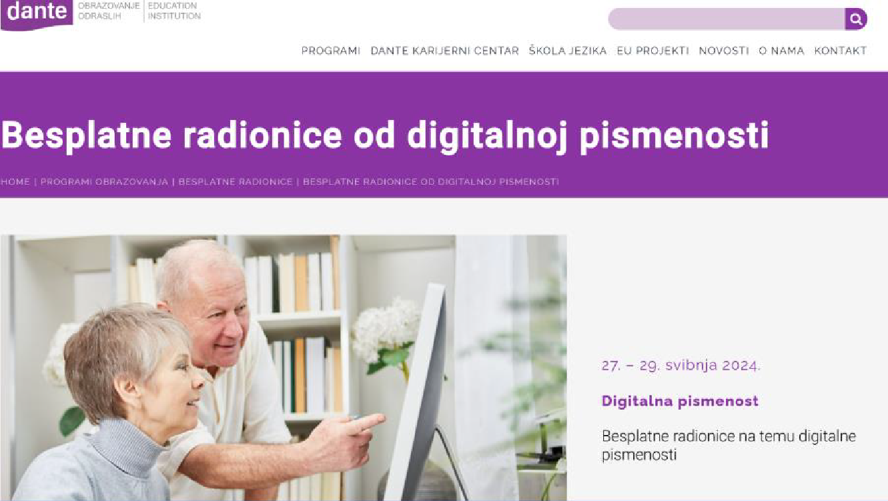</th>
</tr>
<tr>
<th colspan="2"><strong>2.2 Description:</strong></th>
</tr>
<tr>
<th colspan="2" style="text-align: left;">Adult Education Institution Dante from Rijeka, Croatia, integrates digital tools into its adult education programs to promote active learning, engagement, and skills development. The practice focuses on training adult learners and educators in how to use digital platforms, applications, and online resources for enhanced teaching and learning experiences. The primary target group includes adult education professionals, educators, and learners enrolled in language, communication, and vocational upskilling programs.</th>
</tr>
<tr>
<th colspan="2"><strong>2.3 Context:</strong></th>
</tr>
<tr>
<th colspan="2" style="text-align: left;">Dante is a certified adult education institution with a long history (since 1991) of providing quality learning experiences to adults. Based in Rijeka, it serves a diverse learner population, including unemployed individuals, language learners, and professionals. Through Erasmus+ KA1 mobility and accredited training programs, Dante has created a context where technology is not only a support tool but a driver of educational innovation and inclusivity.</th>
</tr>
<tr>
<th colspan="2"><strong>2.4 Selection Criteria:</strong></th>
</tr>
<tr>
<th style="text-align: left;"><strong>Effectiveness:</strong></th>
<th style="text-align: left;">Participants report increased motivation and deeper engagement through the use of interactive digital tools. The use of platforms like Padlet, Canva, Mentimeter, and Google Classroom fosters better content retention and boosts learner confidence.</th>
</tr>
<tr>
<th style="text-align: left;"><strong>Technology:</strong></th>
<th style="text-align: left;">Dante applies a wide range of technologies, including collaborative tools (Padlet, Miro), video platforms (YouTube, Loom), assessment apps (Kahoot, Socrative), and learning management systems (Google Classroom, Moodle) to support active, personalized learning.</th>
</tr>
<tr>
<th style="text-align: left;"><strong>Collaboration:</strong></th>
<th style="text-align: left;">Courses encourage peer learning and teamwork through shared tasks, online group projects, and real-time collaboration activities. Educators use digital platforms to facilitate communication and group reflection.</th>
</tr>
<tr>
<th style="text-align: left;"><strong>Feedback:</strong></th>
<th style="text-align: left;">Digital tools allow for instant feedback via quizzes, live polls, comment boards, and in-app assessments. Trainers use analytics and learner input to tailor future sessions and provide individualized support.</th>
</tr>
<tr>
<th colspan="2"><strong>2.5 Sources of Collection</strong>:</th>
</tr>
<tr>
<th colspan="2"><ul>
<li>
Dante’s official website: <a href="https://dante-ri.hr"><u>https://dante-ri.hr</u></a>
</li>
</ul></th>
</tr>
<tr>
<th colspan="2"><strong>2.6 Results</strong>:</th>
</tr>
<tr>
<th colspan="2" style="text-align: left;">This practice has led to a notable increase in the digital competence of adult educators and learners. Course participants have implemented similar to TEAL-based methods in their own institutions and training contexts. Evaluation data show high satisfaction, improved learner autonomy, and greater adaptability of educators in hybrid and online settings. The model continues to evolve through Dante’s ongoing participation in Erasmus+ innovation and staff mobility projects.</th>
</tr>
</thead>
<tbody>
</tbody>
</table>

| Partner Organization Name | **Asociația UZINADUZINA** |
|---------------------------|---------------------------|
| Country:                  | **ROMANIA**               |
| Contact Person:           | **LIVIU POP**             |
| Date:                     | **30/03/2025**            |

<table style="width:100%;">
<colgroup>
<col style="width: 16%" />
<col style="width: 83%" />
</colgroup>
<thead>
<tr>
<th colspan="2"><strong>2.1 Good Practice Title:</strong></th>
</tr>
<tr>
<th colspan="2" style="text-align: left;">Digitaliada – Digital Education for Active Learning in Rural Schools</th>
</tr>
<tr>
<th colspan="2"><strong>2.1.1 Picture if available</strong></th>
</tr>
<tr>
<th colspan="2" style="text-align: center;">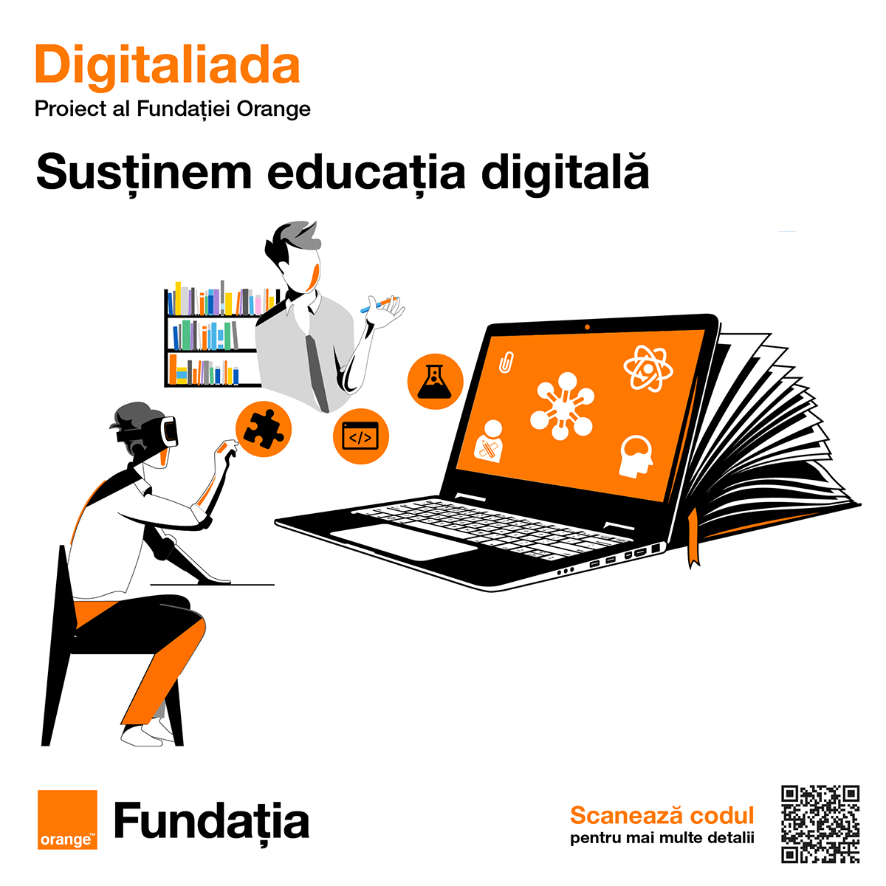</th>
</tr>
<tr>
<th colspan="2"><strong>2.2 Description:</strong></th>
</tr>
<tr>
<th colspan="2" style="text-align: left;">Digitaliada is a national program that leverages technology to enhance active learning, particularly in Romanian rural schools. Initiated in 2016 by the Orange Foundation, Digitaliada provides a comprehensive model for integrating digital tools into the teaching and learning process. The program’s objectives are to improve students’ engagement and understanding of subjects (especially math and ICT) through interactive digital content, and to build teachers’ capacity to use technology in student-centered ways. Digitaliada equips participating schools with modern educational technology (tablets for students, laptops for teachers, projectors, interactive whiteboards, etc.) and offers an extensive repository of curriculum-aligned digital learning materials. It also includes a strong teacher training component: educators receive accredited courses and ongoing mentoring on how to conduct active learning lessons using apps, educational games, and online platforms. The target audience is middle school students (grades 5–8, roughly ages 11–14) and their teachers in underserved areas, though the program has expanded to some urban schools as well. In a typical Digitaliada classroom, students might learn mathematics by playing an interactive game or solve problems collaboratively on tablets, while the teacher facilitates and offers immediate feedback via an e-learning platform. By combining technology with active pedagogies (like project-based learning and gamification), Digitaliada aims to make learning more attractive and effective for students.</th>
</tr>
<tr>
<th colspan="2"><strong>2.3 Context:</strong></th>
</tr>
<tr>
<th colspan="2" style="text-align: left;">Digitaliada was conceived in response to the educational disparities between urban and rural areas in Romania, particularly in terms of access to digital resources and modern teaching methods. Many rural schools struggled with outdated materials and limited internet access. The program began by selecting a cohort of pilot rural schools and gradually scaling up each year. As of the 2022-2023 school year, Digitaliada had been implemented in 101 schools across 34 counties, directly reaching over 30,000 students and training more than 3,000 teachers in digital pedagogy . Most of these schools are small and located in villages or small towns, where Digitaliada often provided the first fully equipped digital lab. The socio-economic context of these communities made the program particularly impactful: for many students, it was the first time they used a tablet or experienced internet-based learning. The Digitaliada program is aligned with Romania’s broader push for digital education (such as the Smart-Edu strategy 2021–2027), and it has been recognized by the Ministry of Education – the teacher training courses in the program are accredited, and the Ministry has collaborated in disseminating the open educational resources created. During the COVID-19 pandemic, Digitaliada’s existing e-learning platform and content became invaluable, enabling continuous education online for the schools involved and even for others who accessed its open resources. The program’s context is therefore one of addressing digital divide challenges and modernizing teaching in the formal education system, with strong support from a private foundation in partnership with educational authorities.</th>
</tr>
<tr>
<th colspan="2"><strong>2.4 Selection Criteria:</strong></th>
</tr>
<tr>
<th><strong>Effectiveness:</strong></th>
<th style="text-align: left;">Digitaliada has shown clear evidence of increasing student interaction and understanding. Classrooms in the program report a shift from passive learning to highly interactive sessions – students regularly work in teams on tablets, participate in educational games and quizzes, and receive instant feedback on their work, which keeps them engaged. According to program data, the introduction of digital interactive content has improved students’ performance in subjects like mathematics; teachers noted higher retention of concepts when students practiced via apps (e.g., using GeoGebra for visualizing geometry) . The Digitaliada platform hosts thousands of exercises and automatic quizzes, which have been successfully used in over 100 schools around the country to enhance lessons and homework . This wide usage indicates the material’s effectiveness and adaptability. Teachers also observe that students who were previously shy or less involved became more active when learning with technology, as the variety of media (videos, interactive simulations, etc.) caters to different learning styles. In terms of measurable outcomes, some Digitaliada schools have seen improved exam readiness; for instance, the program developed a dedicated series of 10 video lessons and online tests for the national Grade 8 exam, which provided personalized feedback to students and helped boost their confidence and results . Overall, Digitaliada’s approach—blending technology with active learning—has effectively increased student participation in class and improved understanding of complex topics by allowing students to learn by doing and by exploring at their own pace.</th>
</tr>
<tr>
<th><strong>Technology:</strong></th>
<th style="text-align: left;">The program makes innovative use of technological tools to support learning. Each Digitaliada school is provided with a kit that typically includes class sets of tablets (allowing each student to have hands-on access), laptops for teachers, video projectors or interactive flat panels, document cameras, and even graphics tablets for digital handwriting . In addition to hardware, Digitaliada offers a rich digital ecosystem: an online platform with over 4,000 open educational resources (interactive lessons, exercises, and tutorials) aligned to the national curriculum , and recommended educational software/apps for various subjects . What’s innovative is not just the presence of technology, but how it’s applied – teachers are trained to use these tools in active pedagogies (for example, using a quiz app for real-time class polls, or having students create their own digital stories). The program also integrates emerging technologies like AI-driven tools; a recent update introduced an AI-based feature on the platform to assist in lesson creation and homework help . This keeps the technology aspect cutting-edge. Additionally, Digitaliada encourages content creation: it runs an annual contest where teachers and even students (14+) create and upload their own interactive digital lessons . This has led to a growing repository of locally made tech-enabled lessons, showcasing innovative uses of technology from the grassroots. In summary, Digitaliada employs technology not as a gimmick, but as a well-rounded means to enrich the curriculum – from hardware deployment in classrooms to development of custom Romanian-language digital content – thereby exemplifying TEAL through comprehensive tech integration.</th>
</tr>
<tr>
<th><strong>Collaboration:</strong></th>
<th style="text-align: left;">Collaboration is a key facet of the Digitaliada methodology, both among students and among educators. In the classroom, many Digitaliada activities are designed for teamwork – students often work in pairs or groups on tablets to solve problems, play collaborative learning games, or complete project-based assignments. This fosters peer learning; for example, a group might collaborate on a Scratch coding project or jointly research a topic online to create a presentation, thereby practicing teamwork and communication while using technology. Teachers have reported that students develop better teamwork skills as they discuss strategies to win an educational game or troubleshoot a digital challenge together. Moreover, Digitaliada created a community of practice for teachers: over 3,000 teachers form the “Digitaliada family,” sharing experiences and tips on using digital tools . The program conducts regional and national workshops where teachers from different schools meet (sometimes virtually) to collaborate on improving digital lesson plans. The online platform also serves as a collaborative hub – educators contribute open resources and provide feedback to each other (resources are reviewed and improved collaboratively by the community). There have been instances of inter-school collaboration as well: some Digitaliada schools have partnered for joint activities, such as coding hackathons or virtual math competitions, connecting students from different areas. The collaborative spirit is further seen in how the program materials were used during school closures – teachers collaborated to support each other and even volunteer outside the program, sharing Digitaliada resources widely. By promoting teamwork in learning activities and establishing a supportive teacher network, Digitaliada strongly embodies the collaboration criterion of TEAL.</th>
</tr>
<tr>
<th><strong>Feedback:</strong></th>
<th style="text-align: left;">Immediate and constructive feedback mechanisms are built into the Digitaliada learning process. The program’s digital platform features automated quizzes and exercises where students get instant results and explanations for their answers. For example, the math and Romanian language test modules for exam preparation provide personalized feedback – when a student answers a question, the system immediately indicates if it’s correct and offers an explanation or hint for incorrect answers. This allows students to learn from mistakes in real-time and adjust their understanding on the spot. In the classroom setting, teachers use educational apps that have live response systems (like Kahoot! or Socrative) to gauge student understanding; students receive instant feedback on their devices as they participate in these quizzes, which also adds a level of gamified reinforcement. Digitaliada also encourages a culture of feedback in teaching practices: through the teacher training, educators learn to utilize digital assessment tools that track student progress, enabling them to give data-driven, timely feedback. For instance, a teacher can see analytics from the platform on which exercises students struggled with and then address those areas individually with those students. The digital content often includes interactive hints and scaffolded tasks – effectively guiding students step-by-step (a form of built-in feedback that directs learners). Outside of automated means, the technology frees up teachers’ time from administrative tasks, allowing them to circulate in the class and provide instant personal feedback as students work on tablets. In summary, Digitaliada’s implementation ensures students are not working in a vacuum with technology; rather, they receive continuous feedback through quizzes, interactive content, and teacher input, which reinforces learning and keeps students actively engaged in improving their performance.</th>
</tr>
<tr>
<th colspan="2"><ol start="5" type="1">
<li>
<strong>Sources of Collection</strong>:
</li>
</ol></th>
</tr>
<tr>
<th colspan="2"><ul>
<li>
<a href="https://digitaliada.ro/">Digitaliada Official Site (digitaliada.ro) – statistical data on reach (number of schools, students, teachers, equipment provided) and description of program components</a>;
</li>
<li>
<a href="https://www.edupedu.ro/proiectul-digitaliada-accepta-din-nou-scoli-in-proiect-iar-de-aceasta-data-pot-fi-si-din-mediul-urban-inscrierile-pentru-pana-la-50-de-noi-scoli-gimnaziale-deschise-pana-pe-25-august/#:~:text=fi%20incluse%20%C3%AEn%20programul%20Digitaliada,,%C3%AEn%20cele%206%20edi%C8%9Bii%20anterioare">Press releases and media coverage – e.g., Adevarul and EduPedu articles describing the Digitaliada platform expansion and resource library , as well as announcements of new school cohorts and features</a>;
</li>
<li>
<a href="https://www.fundatiaorange.ro/digitaliada/">Foundation reports – Orange Foundation’s annual reports or impact summaries highlighting improvements in digital skills and examples of student achievements through Digitaliada</a>;
</li>
<li>
<a href="https://www.facebook.com/watch/Digitaliada/?ref=embed_video">Teacher testimonials and case studies – documented experiences from participating teachers (often shared at Digitaliada conferences or on educational blogs) about student engagement and performance improvements</a>;
</li>
<li>
<a href="https://www.edu.ro/discursul-sus%C8%9Binut-de-ministrul-educa%C8%9Biei-na%C8%9Bionale-liviu-marian-pop-la-gala-premiilor-edumangerro">Education policy documents – references to Digitaliada in the context of Romania’s national digital education strategies (showcasing it as a best practice model in rural education modernization)</a>.
</li>
</ul></th>
</tr>
<tr>
<th colspan="2"><strong>2.6 Results</strong>:</th>
</tr>
<tr>
<th colspan="2" style="text-align: left;">After several years, Digitaliada has achieved significant results in terms of both educational outcomes and resource creation. Quantitatively, the program’s scale is itself a result: as of 2023, over 30,000 students have benefitted from modern digital learning in their classrooms, and more than 3,000 teachers have been trained in active digital teaching techniques . The investment of over 3.2 million euros by the Orange Foundation has translated into tangible infrastructure in 100+ schools (for instance, 2,100 tablets and 300+ other devices were deployed ). Many of these schools, which previously had minimal ICT resources, now serve as local examples of digital transformation. In nationwide math assessments, some Digitaliada schools have reported improved average scores, attributing it to the engaging practice students get on the platform (though comprehensive data is still being gathered). Qualitatively, teacher surveys indicate increased confidence in using technology and a shift towards more student-centered teaching. One teacher noted that after Digitaliada training, they “start math class by asking students how they feel” and incorporate well-being checks, showing a pedagogical shift to more interactive and responsive teaching . The Digitaliada OER platform is a major output: with over 4,000 open educational resources now available to anyone, it has become a go-to source for quality Romanian-language digital content . This content is widely accessed (the platform has thousands of registered users beyond the official schools) and was crucial during remote learning periods. Another result is community recognition – in 2020, a Digitaliada teacher received the national “Meritul pentru Învățământ” award (Order of Merit for Education) for contributions to digital education , highlighting the program’s positive reputation. Perhaps the most telling results come from the students: engagement levels are up, evidenced by full participation in digital lessons and even coding clubs started as a spin-off in some schools. Students have gained not only subject knowledge but also digital literacy skills that are essential for the 21st century. In some communities, Digitaliada sparked further initiatives, such as local authorities investing in improving school internet connectivity or other schools adopting the freely available Digitaliada materials even if they weren’t officially in the program. In summary, Digitaliada’s TEAL approach has yielded improved learning engagement, a rich trove of educational resources, and a growing cadre of teachers and students proficient in using technology for active learning , thereby contributing to narrowing the digital education gap in Romania.</th>
</tr>
</thead>
<tbody>
</tbody>
</table>

<table style="width:100%;">
<colgroup>
<col style="width: 16%" />
<col style="width: 83%" />
</colgroup>
<thead>
<tr>
<th colspan="2"><strong>2.1 Good Practice Title:</strong></th>
</tr>
<tr>
<th colspan="2" style="text-align: left;">SmartLab Bucov – High-Tech Active Learning Laboratory in a Rural School</th>
</tr>
<tr>
<th colspan="2"><strong>2.1.1 Picture if available</strong></th>
</tr>
<tr>
<th colspan="2" style="text-align: center;">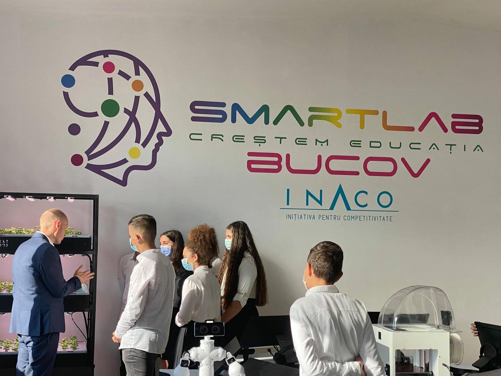</th>
</tr>
<tr>
<th colspan="2"><strong>2.2 Description:</strong></th>
</tr>
<tr>
<th colspan="2" style="text-align: left;">SmartLab Bucov is an example of a Technology Enhanced Active Learning environment implemented in a Romanian rural school. Opened in 2021 at “Constantin Stere” Gymnasium School in Bucov (Prahova County), it is the first fully equipped SmartLab (intelligent digital laboratory) in a village school in Romania . This lab serves as a model for integrating cutting-edge technology – such as Virtual Reality (VR), 3D printing, and educational robotics – into the daily learning experience. The lab’s objective is to stimulate creativity, critical thinking, and collaboration among students by providing them with state-of-the-art tools and a flexible learning space. In SmartLab Bucov, traditional classroom desks have been replaced with collaborative workstations. Students can engage in active projects like designing objects with 3D modeling software and printing them on a 3D printer, programming multifunctional robots, or exploring virtual field trips with VR goggles. These activities align with and enhance the school curriculum: for instance, students learn geometry by creating shapes on the computer and printing them, or they study biology by virtually exploring ecosystems in VR. The target audience includes the school’s 500 students (aged roughly 6 to 15) and their teachers. The lab is used across subjects – from STEM classes to even literature (the space also includes a cozy reading corner to blend technology with reading) . SmartLab Bucov was realized through a public-private partnership (six private companies jointly funded the ~€120,000 cost) , highlighting a community investment in innovative education. In essence, this good practice transforms a rural classroom into a “future classroom,” demonstrating how active learning can be supercharged with technology.</th>
</tr>
<tr>
<th colspan="2"><strong>2.3 Context:</strong></th>
</tr>
<tr>
<th colspan="2" style="text-align: left;">The educational context of SmartLab Bucov is a public lower secondary school in a rural area, which traditionally had limited access to advanced technology. The initiative emerged as part of a broader vision (championed by organizations like INACO – Initiative for Competitiveness) to create smart labs in schools across Romania, ensuring that even rural students gain the digital skills needed for the future. The lab in Bucov is a pioneer: prior to this, such high-tech labs were typically found only in a few elite urban schools or universities. Its inauguration marked the first time rural students would have daily access to equipment like 3D scanners and VR sets. The lab is physically set up in a renovated space (the school’s attic), which was transformed with modern flooring, new furniture, and colorful décor to be inviting and conducive to creativity. This environment differs from standard classrooms: it’s open, with areas for hands-on experimentation and others for collaboration or relaxation (like the reading beanbag area), embodying a student-centric design. The social context is notable – Bucov’s SmartLab drew attention nationally (“even better than in Denmark!” a media headline quipped, underscoring its exceptional quality for a village school) and has since inspired additional labs. Following Bucov’s example, similar digital labs have been set up in other locations, including an urban SmartLab in Bucharest (School No. 311, Sector 6, in 2023) where an entire floor was redesigned to blend technology and learning in an appealing way. These contexts show that the SmartLab concept is spreading, supported by Romania’s National Recovery and Resilience Plan (PNRR) which allocated funds for equipping schools with such labs. In summary, SmartLab Bucov operates in a context of bridging educational inequity – bringing a top-tier active learning facility to a rural school – and it sits at the forefront of a nascent network of SmartLabs aiming to modernize education countrywide.</th>
</tr>
<tr>
<th colspan="2"><strong>2.4 Selection Criteria:</strong></th>
</tr>
<tr>
<th><strong>Effectiveness:</strong></th>
<th style="text-align: left;">The SmartLab has markedly increased student interaction and enthusiasm for learning. Since its opening, teachers report that the lab has become the “favorite place” of students at school. Instead of passively sitting through lectures, students in the SmartLab are constantly doing: they build, code, experiment, and explore. This high level of hands-on engagement has led to deeper understanding, especially in STEM subjects. For example, abstract concepts in physics or math become tangible when students can model them in 3D or simulate them in virtual reality. A teacher from Bucov noted that during robotics sessions, even students who typically struggle academically were fully absorbed in problem-solving to make their robot complete a task – a sign of improved focus and comprehension through interactive learning. The SmartLab’s effectiveness is also evident in skill acquisition: over the course of a year, many students became proficient in 3D design and basic programming, skills they did not have before. Formative feedback from the lab’s usage shows improved learning outcomes; teachers have cited increases in class participation and a willingness among students to tackle complex projects, thanks to the motivating environment. Furthermore, the SmartLab has drawn in students after hours – voluntary attendance in newly formed clubs (robotics club, 3D printing club) went up, indicating that learning feels less like an obligation and more like a passion in this setting. While quantitative test score data is still being collected, early indicators like increased science fair participation and better problem-solving scores in informatics contests suggest that the active learning enabled by SmartLab Bucov translates to academic and practical success.</th>
</tr>
<tr>
<th><strong>Technology:</strong></th>
<th style="text-align: left;">SmartLab Bucov is equipped with an impressive array of cutting-edge technological tools applied in innovative ways for education. The lab includes multiple 3D printers (both monochrome and multicolor) and 3D scanners, which allow students to turn digital designs into physical objects and to scan real objects into digital models. It features about 15 VR headsets, enabling immersive virtual reality experiences – for instance, virtual science experiments or virtual field trips to historical sites. The lab also contains several educational robots (programmable devices that students can use to learn coding and automation) and robotics kits for building custom projects. An interactive digital whiteboard and high-performance computers with design software are available for collaborative work and multimedia projects. What makes the use of this technology special is the integration into the curriculum: technology is not just shown as a demo, but actively used by students to learn. For example, in art or geography class, students might use VR to virtually visit art museums or remote geographies, making lessons far more vivid. In chemistry, a 3D molecular modeling program plus 3D printing allows students to create models of molecules. The SmartLab also introduces technologies like a hydroponic station (as hinted by some SmartLab packages) to learn about smart agriculture, again blending tech with real-world applications. The innovative aspect is the holistic approach: multiple technologies are available in one space, encouraging interdisciplinary projects (a student designing an engineering prototype can 3D print it and program a robot to interact with it, all within the same lab). Overall, SmartLab Bucov exemplifies how modern hardware and software, from VR to 3D fabrication, can be harnessed to create an active learning playground that keeps students at the forefront of technological literacy.</th>
</tr>
<tr>
<th><strong>Collaboration:</strong></th>
<th style="text-align: left;">The design and operation of SmartLab Bucov strongly promote teamwork and cooperation among students. The physical setup has cluster seating and open areas where students naturally gather to work together, rather than sit in isolated rows. Many learning activities in the lab are project-based and too complex for one student to do alone, which encourages students to form groups – for example, a team of students might divvy up roles to build a robotic car (one works on coding, another on design, another on testing). In using the VR equipment, students often work in pairs – one student navigates the virtual environment while another observes on a screen and they discuss the experience in real time. Such interactions build communication and team problem-solving skills. The creation of the lab itself was a collaborative educational experience: students worked side by side with architects to design the reading corner and the look of the space, giving them a sense of ownership and demonstrating a real-world collaboration between youth and professionals. This participatory design process taught students how to negotiate ideas and cooperate towards a common goal (a model that could be replicated for future student involvement in school improvements). Additionally, the SmartLab often hosts multi-grade workshops where older students mentor younger ones on using equipment like 3D printers, fostering a collaborative learning community across age groups. Teachers, too, collaborate in this space – it’s common for multiple teachers (e.g., an IT teacher and a science teacher) to co-run a SmartLab session that intersects their subjects, modeling collaboration in teaching. Finally, the SmartLab has become a hub for community collaboration: local businesses and the city council have visited and even held workshops in the lab, integrating community experts (like engineers or IT specialists) who collaborate with teachers to guide student projects. All these elements ensure that cooperation is intrinsic to the SmartLab experience, preparing students to work effectively in teams – a key tenet of active learning.</th>
</tr>
<tr>
<th><strong>Feedback:</strong></th>
<th style="text-align: left;">The SmartLab environment provides numerous avenues for immediate and constructive feedback, essential for the active learning process. With many activities being hands-on and iterative, students receive instant feedback from the technology itself: a robot either works or doesn’t, providing prompt insight into whether the code was correct, or a 3D print may fail if a design flaw exists, signaling students to adjust their model. This trial-and-error learning, facilitated by technology, is guided by teachers who prompt students to reflect on why a failure occurred and how to fix it – a constructive feedback loop. The presence of interactive software also means students often get real-time on-screen feedback; for instance, coding platforms used in the lab can flag errors in real time, and VR educational programs can respond to student choices (like a virtual lab simulation giving immediate results for an experiment). Teachers in the SmartLab leverage these quick feedback mechanisms to have “teachable moments” on the spot. Because the teacher-to-student ratio during lab sessions is often lower (sometimes classes are split for lab work), instructors can circulate and give one-on-one feedback more readily than in a traditional classroom. They can quickly intervene if a group is stuck, ask probing questions, and provide hints without taking over the project, thus guiding students to the solution. Moreover, the SmartLab’s culture encourages peer feedback: students are commonly found reviewing each other’s designs or code, offering suggestions (for example, “Try making that gear bigger so it prints better”), which not only helps the recipient improve their work immediately but also reinforces the giver’s understanding. This open feedback culture is supported by the lab’s non-judgmental, experimental atmosphere – mistakes are seen as part of learning, and the quick iteration cycles mean students can rapidly implement feedback and see the results. In summary, SmartLab Bucov integrates continuous feedback through its technology (immediate outputs and responses) and its collaborative teaching approach, ensuring that learning is adjusted and improved in real time as students actively engage with the tasks.</th>
</tr>
<tr>
<th colspan="2"><ol start="5" type="1">
<li>
<strong>Sources of Collection</strong>:
</li>
</ol></th>
</tr>
<tr>
<th colspan="2"><ul>
<li>
<a href="https://spotmedia.ro/stiri/educatie/roboti-ochelari-vr-imprimante-si-scannere-3d-%C8%8Bn-primul-smartlab-dintr-o-scoala-de-la-tara-e-mai-ceva-ca-n-danemarca">Spotmedia News Article (Sept 2021) – provided details on SmartLab Bucov’s launch, including number of beneficiaries and equipment, and the context of being the first rural SmartLab</a>;
</li>
<li>
<a href="https://www.inaco.ro/smart-lab/">INACO (NGO) Official Information – outlines the SmartLab initiative’s vision, lists of equipment for SmartLabs in various locations, and the goal of nationwide adoption</a>;
</li>
<li>
<a href="https://www.presshub.ro/laborator-de-scoala-gimnaziala-cu-ochelari-vr-imprimante-3d-si-tabla-digitala-la-bucuresti-289093">PressHub News (Oct 2023) – described the implementation of a SmartLab in a Bucharest school, illustrating the replication of the model and student engagement (students enjoying the space, etc.)</a>;
</li>
<li>
<a href="https://www.youtube.com/watch?v=bY2pjB26tR8">Video from the opening of the SmartLab Bucov – statements from Bucov’s teachers and students (some were featured on Radio Romania Cultural or local TV) about how the SmartLab changed their learning experience, giving qualitative insight into its effectiveness and use</a>.
</li>
</ul></th>
</tr>
<tr>
<th colspan="2"><strong>2.6 Results</strong>:</th>
</tr>
<tr>
<th colspan="2" style="text-align: left;">Although relatively new, SmartLab Bucov and similar SmartLabs have begun to show promising results in the realm of TEAL. <strong>Qualitatively</strong>, student engagement is exceptionally high – teachers observe nearly 100% participation in lab activities, even from students who are usually disinterested in traditional classes. Students have developed tangible skills: in the first year, Bucov students created dozens of 3D printed models (from keychains to engineering prototypes), wrote their first lines of code for robots, and some even entered (and won prizes in) national coding and robotics competitions as a direct consequence of their SmartLab practice. The lab environment also improved soft skills; for instance, students became noticeably more confident in presenting their projects to peers and even to visiting officials, showing growth in communication abilities. <strong>Quantitatively</strong>, while standardized test improvements may take time to document, one immediate metric is participation and outreach: within a year, the SmartLab hosted over 10 community workshops and events, and an estimated 800+ people (students, teachers from other schools, parents, community members) had visited or utilized the lab in some capacity, spreading digital literacy beyond just the core student body. The success of Bucov’s lab has catalyzed replication – by 2023, at least <strong>20 SmartLabs</strong> (approximate figure) have been established or were in planning across different counties (some funded by local councils, others by EU funds), indicating that the model is being adopted as a best practice in educational innovation. Another outcome has been increased student retention and interest in science/tech careers: the school noted a decrease in absenteeism for classes held in the SmartLab, and surveys showed more students expressing interest in pursuing IT or engineering studies. In terms of teacher development, having the SmartLab has improved teacher morale and attracted new talent – educators are eager to teach in a school with such facilities, and existing staff gained new competencies through training on the lab’s equipment. The SmartLab’s results also align with community development: local companies have shown greater interest in partnering with the school (some offering internships or mentorship programs for students) after seeing the lab, thus creating a pipeline between education and industry in the area. In conclusion, the SmartLab Bucov illustrates how providing a technology-rich, active learning space in a rural school can yield benefits ranging from heightened student engagement and skill acquisition to serving as a replicable prototype that influences educational policy and investment on a broader scale.</th>
</tr>
</thead>
<tbody>
</tbody>
</table>

<table>
<colgroup>
<col style="width: 100%" />
</colgroup>
<thead>
<tr>
<th><h1 id="section-3">Section 3:</h1></th>
</tr>
<tr>
<th><h1 id="general-notes">General Notes</h1></th>
</tr>
</thead>
<tbody>
</tbody>
</table>

<table>
<colgroup>
<col style="width: 100%" />
</colgroup>
<thead>
<tr>
<th><h2 id="acta-center---romania">ACTA Center - ROMANIA</h2></th>
</tr>
<tr>
<th><strong>3.1 Reflection:</strong></th>
</tr>
<tr>
<th style="text-align: left;">In two of the four examples of good practices, one from each category, members of our organization participated in their implementation and therefore, we consider them very suitable, both in terms of the themes addressed and the results obtained, as well as in terms of their replicability, as valuable examples for the DROPS of Sustainability project. The other two examples, also developed at international level and involving Romanian partners, were found through an internet search and are appropriate and complementary to the activities proposed to be carried out within this project.</th>
</tr>
<tr>
<th><strong>3.2 Recommendations for Adaptation</strong>:</th>
</tr>
<tr>
<th style="text-align: left;">By taking on board the messages conveyed, adapting and exploiting the results obtained, following the recommendations proposed, or simply by the power of example, all these examples of good practice can be multiplied and diversified.</th>
</tr>
<tr>
<th><strong>Conclusion</strong>:</th>
</tr>
<tr>
<th style="text-align: left;">The proposed examples of good practices, being themselves in the field of ESD and TEAL, will constitute important materials with a significant impact, firstly, in achieving the project results, and finally, their exploitation will contribute to the achievement of the proposed objectives, namely improving knowledge and skills in sustainability through the use of TEAL methodology, by creating conducive and personalized learning environments, in order to raise awareness of the need to live in a more sustainable way by changing consumption patterns, adopting healthier lifestyles and contributing to the transformation of the whole society.</th>
</tr>
</thead>
<tbody>
</tbody>
</table>

<table>
<colgroup>
<col style="width: 100%" />
</colgroup>
<thead>
<tr>
<th><h2 id="ccif-cyprus---cyprus">CCIF Cyprus - CYPRUS</h2></th>
</tr>
<tr>
<th><strong>3.1 Reflection:</strong></th>
</tr>
<tr>
<th style="text-align: left;">The use of Augmented Reality (AR) in environmental education transforms passive learning into an interactive, TEAL based experience that boosts student engagement, understanding, and green skill development. It makes complex sustainability concepts more accessible and encourages teamwork and community involvement. However, its success relies on adequate infrastructure, teacher training, and equitable access.</th>
</tr>
<tr>
<th><strong>3.2 Recommendations for Adaptation</strong>:</th>
</tr>
<tr>
<th>To effectively implement AR in environmental education, schools should integrate AR modules across relevant subjects, train teachers to use AR tools, and ensure all students have access to the necessary technology. Collaboration with tech and environmental experts is key to creating meaningful AR content, and embedding real-time feedback tools will enhance learning and support ongoing improvement.</th>
</tr>
<tr>
<th><strong>Conclusion</strong>:</th>
</tr>
<tr>
<th style="text-align: left;">Using Augmented Reality (AR) in environmental education, along with TEAL methods, is an effective way to teach green skills and sustainability. It helps students learn actively and encourages them to take action for the environment. To make a lasting impact, AR should be included in school programs, supported by teacher training, and backed by inclusive policies.</th>
</tr>
</thead>
<tbody>
</tbody>
</table>

<table>
<colgroup>
<col style="width: 100%" />
</colgroup>
<thead>
<tr>
<th><h2 id="petit-pas---italy">PETIT PAS - ITALY</h2></th>
</tr>
<tr>
<th><strong>3.1 Reflection:</strong></th>
</tr>
<tr>
<th style="text-align: left;">The collection of these best practices has highlighted the importance of a holistic approach to education for sustainable development, which integrates theory and practice, innovation and tradition, technology and participation. The four practices analyzed offer interesting insights for the design of educational activities that promote environmental awareness, the development of skills, and responsible action towards a sustainable future. The analysis of these practices has also highlighted the importance of collaboration between different actors, such as schools, universities, businesses, and non-governmental organizations, to create an educational ecosystem that supports the transition towards sustainability.</th>
</tr>
<tr>
<th><strong>3.2 Recommendations for Adaptation</strong>:</th>
</tr>
<tr>
<th style="text-align: left;">
The collected best practices can be combined and adapted to the "Drops of Sustainability" project in several ways:

<ul>
<li>
<u>Warka Tower and Rifò</u>: These two practices can be used to create an educational pathway that addresses the theme of sustainability from different perspectives, combining the environmental aspect with the social and economic ones. For example, workshops could be organized where students design and build small-scale models of the Warka Tower using recycled materials, inspired by the Rifò model.
</li>
<li>
<u>Flipped Learning and Matematica Live</u>: These two practices can be integrated to create a more engaging and interactive learning environment. For example, Matematica Live's video lessons and interactive activities could be used to introduce sustainability concepts, and then Flipped Learning could be used to foster discussion and collaboration in the classroom.
</li>
<li>
<u>Combination of all practices</u>: An interdisciplinary project could be created that integrates all four best practices. For example, students could analyze the problem of water scarcity using Matematica Live, design and build a model of the Warka Tower with recycled materials, and then use Flipped Learning to discuss the social and economic implications of the project.
</li>
</ul></th>
</tr>
<tr>
<th><strong>Conclusion</strong>:</th>
</tr>
<tr>
<th style="text-align: left;">The best practices collected in this document offer a rich and varied framework of innovative approaches to education for sustainable development and the TEAL methodology. Integrating these practices into the "Drops of Sustainability" project can contribute to creating a more effective, engaging, and transformative educational experience that promotes awareness, skills development, and responsible action towards a sustainable future.</th>
</tr>
</thead>
<tbody>
</tbody>
</table>

<table>
<colgroup>
<col style="width: 100%" />
</colgroup>
<thead>
<tr>
<th><h2 id="stp-consulting-sl---spain">STP CONSULTING, SL - SPAIN</h2></th>
</tr>
<tr>
<th><strong>3.1 Reflection:</strong></th>
</tr>
<tr>
<th style="text-align: left;">Regarding the TEAL best practices, we have used two examples that STP has participated as a partner and the other one we used in our presentations and training sessions, and we would like to share with other adult trainers. Concerning the best practices, we have done a research to find the more suitable sources for the adult trainers and adult learners that they had great success in our country.</th>
</tr>
<tr>
<th><strong>3.2 Recommendations for Adaptation</strong>:</th>
</tr>
<tr>
<th style="text-align: left;">STP has chosen best practices easy to replicate for the adult trainers in their training sessions, already tested with learners in Spain and other countries, this is the case with the E-growth project, and also easy to create a networking and useful tools to motivate adult learners.</th>
</tr>
<tr>
<th><strong>Conclusion</strong>:</th>
</tr>
<tr>
<th style="text-align: left;">
The collection of good practices in Education for Sustainable Development (ESD) and Technology-Enhanced Active Learning (TEAL) by STP Consulting highlights the importance of implementing innovative and sustainable educational strategies. These practices not only promote environmental awareness and sustainability but also enhance students&amp;#39; digital and collaborative skills.

<strong>Impact on ESD</strong>: The practices in ESD, such as the project on well-being in a more sustainable neighborhood and the ESenRED network, demonstrate how education can drive change towards more sustainable and conscious communities. These initiatives encourage active participation from students, teachers, and the community, creating an educational environment that values and protects the environment. Additionally, they integrate the Sustainable Development Goals (SDGs), providing students with a platform to contribute to a global commitment.

<strong>Impact on TEAL</strong>: The practices in TEAL, such as the E-Growth project and the use of Padlet, show how technology can transform education. These methodologies enhance student interaction and understanding, promoting a more dynamic and collaborative learning experience. Integrating digital tools in vocational education and training teachers in the use of advanced technologies prepares students for the challenges of the 21st century, creating a more competent and productive workforce.

<strong>Overall Conclusion</strong>: Implementing these good practices has the potential to transform education, making it more inclusive, collaborative, and sustainability-oriented. By adopting these strategies, educational institutions can significantly improve the quality of learning and the development of key competencies in students, better preparing future generations to face environmental and technological challenges.
</th>
</tr>
</thead>
<tbody>
</tbody>
</table>

<table>
<colgroup>
<col style="width: 100%" />
</colgroup>
<thead>
<tr>
<th><h2 id="udruga---association-4-elements---croatia">UDRUGA - Association 4 ELEMENTS - CROATIA</h2></th>
</tr>
<tr>
<th><strong>3.1 Reflection:</strong></th>
</tr>
<tr>
<th style="text-align: left;">The process of collecting good practices has highlighted the rich variety of innovative approaches already in use across Europe, including in Croatia, even if they are not always formally labeled as “TEAL” or “ESD”. Seeing how education providers adapt technology to meet real-world learning needs was particularly insightful. One of the key takeaways was that successful TEAL and ESD practices are not always complex or expensive — often, small, well-integrated digital tools can create highly engaging and effective learning experiences.</th>
</tr>
<tr>
<th><strong>3.2 Recommendations for Adaptation</strong>:</th>
</tr>
<tr>
<th style="text-align: left;">These practices could be adapted to the project’s target group by combining interactive content with real-world sustainability challenges. For example, adult learners can use digital platforms to collaboratively design local sustainability campaigns or analyze environmental data using basic digital tools. Integrating ESD topics (e.g., green jobs, circular economy) into TEAL frameworks like flipped classrooms or project-based learning can enhance both engagement and relevance. The LTTA phase will be a good opportunity to test blended workshops, digital storytelling, and collaborative e-learning modules tailored to adult learners with diverse needs.</th>
</tr>
<tr>
<th><strong>Conclusion</strong>:</th>
</tr>
<tr>
<th style="text-align: left;">The collected good practices demonstrate how ESD and TEAL can transform adult education by making it more active, relevant, and future-oriented. By fostering critical thinking, collaboration, and digital literacy, these approaches empower learners not only to gain knowledge, but to apply it meaningfully in their communities and workplaces. Their adoption across partner countries will strengthen the impact and sustainability of the “Drops of Sustainable Development” project.</th>
</tr>
</thead>
<tbody>
</tbody>
</table>

<table>
<colgroup>
<col style="width: 100%" />
</colgroup>
<thead>
<tr>
<th><h2 id="asociația-uzinaduzina---romania">Asociația UZINADUZINA - ROMANIA</h2></th>
</tr>
<tr>
<th><strong>3.1 Reflection:</strong></th>
</tr>
<tr>
<th style="text-align: left;">The above good practices from Romania highlight the transformative power of Education for Sustainable Development and Technology Enhanced Active Learning in real-world settings. <strong>Education for Sustainable Development (ESD)</strong> initiatives like Patrula de Reciclare and Eco-Școala demonstrate that when students are given ownership of environmental projects, they not only learn about sustainability more deeply but also act as multipliers of change in their communities. A key reflection is that <strong>student engagement and community impact reinforce each other</strong>: motivated students can influence family and community behavior (as seen with recycling and energy saving), and supportive communities in turn provide a richer context for student learning. To adapt these ESD practices, educators and organizations should focus on creating structured yet flexible frameworks – much like the Eco-Școala 7-step model or the Patrula de Reciclare team approach – that can be tailored to local issues. It’s recommended to start with manageable <strong>projects (e.g., a school recycling corner or a small garden)</strong> and gradually scale up to larger initiatives (like municipal partnerships for waste collection) as capacity grows. Ensuring the involvement of all stakeholders (school leaders, teachers across subjects, parents, local authorities) from the planning stage is crucial for adaptation, echoing Eco-Școala’s emphasis on whole-school and community participation. Another lesson is the value of <strong>recognition and reward</strong> in sustaining these practices: small incentives such as awards (Green Flags, eco-certificates) or public acknowledgement of success keep participants motivated and signal the importance of the work to the broader community.</th>
</tr>
<tr>
<th><strong>3.2 Recommendations for Adaptation</strong>:</th>
</tr>
<tr>
<th style="text-align: left;">
<strong>From the TEAL practices</strong> (Digitaliada and SmartLab), we learn that introducing technology in education is most effective when it’s coupled with teacher training and active learning pedagogies. Simply having equipment is not enough – the success of Digitaliada came from empowering teachers with new methods and providing localized digital content, and SmartLab’s success lies in letting students learn by doing in an open, innovative space. Adaptation of these practices should therefore prioritize <strong>capacity building for educators</strong> and careful planning of how technology will be used to achieve learning objectives. For example, a school or organization looking to emulate Digitaliada need not start with a full suite of hardware; it can begin by using free digital resources and training teachers in interactive teaching techniques, then progressively integrate devices as resources allow.

The <strong>open educational resources (OER)</strong> from Digitaliada are freely accessible, which is an immediate adaptation step – any school can tap into this library to enrich their lessons with interactive content. In terms of infrastructure, the SmartLab model can be adapted incrementally: one might pilot a “mini smart lab” in a regular classroom by acquiring a few laptops, a 3D printer, and some VR headsets, and demonstrate their use across subjects, making the case for further investment. It’s also recommended to seek partnerships for support – as seen, private companies and grant programs are often willing to fund innovative labs or digital education projects, especially if a clear impact on skills and community development is presented.

Importantly, these practices underscore a need for a <strong>cultural shift in teaching and learning</strong>. Adapting them means fostering an educational culture that values experiential learning, cross-disciplinary projects, and student voice. For uzinaduzina and similar organizations, a reflection would be to incorporate student feedback and leadership in program design (students often have creative ideas on using technology or tackling sustainability issues). Additionally, ensuring <strong>sustainability of the initiatives</strong> is key: for ESD, this means integrating projects into the curriculum so they persist year after year (rather than one-off events), and for TEAL, it means budgeting for maintenance of tech and continuous teacher upskilling. By taking these adaptation steps – starting small, involving stakeholders, leveraging available resources, and building on the proven frameworks – other schools and organizations can recreate the successes of the highlighted Romanian good practices, while tailoring them to their unique context.
</th>
</tr>
<tr>
<th><strong>Conclusion</strong>:</th>
</tr>
<tr>
<th style="text-align: left;">
In conclusion, the compilation of good practices above illustrates how Romanian educational initiatives are successfully advancing sustainable development and enriching learning through technology. The <strong>Education for Sustainable Development</strong> examples show that empowering students to become environmental stewards can yield measurable ecological benefits and nurture a generation of responsible citizens.

The <strong>TEAL</strong> examples demonstrate that with thoughtful integration of technology and active methods, even schools in under-resourced areas can leap into 21st-century education, dramatically improving student engagement and skills. Each practice – from students running recycling campaigns that collect tons of e-waste, to rural children donning VR headsets to explore the ocean floor – contributes to a more dynamic, participatory, and future-ready educational landscape. These success stories from Romania provide not only inspiration but also concrete models that can be replicated and adapted globally. By embracing the key principles evident here – <strong>impact through action, innovation in approach, adaptability, broad participation, collaboration, and continuous feedback</strong> – educators and policymakers can foster learning environments that are both <strong>sustainable</strong> and <strong>engaging</strong>. Ultimately, integrating the lessons of these good practices will help ensure that education systems prepare learners not only to excel academically, but also to actively shape a more sustainable and technologically adept future. The journey of uzinaduzina in compiling and reflecting on these practices is a step toward that vision, affirming that with the right strategies, <strong>education can be transformed into a powerful catalyst for sustainable and inclusive development</strong>.
</th>
</tr>
</thead>
<tbody>
</tbody>
</table>

<table>
<colgroup>
<col style="width: 100%" />
</colgroup>
<thead>
<tr>
<th><h1 id="section-4"></h1></th>
</tr>
<tr>
<th><h1 id="conclusion">Conclusion</h1></th>
</tr>
</thead>
<tbody>
</tbody>
</table>

This collection of good practices is one of the key outcomes of the Erasmus+ project "**Drops of Sustainable Development**" and represents a valuable tool for adult educators and trainers. The project aims to provide innovative tools and strategies to integrate sustainable development skills into training programs, with a particular focus on the TEAL (Technology Enhanced Active Learning) methodology.

The practices presented in this document, selected through a rigorous process of research and analysis of educational and community projects, reflect the commitment of the **DROPS project** to promoting active, collaborative, and technology-enhanced learning. The selection criteria adopted (impact, innovation, replicability, participation, and sustainability) made it possible to identify initiatives that can effectively support educators in overcoming the difficulties of integrating sustainability into curricula, by offering practical and engaging methods.

The compilation of these practices has brought to light several important reflections, common to all the contributions. A central theme is the emphasis on student empowerment and the shift away from traditional teacher-centered models. Many projects actively involve students in the learning process, promoting critical thinking, problem-solving, and a sense of agency. This is evident in initiatives such as "Greener and Safer School Streets," where students become "local experts" in assessing and improving their own environment, and "**Eco-Scoala**" which establishes student-led Eco-Committees to promote sustainability efforts within schools.

This approach is closely linked to the contextualization of learning, another key theme that emerged from the practices, which highlight the importance of adapting educational interventions to the specific needs and characteristics of the territories, as illustrated by the "**WELL-BEING IN A MORE SUSTAINABLE NEIGHBOURHOOD**" and "**WARKA TOWER**" projects. This fosters meaningful learning and a greater impact of the actions undertaken, responding to the need, emphasized by the DROPS project, to provide practical and applicable tools.

Another key reflection is the integration of sustainability in various educational fields. The practices demonstrate that ESD is not limited to environmental science but can be effectively incorporated into different sectors such as adult education ("**5P Competences**"), vocational training ("**Apprenticeships for Greener Economies and Societies**"), and even the fashion industry ("**Rifò**"). This interdisciplinary approach highlights the interconnectedness of sustainability with all aspects of life and the importance of promoting a holistic understanding.

Furthermore, the document emphasizes the transformative power of technology in enhancing learning experiences. Projects such as "**CircuTex**" and "**ELEMENTS OF AI**" utilize virtual reality and online platforms to offer engaging and accessible educational opportunities. These initiatives demonstrate the potential of technology not only to provide content but also to create immersive environments, facilitate collaboration, and personalize learning.

Finally, the strong emphasis on collaboration and partnerships throughout the collection highlights the awareness that education for sustainable development is a shared responsibility. The success of many projects relies on the active involvement of various stakeholders, including schools, universities, local communities, NGOs, and industry partners. This spirit of collaboration promotes knowledge sharing, resource mobilization, and the creation of support ecosystems for sustainable development.

In conclusion, this collection of good practices represents a valuable resource for the **DROPS project**, providing concrete and stimulating examples of how ESD can be effectively integrated into adult education through innovative methodologies such as TEAL. It is hoped that these examples can inspire educators and trainers to develop transformative educational paths, capable of forming aware and active citizens in the construction of a more sustainable future.

**Recommendations for Adaptation**

The diverse range of practices presented offers numerous opportunities for adaptation and synergy. To effectively adapt these approaches to the project's target group, the following recommendations can be considered:

- **Contextualization**: Adapting the practices to the specific local context is essential. This implies considering the unique environmental, social, and economic challenges and opportunities that the target group faces.

- **Integration**: Combining elements from different practices can create more complete and impactful interventions. For example, integrating the community engagement strategies of "Well-being in a More Sustainable Neighbourhood" with the technological tools of "**InnoVET**" could promote both local action and digital literacy.

- **Scalability**: Prioritizing practices that can be easily scaled and replicated is essential for a broader impact. The "Patrula de Reciclare" program, with its adaptable "recycling patrol" model, provides a good example of a practice that can be implemented in various contexts.

These possible combinations and adaptations will be the subject of exploration and experimentation during the LTTA in Spain, which will involve 12 adult educators from the 5 partner countries. Their experiences and feedback will also contribute to defining the project’s training materials, in particular the “**DSD_Toolkit**”, which will include teaching modules for educators and facilitators on ESD, based on practical, engaging, and action-oriented methods, using the TEAL methodology.

In conclusion, this collection of good practices represents a valuable resource for the DROPS project, providing concrete and stimulating examples of how ESD can be effectively integrated into adult education through innovative methodologies such as TEAL. It is hoped that these examples can inspire educators and trainers to develop transformative educational paths, capable of forming aware and active citizens in the construction of a more sustainable future.
